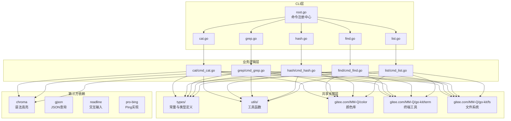

# FCK 项目分析报告

> **生成时间**: 2026-05-19  
> **分析工具**: AI 架构分析引擎  
> **项目定位**: 跨平台命令行工具集（类 Unix 工具 Windows 替代方案）

---

## 一、目录结构梳理

### 1.1 整体架构概览

```
fck/
├── cmd/                          # 应用程序入口
│   └── main.go                   # 主入口文件（仅 15 行，极简设计）
├── internal/                     # 内部实现（Go 标准项目布局）
│   ├── cli/                      # CLI 层：命令定义与参数解析
│   │   ├── root.go               # 根命令注册中心
│   │   ├── [40+ 命令定义文件]    # 每个命令一个文件
│   │   └── tcp/                  # 复杂命令子模块
│   ├── commands/                 # 业务逻辑层：命令核心实现
│   │   ├── [40+ 命令实现目录]    # 每个命令独立目录
│   │   │   ├── cat/              # 复杂命令多文件组织
│   │   │   │   ├── cmd_cat.go    # 主逻辑
│   │   │   │   ├── processor.go  # 内容处理器
│   │   │   │   ├── output.go     # 输出管理
│   │   │   │   └── types.go      # 类型定义
│   │   │   └── ...               # 其他命令目录
│   ├── types/                    # 共享类型与常量定义
│   │   ├── types.go              # 核心常量（编码、换行符等）
│   │   ├── command.go            # 查找类型常量
│   │   ├── format.go             # 表格样式映射
│   │   ├── logo.go               # CLI Logo 定义
│   │   └── ...                   # 其他类型定义
│   └── utils/                    # 工具函数库
│       ├── utils.go              # 通用工具函数
│       ├── color.go              # 颜色输出工具
│       └── color_ext.go          # 颜色扩展
├── docs/                         # 设计文档（每个功能独立文档）
│   └── [80+ 设计文档]            # 详细的设计决策记录
├── vendor/                       # 依赖库（Go 1.14+ vendor 模式）
│   └── [第三方依赖]              # 完整依赖副本
├── build.py                      # Python 构建脚本（跨平台编译）
├── go.mod / go.sum               # Go 模块定义
└── README.md                     # 项目文档
```

### 1.2 目录规范评估

| 维度 | 评估 | 说明 |
|------|------|------|
| **项目布局** | ✅ 优秀 | 遵循 Go 标准项目布局（Standard Go Project Layout） |
| **代码组织** | ✅ 优秀 | 清晰的分层：cli（接口层）→ commands（业务层）→ types/utils（支撑层） |
| **命令隔离** | ✅ 优秀 | 每个命令独立目录，高内聚低耦合 |
| **文档管理** | ✅ 良好 | 每个功能有独立设计文档，便于追溯决策 |
| **依赖管理** | ✅ 优秀 | 使用 vendor 模式，保证构建可重现性 |

---

## 二、核心功能模块识别

### 2.1 模块分类矩阵

| 类别 | 模块名称 | 核心功能 | 对应代码路径 |
|------|----------|----------|--------------|
| **文件操作** | pack | 智能打包压缩 | `internal/commands/pack/` |
| | unpack | 智能解压缩 | `internal/commands/unpack/` |
| | find | 文件查找搜索 | `internal/commands/find/` |
| | list (ls) | 目录列表显示 | `internal/commands/list/` |
| | cp | 文件复制 | `internal/commands/cp/` |
| | mv | 文件移动 | `internal/commands/mv/` |
| | rm | 文件删除 | `internal/commands/rm/` |
| | mkdir | 目录创建 | `internal/commands/mkdir/` |
| | touch | 文件时间戳修改 | `internal/commands/touch/` |
| | truncate | 文件截断 | `internal/commands/truncate/` |
| | hash | 文件哈希计算 | `internal/commands/hash/` |
| | check | 哈希校验 | `internal/commands/check/` |
| | size (sz) | 文件大小统计 | `internal/commands/size/` |
| | preview (pv) | 压缩包预览 | `internal/commands/preview/` |
| **文本处理** | cat | 文件内容显示 | `internal/commands/cat/` |
| | head | 显示文件开头 | `internal/commands/head/` |
| | tail | 显示文件结尾 | `internal/commands/tail/` |
| | grep | 文本搜索 | `internal/commands/grep/` |
| | sed | 流编辑器 | `internal/commands/sed/` |
| | awk | 字段处理 | `internal/commands/awk/` |
| | wc | 字数统计 | `internal/commands/wc/` |
| | tr | 字符转换 | `internal/commands/tr/` |
| | xargs | 参数批量执行 | `internal/commands/xargs/` |
| | tee | 输出分流 | `internal/commands/tee/` |
| | newline (nl) | 换行符检测转换 | `internal/commands/newline/` |
| | iconv (icv) | 编码转换 | `internal/commands/iconv/` |
| **系统监控** | proc (ps) | 进程查看 | `internal/commands/proc/` |
| | port (pt) | 端口监控 | `internal/commands/port/` |
| | df | 磁盘空间 | `internal/commands/df/` |
| | watch (wch) | 命令监控 | `internal/commands/watch/` |
| | which (wh) | 命令查找 | `internal/commands/which/` |
| | pwd | 当前目录 | `internal/commands/pwd/` |
| | home | 用户主目录 | `internal/commands/home/` |
| **网络工具** | tcp | TCP 客户端/服务端/扫描 | `internal/commands/tcp/` |
| | ping | 网络连通测试 | `internal/commands/ping/` |
| | dns | DNS 查询 | `internal/commands/dns/` |
| | curl (c) | HTTP 客户端（支持 `-o` 保存文件、`-O` 远程文件名、下载进度条、语法高亮） | `internal/commands/curl/` |
| **开发辅助** | json (j) | JSON 处理 | `internal/commands/json/` |
| | base64 (b64) | Base64 编解码 | `internal/commands/base64/` |
| | md | Markdown 预览 | `internal/commands/md/` |
| | seq | 序列生成 | `internal/commands/seq/` |
| | date | 时间格式化 | `internal/commands/date/` |
| | echo | 文本输出 | `internal/commands/echo/` |
| | gm | Git 元数据 | `internal/commands/gm/` |

### 2.2 模块复杂度分级

```
┌─────────────────────────────────────────────────────────────────┐
│  高复杂度（多文件组织）                                          │
│  ├── cat/     : 4 文件 - 内容源抽象 + 处理器 + 输出管理          │
│  ├── find/    : 7 文件 - 验证器 + 匹配器 + 操作器 + 搜索器       │
│  ├── list/    : 9 文件 - 扫描器 + 处理器 + 格式化器 + 模型       │
│  ├── hash/    : 3 文件 - 文件收集 + 哈希任务管理                 │
│  ├── tcp/     : 5 文件 - 客户端 + 服务端 + 扫描器 + 交互模式     │
│  ├── curl/    : 4 文件 - 请求构建 + 进度下载 + 响应格式化 + 语法高亮 │
│  ├── iconv/   : 3 文件 - 编码检测 + 转换器                       │
│  └── xargs/   : 1 文件 - 但内部逻辑复杂（并行/串行执行）         │
├─────────────────────────────────────────────────────────────────┤
│  中复杂度（核心逻辑独立）                                        │
│  ├── grep/    : 递归搜索 + 二进制处理 + 颜色高亮                 │
│  ├── sed/     : 替换引擎 + 多文件处理                            │
│  ├── watch/   : 调度器 + 执行器 + 渲染器                         │
│  └── json/    : 解析 + 查询(gjson) + 高亮                        │
├─────────────────────────────────────────────────────────────────┤
│  低复杂度（单一功能）                                            │
│  └── [其他 30+ 命令]  : 单文件实现，功能聚焦                     │
└─────────────────────────────────────────────────────────────────┘
```

---

## 三、模块间依赖关系分析

### 3.1 依赖关系图（Mermaid 语法）



### 3.2 核心依赖关系说明

| 依赖方向 | 依赖内容 | 依赖强度 |
|----------|----------|----------|
| **所有命令** → `internal/types` | 共享常量（编码、换行符、表格样式等） | 强依赖 |
| **所有命令** → `internal/utils` | 颜色输出、正则构建、系统文件检测 | 强依赖 |
| **所有命令** → `gitee.com/MM-Q/color` | 彩色终端输出 | 强依赖 |
| **所有命令** → `gitee.com/MM-Q/go-kit` | 终端检测、文件系统操作 | 中强依赖 |
| **所有命令** → `gitee.com/MM-Q/qflag` | 命令行参数解析 | 强依赖 |
| **文本处理命令** → `chroma` | 语法高亮 | 可选依赖 |
| **json 命令** → `gjson` | JSON 路径查询 | 强依赖 |
| **tcp 命令** → `readline` | 交互式输入 | 功能依赖 |
| **ping 命令** → `pro-bing` | ICMP Ping 实现 | 强依赖 |

### 3.3 潜在依赖问题分析

| 问题类型 | 具体表现 | 风险等级 |
|----------|----------|----------|
| **循环依赖** | 未发现明显循环依赖 | ✅ 无风险 |
| **过度依赖** | 所有命令都依赖 color/go-kit，无法单独使用 | ⚠️ 低 |
| **版本锁定** | vendor 模式锁定依赖版本，更新需手动 | ⚠️ 中 |
| **外部库依赖** | 核心功能强依赖 MM-Q 组织下的私有库 | ⚠️ 中 |

---

## 四、设计模式与实现逻辑

### 4.1 设计模式识别

| 设计模式 | 应用场景 | 代码位置 |
|----------|----------|----------|
| **命令模式 (Command)** | 每个 CLI 命令封装为独立对象 | `internal/cli/*.go` |
| **策略模式 (Strategy)** | cat 命令的内容源抽象（文件/管道） | `internal/commands/cat/processor.go` |
| **模板方法 (Template Method)** | find 命令的搜索流程 | `internal/commands/find/searcher.go` |
| **建造者模式 (Builder)** | curl 命令的请求构建 | `internal/commands/cmd_curl.go` |
| **观察者模式 (Observer)** | watch 命令的定时执行 | `internal/commands/watch/watch.go` |
| **工厂模式 (Factory)** | 表格样式创建 | `internal/types/format.go` |
| **管道模式 (Pipeline)** | xargs 的批量执行流程 | `internal/commands/xargs/cmd_xargs.go` |

### 4.2 核心实现逻辑拆解

#### 4.2.1 命令执行流程（以 cat 为例）

```
┌─────────────────────────────────────────────────────────────────┐
│  1. 入口层 (cli/cat.go)                                         │
│     └── 定义命令标志（-n, -b, -E, -T, -A, -H, -l 等）            │
│     └── 构建配置对象 (CatConfig)                                 │
├─────────────────────────────────────────────────────────────────┤
│  2. 业务层 (commands/cat/cmd_cat.go)                            │
│     └── CatCmdMain(config)                                      │
│         ├── 处理标志冲突（-b 优先级高于 -n）                     │
│         ├── 检测输入类型（管道/文件）                            │
│         ├── 创建内容源 (ContentSource)                           │
│         │   ├── 管道输入 → StdinSource                          │
│         │   └── 文件输入 → FileSource                           │
│         ├── 创建处理器 (Processor)                               │
│         ├── 处理内容 → 返回字节数组                              │
│         └── 输出内容                                             │
│             ├── 分页模式 → OutputWithPager()                    │
│             └── 直接输出 → OutputDirectly()                     │
├─────────────────────────────────────────────────────────────────┤
│  3. 输出层 (commands/cat/output.go)                             │
│     └── 支持语法高亮（chroma 库）                                │
│     └── 支持分页器（ov 库）                                      │
└─────────────────────────────────────────────────────────────────┘
```

#### 4.2.2 复杂命令架构（以 find 为例）

```go
// 核心组件协作关系
FindCmdMain
    ├── ConfigValidator    // 配置验证器
    ├── PatternMatcher     // 模式匹配器（正则/通配符）
    ├── FileOperator       // 文件操作器（打印/删除/移动）
    └── FileSearcher       // 文件搜索器（遍历目录树）
```

#### 4.2.3 下载执行流程（以 curl -O 为例）

```
┌─────────────────────────────────────────────────────────────────┐
│  1. 入口层 (cli/curl.go)                                        │
│     └── 定义命令标志（-X, -d, -H, -o, -O, -L, -v 等）           │
│     └── 构建配置对象 (Config)                                    │
├─────────────────────────────────────────────────────────────────┤
│  2. 业务层 (commands/curl/cmd_curl.go)                          │
│     └── Execute(config)                                         │
│         ├── 创建 HTTP 客户端（支持超时、重定向、TLS）             │
│         ├── buildRequest(ctx, config) → 构建 HTTP 请求           │
│         │   ├── 处理表单数据 (multipart/form-data)               │
│         │   └── 设置请求头、认证、User-Agent                     │
│         ├── 执行请求（带重试机制）                               │
│         ├── 处理 -O 标志：extractFilenameFromURL()              │
│         │   ├── 从 URL 路径提取文件名                            │
│         │   ├── sanitizeFilename() → 清理不安全字符              │
│         │   └── 无法提取时 generateDefaultFilename() → 时间戳    │
│         ├── 有 -o/-O 时 → downloadWithProgress(resp, config)   │
│         │   ├── 静默模式：直接 io.CopyBuffer 写入文件            │
│         │   ├── 正常模式：显示下载信息 + 进度条                  │
│         │   │   ├── progressbar.NewOptions64()                  │
│         │   │   ├── io.MultiWriter(file, bar)                   │
│         │   │   └── io.CopyBuffer() → 流式写入                  │
│         │   └── 下载完成 → "Saved to: ..."                     │
│         └── 无 -o/-O 时 → outputResponse(response, config)     │
│             ├── Head 模式 → 仅显示响应头                         │
│             ├── 静默模式 → 只输出响应体                          │
│             ├── Verbose 模式 → 显示请求/响应详情                  │
│             └── 正常模式 → 格式化输出（含语法高亮）              │
├─────────────────────────────────────────────────────────────────┤
│  3. 格式化层 (commands/curl/formatter.go + highlight.go)        │
│     └── PrintHeaders() → 响应头格式化                            │
│     └── PrintBody() → 响应体输出（支持 chroma 语法高亮）         │
│     └── PrintVerbose() → 详细输出                                │
└─────────────────────────────────────────────────────────────────┘
```

### 4.3 代码质量评估

| 维度 | 评估 | 说明 |
|------|------|------|
| **逻辑清晰度** | ✅ 优秀 | 每个函数职责单一，流程清晰 |
| **命名规范** | ✅ 优秀 | 遵循 Go 命名规范，语义明确 |
| **注释完整性** | ✅ 优秀 | 函数级注释完整（符合用户要求） |
| **硬编码问题** | ⚠️ 轻微 | 部分常量分散在各文件中，建议统一 |
| **错误处理** | ✅ 良好 | 使用 Go 标准错误处理模式 |

---

## 五、技术栈评估

### 5.1 核心技术栈清单

| 层级 | 技术组件 | 版本 | 用途 |
|------|----------|------|------|
| **语言** | Go | 1.25.0 | 核心开发语言 |
| **CLI 框架** | qflag (MM-Q) | v0.5.20 | 命令行解析（自研） |
| **颜色输出** | color (MM-Q) | v1.0.3 | 终端彩色输出（自研） |
| **工具库** | go-kit (MM-Q) | v0.0.20 | 文件系统/终端工具（自研） |
| **压缩库** | comprx (MM-Q) | v0.1.7 | 压缩解压（自研） |
| **执行库** | shellx (MM-Q) | v1.0.19 | 命令执行（自研） |
| **版本管理** | verman (MM-Q) | v0.0.19 | 版本信息注入（自研） |
| **语法高亮** | chroma | v2.23.1 | 代码高亮显示 |
| **JSON 处理** | gjson | v1.18.0 | JSON 路径查询 |
| **表格输出** | go-pretty | v6.6.8 | 格式化表格 |
| **Markdown** | glamour | v0.8.0 | Markdown 渲染 |
| **交互输入** | readline | v1.5.1 | 交互式命令行 |
| **Ping 实现** | pro-bing | v0.8.0 | ICMP Ping |
| **系统信息** | gopsutil | v3.24.5 | 系统/进程信息 |
| **进度条** | progressbar | v3.19.0 | 进度显示（curl 下载进度条、size 统计） |
| **缓冲池** | go-kit/pool (MM-Q) | v0.0.20 | 字节缓冲区对象池（curl 流式下载、文件操作） |
| **终端控制** | term (golang.org/x) | v0.43.0 | 终端能力检测 |
| **编码处理** | text (golang.org/x) | v0.37.0 | 字符编码转换 |

### 5.2 技术栈评估

| 评估维度 | 评分 | 分析 |
|----------|------|------|
| **技术适配性** | ⭐⭐⭐⭐⭐ | 技术栈高度适配 CLI 工具场景 |
| **社区活跃度** | ⭐⭐⭐⭐☆ | 主流第三方库活跃，自研库待确认 |
| **维护状态** | ⭐⭐⭐⭐☆ | 依赖版本较新，维护良好 |
| **版本兼容性** | ⭐⭐⭐⭐⭐ | Go 1.25，使用 vendor 锁定版本 |
| **学习成本** | ⭐⭐⭐☆☆ | 大量使用自研库，外部贡献者需学习 |

### 5.3 技术选型亮点

1. **自研工具链生态**：MM-Q 组织下 6 个自研库形成完整工具链
2. **vendor 模式**：保证构建可重现性，适合分发场景
3. **跨平台设计**：CGO_ENABLED=0，纯 Go 实现
4. **现代化 CLI**：支持自动补全、彩色输出、进度显示

---

## 六、补充分析项

### 6.1 代码规范

| 规范项 | 状态 | 说明 |
|--------|------|------|
| **命名规范** | ✅ 符合 | 遵循 Go 官方命名规范 |
| **包结构** | ✅ 符合 | 按功能分层，职责清晰 |
| **注释规范** | ✅ 优秀 | 函数级注释完整，含参数/返回值说明 |
| **错误处理** | ✅ 符合 | 使用 `if err != nil` 标准模式 |
| **导入规范** | ✅ 符合 | 分组导入，标准库在前 |
| **代码风格** | ✅ 一致 | 使用 gofmt 标准格式 |

### 6.2 异常处理

```go
// 典型错误处理模式（来自 cat/cmd_cat.go）
content, err := processor.Process(source)
if err != nil {
    return err  // 直接返回，由上层处理
}

// panic 恢复（来自 cli/root.go）
defer func() {
    if r := recover(); r != nil {
        err = fmt.Errorf("panic: %v\n%s", r, debug.Stack())
    }
}()
```

**评估**：异常处理完善，核心流程有 panic 恢复机制。

### 6.3 扩展性分析

| 扩展点 | 扩展方式 | 难度 |
|--------|----------|------|
| **新增命令** | 在 `cli/` 和 `commands/` 添加文件，在 `root.go` 注册 | 低 |
| **修改现有命令** | 修改对应命令目录下的文件 | 低 |
| **添加新表格样式** | 在 `types/format.go` 的 `TableStyleMap` 添加 | 极低 |
| **添加新编码支持** | 在 `types/types.go` 添加编码常量 | 极低 |
| **修改颜色方案** | 修改 `utils/color.go` 中的映射 | 中 |

### 6.4 性能关键点

| 关注点 | 位置 | 优化措施 |
|--------|------|----------|
| **大文件处理** | cat/grep/sed | 流式读取，限制最大文件大小 |
| **并发执行** | hash/xargs | 支持并发任务，可配置并发数 |
| **内存使用** | watch | 限制输出缓冲区大小 |
| **递归遍历** | find | 使用通道异步处理 |
| **正则编译** | grep/find | 预编译正则表达式，缓存复用 |

---

## 七、总结

### 7.1 项目核心特点

1. **一站式工具集**：40+ 命令覆盖文件、文本、系统、网络、开发全场景
2. **跨平台兼容**：Windows/Linux/macOS 统一体验，纯 Go 实现
3. **现代化体验**：彩色输出、表格样式、进度显示、语法高亮
4. **下载功能**：curl 命令支持 `-o`/`-O` 文件保存、进度条显示、流式下载
5. **管道友好**：所有命令支持标准输入输出，便于脚本集成
6. **架构清晰**：分层设计，命令隔离，易于维护和扩展
7. **自研生态**：依赖 MM-Q 组织工具链，高度定制化

### 7.2 待优化点

| 优先级 | 优化项 | 建议 |
|--------|--------|------|
| P1 | 单测覆盖 | 当前仅 list/find 有测试，建议补充核心命令测试（如 curl 下载流程） |
| P2 | 常量分散 | 将分散的常量统一迁移到 `types` 包 |
| P3 | 断点续传 | curl 下载可增加 `-c, --continue` 支持断点续传 |
| P4 | 性能基准 | 建议添加 Benchmark 测试，量化性能指标 |
| P5 | 国际化 | 当前中文为主，可考虑 i18n 支持 |

### 7.3 关键记忆点

```
┌─────────────────────────────────────────────────────────────────┐
│  FCK = Full-featured Command Kit（全功能命令行工具集）            │
├─────────────────────────────────────────────────────────────────┤
│  核心架构: cmd → cli → commands → types/utils                   │
├─────────────────────────────────────────────────────────────────┤
│  命令数量: 40+                                                  │
├─────────────────────────────────────────────────────────────────┤
│  技术特点: 纯 Go + vendor + 自研工具链 + 跨平台                  │
├─────────────────────────────────────────────────────────────────┤
│  复杂命令: cat, find, list, tcp, curl(含下载), hash, xargs, watch│
├─────────────────────────────────────────────────────────────────┤
│  设计模式: 命令模式 + 策略模式 + 管道模式                        │
├─────────────────────────────────────────────────────────────────┤
│  构建方式: Python 脚本 (build.py) 支持批量跨平台编译             │
└─────────────────────────────────────────────────────────────────┘
```

---

## 八、附录

### 8.1 命令别名映射

| 完整命令 | 别名 | 类别 |
|----------|------|------|
| base64 | b64 | 开发辅助 |
| check | chk | 文件操作 |
| curl | c | 网络工具 |
| find | f | 文件操作 |
| grep | g | 文本处理 |
| iconv | icv | 文本处理 |
| json | j | 开发辅助 |
| list | ls | 文件操作 |
| newline | nl | 文本处理 |
| pack | pk | 文件操作 |
| port | pt | 系统监控 |
| preview | pv | 文件操作 |
| proc | ps | 系统监控 |
| size | sz | 文件操作 |
| truncate | trunc | 文件操作 |
| unpack | upk | 文件操作 |
| watch | wch | 系统监控 |
| which | wh | 系统监控 |
| xargs | x | 文本处理 |

### 8.2 项目元数据

- **模块路径**: `gitee.com/MM-Q/fck`
- **Go 版本**: 1.25.0
- **构建脚本**: Python 3 (build.py)
- **支持平台**: Windows, Linux, macOS
- **支持架构**: amd64

---

> **报告状态**: ✅ 已完成项目记忆建立  
> **后续支持**: 可基于此报告回答项目相关的细节问题
