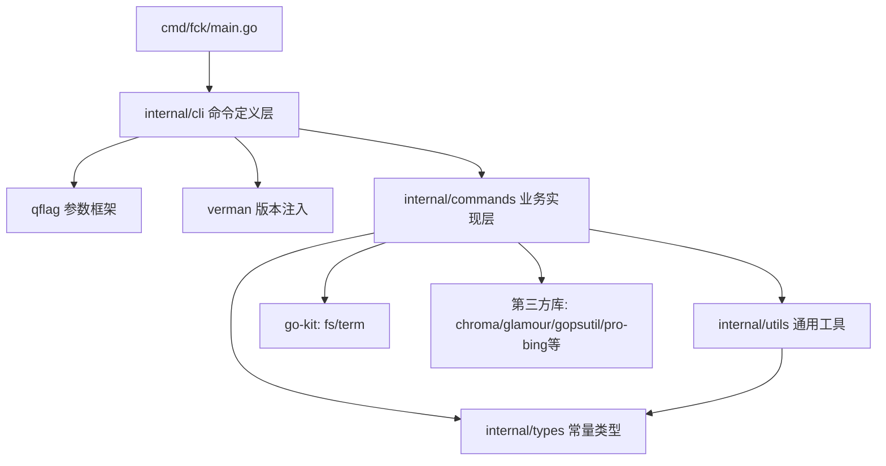

# FCK 项目分析报告

> 本文件为 `gitee.com/MM-Q/fck`（一站式跨平台命令行工具集）的静态架构分析，用于快速回忆项目核心信息。
> 分析基于当前工作区实际代码与目录，未运行程序验证，部分运行行为标注【推断】【待确认】。

---

## 一、目录结构梳理

### 1.1 总体目录树

```
fck/                                  # 项目根
├── cmd/
│   └── fck/main.go                   # 程序唯一入口：调用 cli.InitAndRun()，错误着色输出 + shx 退出码透传
├── internal/
│   ├── cli/                          # 【命令定义层】每个命令一个文件，qflag 命令注册与参数声明
│   │   ├── root.go                   # 根命令：汇总全部 49 个顶层子命令、logo、completion、版本
│   │   ├── <cmd>.go                  # 约 49 个子命令定义（pack/preview/unpack/grep/sed/awk/...）
│   │   └── tcp/                      # tcp 命令的内部组件（client.go / scan.go / server.go）
│   ├── commands/                     # 【业务实现层】每个命令一个子目录，遵循 cmd_<cmd>.go + types.go 命名
│   │   ├── awk/    ├── grep/         # 文本处理类实现
│   │   ├── tcp/                      # 网络工具实现（cmd_tcp.go + client/server/scanner 组件）
│   │   └── ...                       # 共 50 个子命令目录
│   ├── types/                        # 【类型/常量层】集中管理命令共享常量、类型、映射
│   │   ├── types.go                  # 通用常量：编码/换行/哈希/缓冲区、系统文件过滤表
│   │   ├── command.go                # 各命令类型常量：find 类型、DNS 类型、TCP 输出格式
│   │   ├── format.go                 # 语法高亮常量、表格样式映射
│   │   ├── compress_type.go          # 压缩格式类型
│   │   ├── checksum_header.go        # 校验头
│   │   └── logo.go                   # ASCII Logo
│   └── utils/                        # 【通用工具层】跨模块共享函数
│       ├── utils.go                  # 正则构建、错误包装、系统文件判断
│       ├── color.go                  # 按文件类型/扩展名着色输出
│       └── color_ext.go              # 扩展颜色工具（约 15KB）
├── docs/                             # 命令设计文档库（90+ 份 *_design.md / 重构计划），设计驱动开发痕迹明显
├── fck-skill/                        # AI 技能包（SKILL.md + evals/evals.json），随 release 打包分发
├── .trae/
│   ├── rules/                        # git-commit-message.md 提交规范
│   ├── specs/<功能>/                 # 每功能 spec.md + checklist.md + tasks.md 三件套
│   ├── plans/ 和 documents/          # 方案文档与缺陷/变更记录
├── build.py                          # Python 构建脚本：多平台交叉编译、版本注入、打包 zip
├── Rnx.toml                          # rnx 任务编排：build/clean/test/release 等任务
├── CLAUDE.md                         # AI 编码协作通用规范
├── go.mod / go.sum                   # Go 模块定义
├── README.md                         # 项目说明与命令帮助
└── LICENSE                           # GPL-3.0
```

### 1.2 目录规范程度评估

- **分层清晰**：`cli`（定义）→ `commands`（实现）→ `types`/`utils`（支撑）三层职责边界明确，符合 Go CLI 工程常见实践（类似 Cobra 的 cmd/internal 布局）。
- **命名规范统一**：`internal/cli` 下每个命令文件、变量名（`XCmd`、run 函数）高度一致；`commands` 下统一 `cmd_xx.go` + `types.go`。
- **文档规范度高**：`docs/` 与 `.trae/specs/` 形成「设计文档 + spec/checklist/tasks」的报告式开发流程，规范程度超出一般项目【标准偏高】。
- **冗余点**：`internal/types/command.go` 中 `ListTypeLimits`、`FindLimits` 存在大量被注释掉的重复条目（冗余代码）；`internal/utils/utils.go:72-74` 的 `regexp.QuoteMeta` 转义逻辑被注释。规范程度：整体良好，局部有清理空间。

---

## 二、核心功能模块识别

### 2.1 模块清单（模块 - 核心功能 - 对应代码）

| 编号 | 模块 | 核心功能 | 核心代码 |
|------|------|----------|----------|
| M1 | 入口编排 | 初始化、panic 兜底、错误着色输出、退出码透传 | `cmd/fck/main.go`、`internal/cli/root.go` |
| M2 | 文本处理 | grep/sed/awk/wc/tr/head/tail 类 Unix 文本操作 | `internal/commands/grep|sed|awk|wc|tr|head|tail/` |
| M3 | 文件操作 | pack/unpack/preview/check/find/list/size/cp/mv/rm 等 | `internal/commands/pack|unpack|preview|check|find|list|size/` 等 |
| M4 | 网络工具 | ping/dns/tcp(scan/client/server)/curl | `internal/commands/ping|dns|tcp/`、`internal/cli/tcp.go` |
| M5 | 系统监控 | proc/port/df/size/watch | `internal/commands/proc|port|df|watch/` |
| M6 | 开发辅助 | json/base64/hex2str/iconv/newline/hash/seq | `internal/commands/json|base64|hex2str|iconv|newline|hash/` |
| M7 | Shell 工具 | shx 执行、shfmt/shck 格式化检查 | `internal/commands/shx|shfmt|shck/` |
| M8 | Git 元数据 | 解析 Git 仓库版本/提交/状态（用于版本注入） | `internal/commands/gm/`、`internal/cli/gm.go` |
| M9 | 基础支撑 | 类型常量、共享工具、彩色输出、编码转换 | `internal/types/`、`internal/utils/` |

### 2.2 基础支撑模块 vs 业务核心模块

- **基础支撑**：M9（types/utils 支撑层）、M7 的 `internal/cli/tcp/`（组件库，可被 tcp 命令复用）。
- **业务核心**：M2–M8，其中 M4 网络、M2 文本处理为复杂度与实现量最高的模块（grep 实现约 18KB、tcp 组件达 6 个文件）。

### 2.3 模块输入/输出与核心依赖

- 均以「标准输入（管道）或文件路径」为输入，尊重 Unix 管道范式（多个命令判断 `term.IsStdinPipe()` 优先读管道，如 `commands/awk/cmd_awk.go`），以着色的标准输出为输出。
- 核心资源依赖：第三方库（详见第四章）、自研 gitee.com/MM-Q 系列库；tcp 模块存在内部组件依赖（`internal/cli/tcp.go` 依赖 `internal/cli/tcp/{Scan,Client,Server}Cmd`）。
- 无外部数据库、无独立配置/持久化存储【仅有命令行参数与文件交互】。

---

## 三、模块间依赖关系分析

### 3.1 依赖层级（自上而下单向依赖，无明显反向）

```
cmd/fck/main.go
      │ 调用
      ▼
internal/cli · root.go ──► qflag 框架 + verman（版本）+ types（logo）
      │ 每个命令 init() 注册 XCmd，root.go 汇总
      ▼
internal/commands/<cmd>/     ◄── cli 层仅完成参数→config 映射后委托
      │
      ├─► internal/types      （常量/类型/映射）
      ├─► internal/utils      （着色/正则/错误包装）
      ├─► gitee.com/MM-Q/go-kit（fs 通配符展开、term 管道检测）
      └─► 各类第三方库
```

### 3.2 依赖关系 Mermaid 图



### 3.3 依赖问题识别

- **依赖层级合理**：`types` 被 `utils` 与 `commands` 共同依赖，但 `types` 不反向依赖上层，无循环依赖【确认：types 仅引 os/embedded/第三方表格库】。
- **高耦合于自研框架**：命令定义深度依赖自研 `qflag`（命令/参数/互斥组/中英文帮助均由它完成），若框架 API 变更将波及全部 50 个命令定义文件【潜在风险】。
- **同名命令多处引用**：`tcp` 出现于顶层命令（`internal/cli/tcp.go`）与实现包（`internal/commands/tcp/`）及组件包（`internal/cli/tcp/`），包名 `tcp` 复用，需注意导入路径区分【已有包冲突隐患，靠不同 import 路径规避】。

---

## 四、设计模式与实现逻辑

### 4.1 识别到的设计模式

| 模式 | 应用场景 | 代码位置 |
|------|----------|----------|
| 命令模式 | 每个子命令封装为 `qflag.Command` 并 `SetRun(runXxx)` | `internal/cli/*.go`（如 `awk.go:70`） |
| 注册表/收集器 | `init()` 中实例化命令变量并汇总到根命令 `SubCmds` | `internal/cli/awk.go:21-71`、`root.go:30-81` |
| 适配器模式 | 包装 `os.DirEntry` 复用 find 处理逻辑 | `internal/types/types.go:121-130`（`DirEntryWrapper`） |
| 控制器+服务分离（分层） | cli 层仅做参数解析/映射，commands 层做纯业务 | `awk.go` run 函数与 `commands/awk/cmd_awk.go` |
| 配置中心/常量集中 | 共享常量、可变映射集中管理 | `internal/types/*.go` |
| Mutex 互斥组 | 显式声明互斥参数（awk 的 field/chars） | `internal/cli/awk.go:57-63` |

### 4.2 核心业务逻辑流程示例（awk 命令）

典型命令实现遵循「注册 → 参数映射 → 业务实现 → 流式处理」链路：

1. **命令注册**：`init()` 中 `qflag.NewCmd("awk", ...)`，声明 `-p/-f/-c/-F/-O/-n` 参数，注册互斥组。
2. **入参映射**：`runAwk` 将 qflag 参数读取后组装为 `awk.AwkConfig`（`internal/cli/awk.go:73-98`）。
3. **输入分流**：`AwkCmdMain` 优先识别管道（`term.IsStdinPipe()`），否则通配符展开文件（`fs.Expand`）（`internal/commands/awk/cmd_awk.go:23-57`）。
4. **流式处理**：`bufio.NewReader` 逐行读取（支持任意行长度，避免 `Scanner` 的 64KB 限制），逐行正则匹配 → 字段/字符提取 → 拼接输出（`cmd_awk.go:91-122`）。

### 4.3 逻辑质量评估

- **流式与内存优化到位**：核心命令多采用 `bufio` 流式逐行处理，配合 `types.go` 中的缓冲区上限常量（默认 10MB），大文件友好【优点】。
- **管道范式统一**：多命令统一支持 stdin 管道，符合 Unix 工具心智。
- **硬编码/冗余**：`types/command.go` 大量注释残留；部分错误提示沿用英文（`invalid pattern`、`cannot open file`）与中文帮助混杂，本地化不完全一致【待优化】。

---

## 五、技术栈评估

### 5.1 技术栈清单

| 类别 | 技术 | 版本 | 说明 |
|------|------|------|------|
| 语言 | Go | `go 1.25.0`（go.mod 声明） | 跨平台（Windows/Linux/macOS） |
| CLI 框架 | **gitee.com/MM-Q/qflag**（自研） | v0.5.21 | 参数解析、子命令、互斥组、completion、中英文帮助 |
| 彩色输出 | gitee.com/MM-Q/color（自研） | v1.0.3 | ANSI 彩色输出 |
| 压缩 | gitee.com/MM-Q/comprx（自研） | v0.1.9 | pack/unpack 底层 |
| Shell 执行 | gitee.com/MM-Q/shx（自研） | v1.0.3 | `shx` 命令、退出码透传 |
| 版本注入 | gitee.com/MM-Q/verman（自研） | v0.0.20 | `-ldflags -X` 注入版本/提交/时间 |
| 通用工具 | gitee.com/MM-Q/go-kit（自研） | v0.0.25 | fs 通配符、term 管道检测 |
| 语法高亮 | alecthomas/chroma/v2 | v2.23.1 | cat/md 高亮 |
| Markdown 渲染 | charmbracelet/glamour | v0.8.0 | `md` 命令 |
| 终端表格 | jedib0t/go-pretty/v6 | v6.6.8 | 表格输出 |
| 终端分页/输入 | noborus/ov、chzyer/readline | v0.51.1 / v1.5.1 | 分页查看、交互输入 |
| Ping | prometheus-community/pro-bing | v0.8.0 | ICMP |
| 系统监控 | shirou/gopsutil/v3 | v3.24.5 | proc/df/cpu 等 |
| 进度条 | schollz/progressbar/v3 | v3.19.0 | 进度显示 |
| JSON | tidwall/gjson、sjson | v1.18.0 / v1.2.5 | `json` 命令 |
| Shell 解析 | mvdan.cc/sh/v3 | v3.13.1 | shfmt/shck |
| 编码转换 | golang.org/x/text | v0.37.0 | iconv |
| 构建 | build.py + **rnx**（Rnx.toml）+ upx + golangci-lint | — | 双轨构建/检查 |

### 5.2 技术栈适配性评估

- **适配良好**：Go 非常适合此类 Cross-platform CLI 工具集；流式 IO + 纯内存处理契合文本工具场景。
- **依赖生态自研化集中**【需关注】：约 7 个核心依赖为作者自研库（`gitee.com/MM-Q/*`），社区风险与文档维护风险集中于个人/小团队；若关注可持续性需评估这些库的测试与发布节奏【待确认维护活跃度】。
- **可选简化点**：并行存在两套构建方案（`build.py` 与 `Rnx.toml`），功能重叠，存在维护双份成本【待优化】。
- 依赖整体为活跃开源生态组件（chroma/glamour/gopsutil 等），无明确已停止维护的组件【gopsutil 已被作者归档维护，属可接受的稳定库】。

---

## 六、补充分析项

### 6.1 代码规范
- 命名规范统一（命令变量 `XCmd`、config 结构、`runXxx` 函数）。
- 注释规范：函数级中文注释格式高度统一（含参数/返回值/注意事项分块），质量高，符合「函数级注释」要求。
- 代码风格：依赖 `golangci-lint fmt/run`（Rnx.toml 的 fc 任务），有 CI 级强制。

### 6.2 异常处理
- 顶层 `panic` 兜底：`root.go` 的 `defer recover` 捕获 panic 并转错误输出【good】。
- 命令层错误统一向调用方冒泡，支持 `shx` 退出码透传（`main.go:17`）。
- 边缘场景：管道/文件分流、EOF 末行处理、二进制/编码检测均有考虑。

### 6.3 扩展性
- 新增命令成本低：在 `commands/<cmd>/` 实现 + 在 `cli/<cmd>.go` 定义并挂入 `root.go` 的 `SubCmds` 即可，符合「命令模式」扩展范式。
- 大量设计文档（docs/）保证重构可追溯，扩展有章可循。

### 6.4 性能关键点
- 文本命令以 `bufio` 流式逐行为主，避免整文件载入【良好】。
- 需关注点：`grep`/`sed` 等对每个匹配行即时 `fmt.Println` 行级输出，高频小输出在极大数据集下可能成为 IO 瓶颈【待评估】。
- 端口扫描（tcp/scanner.go）已含并发设置字段（`Concurrent`），采用并发扫描【良好】。

---

## 七、总结与结论

### 7.1 项目核心特点
1. 纯 Go 构建的跨平台一站式 CLI 工具集，覆盖文本/文件/网络/系统/开发辅助五大类，顶层命令 49 个。
2. 架构分层清晰：命令定义层（`internal/cli`）与业务实现层（`internal/commands`）解耦，扩展命令成本低。
3. 深度自研生态：CLI 框架 qflag、着色 color、压缩 comprx、shell 执行 shx、版本 verman、工具包 go-kit 均为自研，形成个人工具链。
4. 设计驱动开发：90+ 设计文档 + spec/checklist/tasks 三件套，文档规范度显著高于一般项目。
5. 工程基建完善：`Rnx.toml` + `build.py` 双构建、交叉编译、upx 压缩、`golangci-lint`、版本 ldflags 注入、中英文帮助与 completion。

### 7.2 待优化点
1. 测试覆盖薄弱：50 个命令子目录仅 5 个 `*_test.go`（约集中在 tcp 等核心），核心命令缺单元/集成测试。
2. 自研库依赖集中（qflag 等），框架变更波及面大，建议评估长期维护与替代方案。
3. 冗余代码残留：`types/command.go` 与 `utils/utils.go` 存在被注释代码与重复结构。
4. 双构建方案（build.py 与 Rnx.toml）功能重叠，宜收敛为一套。
5. 交互式/网络类命令（tcp、curl、ping）复杂度高，缺少统一超时与取消语义的集中封装（部分在前端配置体现）。

### 7.3 初始静态分析关键结论（非变更记录）
- 命令注册范式：`internal/cli/<cmd>.go` 的 `init()` 定义 `XCmd`，`root.go` 收集入 `SubCmds`，委托 `internal/commands/<cmd>/` 实现。
- 文本处理统一范式：优先 stdin 管道（`term.IsStdinPipe`）→ 通配符展开（`fs.Expand`）→ `bufio` 流式逐行。
- 常量/类型集中在 `internal/types`，跨命令共享；`internal/utils` 提供着色与正则等通用能力。
- 版本信息经 `verman` + `-ldflags -X` 注入；`gm` 命令负责读取 Git 元数据供注入。
- 依赖关系为单向分层，无循环依赖；`types` 为最底层被依赖的公共基础。

---

## 八、维护规范

1. **第 1-9 章反映项目当前状态**，代码发生结构性变化时更新（新增模块、架构重构、重要功能等）
2. **记忆点顺序**：编号 1（最旧）→ 10（最新），从上到下按时间升序排列。新增记忆点时严格执行以下三步：
   - **第一步**：删除最旧的条目（即 `记忆点 1`）
   - **第二步**：将剩余条目顺移重新编号（原 2→1、原 3→2、……、原 10→9）
   - **第三步**：在末尾追加新条目作为 `记忆点 10`
3. **上限 10 条**，不得超出。禁止在顶部或中间插入新条目，新条目只追加在末尾
4. **所有文件引用必须使用项目相对路径**（如 `src/utils/helper.go`），禁止绝对路径
5. **不要记录文件行数/大小统计**，此类信息变化频繁无维护价值
6. **详细的变更记录请写入项目内其他文档目录**，本文件仅作快速参考

---

## 九、记忆点

1. **doc2md 命令上线**：新增 `doc2md` 命令（`internal/commands/doc2md/`、`internal/cli/doc2md.go`，依赖自研 `gitee.com/MM-Q/doc2md`），将 docx/xlsx/xls/pptx/pdf/epub/html/csv/ipynb/rss/zip/纯文本转 Markdown；支持文件路径与 stdin 管道；`-o` 写出文件、`--keep-data-uris` 控制图片内嵌。
2. **doc2md 管道二进制失败根因**：给 `doc2md` 管道输入 PDF 等二进制报「No readable text」是 **Windows PowerShell 文本管道破坏字节**所致，非代码缺陷——doc2md 的 PDF 转换器按内存字节加载、不依赖文件路径；二进制文档应走文件路径而非管道。
3. **doc2md -x 枚举化**：`-x/--extension` 为 qflag `Enum` 标志，枚举首项哨兵 `DocExtNone("none")` 作默认值（在 `internal/commands/doc2md/types.go`），管道输入未显式指定 `-x` 时命中 none 即报错；枚举自带值限制 + 补全、免手写校验，与 `iconv`/`newline` 的 `*None` 哨兵模式一致。
4. **枚举帮助统一用 qflag.EnumHelp**：qflag（v0.5.21）提供 `qflag.EnumHelp(desc, options, indent)` 生成枚举 desc 帮助，支持 `"值"` 与 `"值: 描述"` 两种形态，自动对齐方框；`options` 的值须与 `allowedValues` 一致（如 pack 压缩级别真实值为 `huffman-only`，帮助不能误写 `huffman`）；共享选项切片集中在 `internal/types`（`TableStyleOptions`/`CompressionLevelOptions`/`ProgressStyleOptions`）；find/list 的 `--type` 为「短名|长名」别名多值形态，EnumHelp 不适用，仍手写。