# FCK - 文件系统命令行工具集 项目分析报告

## 一、项目概述

FCK是一个用Go语言开发的多功能文件系统命令行工具集，提供了文件哈希计算、大小统计、高级查找、目录列表、完整性校验、文件打包解包、压缩包预览和命令监控等功能。该项目采用模块化设计，每个功能作为独立的子命令实现，具有良好的扩展性和维护性。

### 1.1 项目基本信息
- **项目名称**: FCK (文件系统命令行工具集)
- **开发语言**: Go 1.25.0
- **项目类型**: 命令行工具
- **许可证**: GNU General Public License v3.0
- **代码仓库**: gitee.com/MM-Q/fck
- **构建工具**: Python build.py
- **支持平台**: Windows、Linux、macOS

### 1.2 项目定位
FCK定位为一个功能全面、性能高效的文件系统操作工具集，旨在替代和增强传统的Unix/Linux文件操作命令（如ls、find、cp、mv等），提供更现代化的用户体验和更强大的功能特性。

---

## 二、目录结构分析

### 2.1 项目根目录结构

```
fck/
├── cmd/                           # 程序入口目录
│   └── main.go                    # 程序入口点
├── internal/                      # 内部核心代码目录
│   ├── cli/                       # CLI命令定义目录
│   │   ├── root.go                # 根命令定义和初始化
│   │   ├── hash.go                # hash命令CLI定义
│   │   ├── size.go                # size命令CLI定义
│   │   ├── find.go                # find命令CLI定义
│   │   ├── list.go                # list命令CLI定义
│   │   ├── check.go               # check命令CLI定义
│   │   ├── pack.go                # pack命令CLI定义
│   │   ├── unpack.go              # unpack命令CLI定义
│   │   ├── preview.go             # preview命令CLI定义
│   │   ├── watch.go               # watch命令CLI定义
│   │   ├── date.go                # date命令CLI定义
│   │   ├── echo.go                # echo命令CLI定义
│   │   ├── rm.go                  # rm命令CLI定义
│   │   ├── mkdir.go               # mkdir命令CLI定义
│   │   ├── touch.go               # touch命令CLI定义
│   │   ├── chmod.go               # chmod命令CLI定义
│   │   ├── pwd.go                 # pwd命令CLI定义
│   │   ├── home.go                # home命令CLI定义
│   │   ├── truncate.go            # truncate命令CLI定义
│   │   ├── cp.go                  # cp命令CLI定义
│   │   ├── mv.go                  # mv命令CLI定义
│   │   └── test.go                # test命令CLI定义
│   ├── commands/                  # 命令业务逻辑目录
│   │   ├── hash/                  # hash命令业务逻辑
│   │   │   └── cmd_hash.go        # hash命令主逻辑
│   │   ├── size/                  # size命令业务逻辑
│   │   │   └── cmd_size.go        # size命令主逻辑
│   │   ├── find/                  # find命令业务逻辑
│   │   │   ├── cmd_find.go        # find命令主逻辑
│   │   │   ├── matcher.go         # 模式匹配器
│   │   │   ├── searcher.go        # 文件搜索器
│   │   │   ├── operations.go      # 文件操作器
│   │   │   ├── validator.go       # 参数验证器
│   │   │   └── color.go           # 颜色输出
│   │   ├── list/                  # list命令业务逻辑
│   │   │   ├── cmd_list.go        # list命令主逻辑
│   │   │   ├── scanner.go         # 文件扫描器
│   │   │   ├── processor.go       # 文件处理器
│   │   │   ├── formatter.go       # 格式化输出器
│   │   │   ├── models.go          # 数据模型
│   │   ├── check/                 # check命令业务逻辑
│   │   │   ├── cmd_check.go       # check命令主逻辑
│   │   │   ├── parser.go          # 校验文件解析器
│   │   │   ├── validator.go       # 校验验证器
│   │   │   └── checker.go         # 文件校验器
│   │   ├── pack/                  # pack命令业务逻辑
│   │   │   └── cmd_pack.go        # pack命令主逻辑
│   │   ├── unpack/                # unpack命令业务逻辑
│   │   │   └── cmd_unpack.go      # unpack命令主逻辑
│   │   ├── preview/               # preview命令业务逻辑
│   │   │   └── cmd_preview.go     # preview命令主逻辑
│   │   ├── watch/                 # watch命令业务逻辑
│   │   │   └── cmd_watch.go       # watch命令主逻辑
│   │   ├── mkdir/                 # mkdir命令业务逻辑
│   │   │   └── cmd_mkdir.go       # mkdir命令主逻辑
│   │   ├── touch/                 # touch命令业务逻辑
│   │   │   └── cmd_touch.go       # touch命令主逻辑
│   │   ├── rm/                    # rm命令业务逻辑
│   │   │   └── cmd_rm.go          # rm命令主逻辑
│   │   ├── cp/                    # cp命令业务逻辑
│   │   │   └── cmd_cp.go          # cp命令主逻辑
│   │   ├── mv/                    # mv命令业务逻辑
│   │   │   └── cmd_mv.go          # mv命令主逻辑
│   │   ├── chmod/                 # chmod命令业务逻辑
│   │   │   └── cmd_chmod.go       # chmod命令主逻辑
│   │   ├── pwd/                   # pwd命令业务逻辑
│   │   │   └── cmd_pwd.go         # pwd命令主逻辑
│   │   ├── home/                  # home命令业务逻辑
│   │   │   └── cmd_home.go        # home命令主逻辑
│   │   ├── truncate/             # truncate命令业务逻辑
│   │   │   └── cmd_truncate.go    # truncate命令主逻辑
│   │   ├── date/                  # date命令业务逻辑
│   │   │   └── cmd_date.go        # date命令主逻辑
│   │   ├── echo/                  # echo命令业务逻辑
│   │   │   └── cmd_echo.go        # echo命令主逻辑
│   │   ├── testcmd/               # test命令业务逻辑
│   │   │   └── cmd.go             # test命令主逻辑
│   │   ├── hash/                  # hash命令业务逻辑
│   │   │   ├── hashtasks.go       # 哈希任务处理
│   │   │   └── collectfiles.go    # 文件收集
│   │   └── size/                  # size命令业务逻辑
│   │       └── cmd_size_test.go   # size命令测试
│   ├── types/                     # 类型定义目录
│   │   ├── types.go               # 核心类型定义
│   │   ├── compress_type.go      # 压缩类型定义
│   │   ├── checksum_header.go     # 校验头定义
│   │   ├── logo.go                # Logo定义
│   │   └── APIDOC.md              # API文档
│   └── utils/                     # 工具函数目录
│       ├── utils.go               # 通用工具函数
│       ├── color.go               # 颜色工具
│       ├── color_ext.go           # 颜色扩展
│       ├── attrs_windows.go       # Windows属性处理
│       ├── attrs_unix.go          # Unix属性处理
│       └── APIDOC.md              # API文档
├── docs/                          # 文档目录
│   ├── fck-analysis.md            # 项目分析文档
│   ├── qflag规范.md               # qflag使用规范
│   ├── 新命令开发规范.md          # 新命令开发规范
│   ├── 重构计划.md                # 重构计划
│   ├── chmod-command-design.md    # chmod命令设计文档
│   ├── chown-command-design.md    # chown命令设计文档
│   ├── cp-command-design.md       # cp命令设计文档
│   ├── date-command-design.md     # date命令设计文档
│   ├── echo-command-design.md     # echo命令设计文档
│   ├── home-command-design.md     # home命令设计文档
│   ├── mkdir-command-design.md    # mkdir命令设计文档
│   ├── mv-command-design.md       # mv命令设计文档
│   ├── pwd-command-design.md      # pwd命令设计文档
│   ├── rm-command-design.md      # rm命令设计文档
│   ├── test-command-design.md     # test命令设计文档
│   ├── touch-command-design.md    # touch命令设计文档
│   └── truncate-command-design.md # truncate命令设计文档
├── gobf/                          # 构建配置目录
│   ├── dev.toml                   # 开发环境配置
│   ├── install.toml               # 安装配置
│   └── release.toml               # 发布配置
├── vendor/                        # 依赖库目录
│   ├── gitee.com/MM-Q/            # 自研依赖库
│   │   ├── colorlib/              # 颜色输出库
│   │   ├── comprx/                # 压缩解压库
│   │   ├── go-kit/                # Go工具包
│   │   ├── qflag/                 # 命令行参数解析库
│   │   └── shellx/                # Shell命令执行库
│   └── github.com/                # 第三方依赖库
│       ├── jedib0t/go-pretty/v6/  # 表格输出库
│       └── schollz/progressbar/v3/ # 进度条库
├── go.mod                         # Go模块定义文件
├── go.sum                         # 依赖校验文件
├── README.md                      # 项目说明文档
├── LICENSE                        # 许可证文件
├── CLAUDE.md                      # AI编码协作规范
├── build.py                       # 构建脚本
└── .gitignore                     # Git忽略文件配置
```

### 2.2 目录结构评估

#### 2.2.1 优点
1. **清晰的分层架构**: 
   - `cmd/` 目录包含程序入口
   - `internal/cli/` 目录包含CLI定义
   - `internal/commands/` 目录包含业务逻辑
   - `internal/types/` 和 `internal/utils/` 提供共享功能

2. **模块化设计**: 
   - 每个命令都有独立的目录和文件
   - CLI定义和业务逻辑分离
   - 便于独立开发和维护

3. **遵循Go语言规范**: 
   - 符合Go语言标准项目布局
   - 使用`internal/`目录保护内部代码
   - 合理使用`vendor/`目录管理依赖

4. **完善的文档体系**: 
   - `docs/`目录包含详细的设计文档
   - 每个命令都有对应的设计文档
   - 提供开发规范和重构计划

#### 2.2.2 改进点
1. **测试文件分散**: 
   - 测试文件分散在各模块中
   - 缺少统一的测试目录结构
   - 建议创建`tests/`目录集中管理测试

2. **缺少配置文件目录**: 
   - 配置文件分散在各处
   - 建议创建`config/`目录统一管理配置

3. **缺少示例目录**: 
   - 缺少使用示例和教程
   - 建议创建`examples/`目录提供使用示例

---

## 三、核心功能模块识别

### 3.1 基础支撑模块

#### 3.1.1 命令行解析模块 (qflag)
- **核心功能**: 提供命令行参数解析和验证
- **对应文件**: `vendor/gitee.com/MM-Q/qflag`
- **核心输入**: 命令行参数
- **核心输出**: 结构化的命令配置
- **依赖资源**: 无
- **主要特性**: 
  - 支持多种参数类型（字符串、布尔、整数、枚举等）
  - 支持中文帮助信息
  - 支持自动补全功能
  - 支持参数验证和互斥组

#### 3.1.2 颜色输出模块 (colorlib)
- **核心功能**: 提供跨平台的彩色终端输出
- **对应文件**: `vendor/gitee.com/MM-Q/colorlib`
- **核心输入**: 文本内容和颜色配置
- **核心输出**: 带颜色的文本输出
- **依赖资源**: 终端环境
- **主要特性**: 
  - 跨平台支持（Windows/Linux/macOS）
  - 丰富的颜色样式
  - 支持ANSI颜色代码
  - 自动检测终端颜色支持

#### 3.1.3 压缩解压模块 (comprx)
- **核心功能**: 提供多种格式的压缩和解压功能
- **对应文件**: `vendor/gitee.com/MM-Q/comprx`
- **核心输入**: 源文件路径、目标路径、压缩选项
- **核心输出**: 压缩包或解压后的文件
- **依赖资源**: 文件系统
- **主要特性**: 
  - 支持多种压缩格式（zip、tar、gzip等）
  - 支持进度显示
  - 支持文件过滤
  - 支持压缩级别调节

#### 3.1.4 通用工具模块 (utils)
- **核心功能**: 提供文件操作、路径处理、错误处理等通用功能
- **对应文件**: `internal/utils/*`
- **核心输入**: 文件路径、配置参数
- **核心输出**: 处理结果或错误信息
- **依赖资源**: 操作系统文件系统
- **主要特性**: 
  - 跨平台文件属性处理
  - 颜色输出工具
  - 路径处理工具
  - 错误处理工具

#### 3.1.5 类型定义模块 (types)
- **核心功能**: 定义项目中的数据结构、常量和配置
- **对应文件**: `internal/types/*`
- **核心输入**: 无
- **核心输出**: 类型定义和常量
- **依赖资源**: 无
- **主要特性**: 
  - 定义查找类型常量
  - 定义表格样式映射
  - 定义压缩类型枚举
  - 定义校验文件格式

### 3.2 业务核心模块

#### 3.2.1 文件哈希计算模块 (hash)
- **核心功能**: 计算文件和目录的哈希值，支持多种算法
- **对应文件**: 
  - `internal/cli/hash.go` - CLI定义
  - `internal/commands/hash/cmd_hash.go` - 主逻辑
  - `internal/commands/hash/hashtasks.go` - 哈希任务处理
  - `internal/commands/hash/collectfiles.go` - 文件收集
- **核心输入**: 文件路径、哈希算法类型
- **核心输出**: 文件哈希值
- **依赖资源**: 文件系统、哈希算法库
- **主要特性**: 
  - 支持MD5、SHA1、SHA256、SHA512算法
  - 支持递归处理目录
  - 支持并发计算
  - 支持写入校验文件
  - 支持进度显示

#### 3.2.2 文件大小统计模块 (size)
- **核心功能**: 计算文件和目录的磁盘占用大小
- **对应文件**: 
  - `internal/cli/size.go` - CLI定义
  - `internal/commands/size/cmd_size.go` - 主逻辑
- **核心输入**: 文件路径
- **核心输出**: 人性化的大小信息
- **依赖资源**: 文件系统、进度条库
- **主要特性**: 
  - 精确计算文件和目录大小
  - 人性化显示（B/KB/MB/GB/TB）
  - 支持进度显示
  - 支持隐藏文件处理

#### 3.2.3 高级文件查找模块 (find)
- **核心功能**: 根据多种条件查找文件，支持正则表达式
- **对应文件**: 
  - `internal/cli/find.go` - CLI定义
  - `internal/commands/find/cmd_find.go` - 主逻辑
  - `internal/commands/find/matcher.go` - 模式匹配器
  - `internal/commands/find/searcher.go` - 文件搜索器
  - `internal/commands/find/operations.go` - 文件操作器
  - `internal/commands/find/validator.go` - 参数验证器
  - `internal/commands/find/color.go` - 颜色输出
- **核心输入**: 查找路径、匹配条件
- **核心输出**: 匹配的文件列表
- **依赖资源**: 文件系统、正则表达式库
- **主要特性**: 
  - 多条件筛选（名称、大小、时间、类型等）
  - 支持正则表达式
  - 支持并发搜索
  - 支持批量操作（删除、移动、执行命令）
  - 支持AND/OR逻辑组合

#### 3.2.4 目录列表模块 (list)
- **核心功能**: 以表格形式展示目录内容，支持多种排序和样式
- **对应文件**: 
  - `internal/cli/list.go` - CLI定义
  - `internal/commands/list/cmd_list.go` - 主逻辑
  - `internal/commands/list/scanner.go` - 文件扫描器
  - `internal/commands/list/processor.go` - 文件处理器
  - `internal/commands/list/formatter.go` - 格式化输出器
  - `internal/commands/list/models.go` - 数据模型
  - `internal/commands/list/icon.go` - 文件图标
  - `internal/commands/list/color.go` - 颜色输出
- **核心输入**: 目录路径
- **核心输出**: 格式化的目录列表
- **依赖资源**: 文件系统、表格渲染库
- **主要特性**: 
  - 多种排序方式（名称、大小、时间）
  - 彩色显示
  - 20+种表格样式
  - 详细信息（权限、用户组、修改时间）
  - 支持文件图标
  - 支持递归列表

#### 3.2.5 文件完整性校验模块 (check)
- **核心功能**: 根据哈希文件验证文件完整性
- **对应文件**: 
  - `internal/cli/check.go` - CLI定义
  - `internal/commands/check/cmd_check.go` - 主逻辑
  - `internal/commands/check/parser.go` - 校验文件解析器
  - `internal/commands/check/validator.go` - 校验验证器
  - `internal/commands/check/checker.go` - 文件校验器
- **核心输入**: 哈希文件、待校验文件
- **核心输出**: 校验结果报告
- **依赖资源**: 文件系统、哈希算法库
- **主要特性**: 
  - 支持多种哈希算法
  - 支持并发校验
  - 详细报告（通过、失败、错误统计）
  - 支持本地模式和便携模式

#### 3.2.6 文件打包模块 (pack)
- **核心功能**: 将文件和目录打包成压缩文件
- **对应文件**: 
  - `internal/cli/pack.go` - CLI定义
  - `internal/commands/pack/cmd_pack.go` - 主逻辑
- **核心输入**: 源路径、目标压缩包路径
- **核心输出**: 压缩包文件
- **依赖资源**: 文件系统、压缩库(comprx)
- **主要特性**: 
  - 支持多种压缩格式
  - 智能过滤（包含/排除模式、文件大小过滤）
  - 可调节压缩级别
  - 进度显示

#### 3.2.7 文件解包模块 (unpack)
- **核心功能**: 解压缩文件到指定目录
- **对应文件**: 
  - `internal/cli/unpack.go` - CLI定义
  - `internal/commands/unpack/cmd_unpack.go` - 主逻辑
- **核心输入**: 压缩包路径、目标目录
- **核心输出**: 解压后的文件
- **依赖资源**: 文件系统、解压缩库(comprx)
- **主要特性**: 
  - 格式自动识别
  - 选择性解压
  - 覆盖控制
  - 进度跟踪

#### 3.2.8 压缩包预览模块 (preview)
- **核心功能**: 预览压缩包内容而无需解压
- **对应文件**: 
  - `internal/cli/preview.go` - CLI定义
  - `internal/commands/preview/cmd_preview.go` - 主逻辑
- **核心输入**: 压缩包路径
- **核心输出**: 压缩包内容列表
- **依赖资源**: 文件系统、压缩库(comprx)
- **主要特性**: 
  - 内容预览
  - 详细信息
  - 限制输出数量
  - 多种模式（简洁/详细）

#### 3.2.9 命令监控模块 (watch)
- **核心功能**: 周期性执行指定命令并显示结果
- **对应文件**: 
  - `internal/cli/watch.go` - CLI定义
  - `internal/commands/watch/cmd_watch.go` - 主逻辑
- **核心输入**: 监控命令、执行间隔
- **核心输出**: 命令执行结果
- **依赖资源**: Shell环境、系统命令
- **主要特性**: 
  - 周期性执行
  - 执行次数限制
  - 超时设置
  - 多种静默模式
  - 清屏功能
  - Shell环境选择

#### 3.2.10 基础文件操作模块
包括以下基础文件操作命令：

**mkdir (目录创建)**
- **对应文件**: `internal/commands/mkdir/cmd_mkdir.go`
- **功能**: 创建目录，支持递归创建、权限设置

**touch (文件创建)**
- **对应文件**: `internal/commands/touch/cmd_touch.go`
- **功能**: 创建文件或更新文件时间戳

**rm (文件删除)**
- **对应文件**: `internal/commands/rm/cmd_rm.go`
- **功能**: 删除文件或目录，支持递归删除、强制删除

**cp (文件复制)**
- **对应文件**: `internal/commands/cp/cmd_cp.go`
- **功能**: 复制文件或目录，支持递归复制、权限保留

**mv (文件移动)**
- **对应文件**: `internal/commands/mv/cmd_mv.go`
- **功能**: 移动或重命名文件或目录

**chmod (权限修改)**
- **对应文件**: `internal/commands/chmod/cmd_chmod.go`
- **功能**: 修改文件或目录权限

**pwd (当前目录)**
- **对应文件**: `internal/commands/pwd/cmd_pwd.go`
- **功能**: 显示当前工作目录

**home (用户目录)**
- **对应文件**: `internal/commands/home/cmd_home.go`
- **功能**: 显示用户主目录

**truncate (文件截断)**
- **对应文件**: `internal/commands/truncate/cmd_truncate.go`
- **功能**: 截断文件到指定大小

**date (日期时间)**
- **对应文件**: `internal/commands/date/cmd_date.go`
- **功能**: 显示或设置日期时间

**echo (输出文本)**
- **对应文件**: `internal/commands/echo/cmd_echo.go`
- **功能**: 输出文本到标准输出

**test (测试命令)**
- **对应文件**: `internal/commands/testcmd/cmd.go`
- **功能**: 测试和调试命令

---

## 四、模块间依赖关系分析

### 4.1 依赖关系图

```mermaid
graph TD
    A[main.go] --> B[cli.InitAndRun]
    B --> C[cli/root.go]
    C --> D[命令路由]
    
    D --> E[cli/hash.go]
    D --> F[cli/size.go]
    D --> G[cli/find.go]
    D --> H[cli/list.go]
    D --> I[cli/check.go]
    D --> J[cli/pack.go]
    D --> K[cli/unpack.go]
    D --> L[cli/preview.go]
    D --> M[cli/watch.go]
    D --> N[cli/mkdir.go]
    D --> O[cli/touch.go]
    D --> P[cli/rm.go]
    D --> Q[cli/cp.go]
    D --> R[cli/mv.go]
    D --> S[cli/chmod.go]
    D --> T[cli/pwd.go]
    D --> U[cli/home.go]
    D --> V[cli/truncate.go]
    D --> W[cli/date.go]
    D --> X[cli/echo.go]
    D --> Y[cli/test.go]
    
    E --> Z[commands/hash]
    F --> AA[commands/size]
    G --> AB[commands/find]
    H --> AC[commands/list]
    I --> AD[commands/check]
    J --> AE[commands/pack]
    K --> AF[commands/unpack]
    L --> AG[commands/preview]
    M --> AH[commands/watch]
    N --> AI[commands/mkdir]
    O --> AJ[commands/touch]
    P --> AK[commands/rm]
    Q --> AL[commands/cp]
    R --> AM[commands/mv]
    S --> AN[commands/chmod]
    T --> AO[commands/pwd]
    U --> AP[commands/home]
    V --> AQ[commands/truncate]
    W --> AR[commands/date]
    X --> AS[commands/echo]
    Y --> AT[commands/test]
    
    Z --> BA[internal/utils]
    Z --> BB[internal/types]
    AA --> BA
    AA --> BB
    AB --> BA
    AB --> BB
    AC --> BA
    AC --> BB
    AD --> BA
    AD --> BB
    AE --> BC[comprx]
    AF --> BC
    AG --> BC
    AH --> BD[shellx]
    
    BA --> BE[colorlib]
    BA --> BF[go-kit]
    BB --> BE
    
    BG[qflag] --> C
    BH[verman] --> C
    BI[jedib0t/go-pretty] --> AC
    BJ[schollz/progressbar] --> Z
    BJ --> AA
    BJ --> AE
    BJ --> AF
```



### 4.2 依赖关系分析

#### 4.2.1 纵向依赖关系

**应用层**
- `cmd/main.go`: 程序入口，调用`cli.InitAndRun()`

**CLI层**
- `internal/cli/root.go`: 根命令定义和初始化，负责命令路由
- `internal/cli/*.go`: 各子命令的CLI定义，负责参数解析和配置

**业务逻辑层**
- `internal/commands/*`: 各子命令的业务逻辑实现
- 每个命令模块包含主逻辑文件和辅助文件（如matcher、searcher等）

**支撑层**
- `internal/utils`: 通用工具函数（文件操作、颜色输出等）
- `internal/types`: 类型定义和常量

**基础层**
- `vendor/gitee.com/MM-Q/*`: 自研基础库（qflag、colorlib、comprx等）
- `vendor/github.com/*`: 第三方基础库（go-pretty、progressbar等）

#### 4.2.2 横向依赖关系

**共享依赖**
- 所有CLI命令都依赖`qflag`进行参数解析
- 所有业务逻辑模块都依赖`internal/utils`和`internal/types`
- 大部分模块都依赖`colorlib`进行彩色输出

**功能组依赖**
- 压缩相关模块（pack/unpack/preview）共同依赖`comprx`
- 文件操作模块（mkdir/touch/rm/cp/mv）共享相似的文件操作逻辑
- 查找和列表模块共享文件扫描和匹配逻辑

#### 4.2.3 潜在依赖问题

**循环依赖**
- 未发现明显的循环依赖问题
- 模块间依赖关系清晰，单向流动

**过度依赖**
- 部分模块对`internal/utils`的依赖较重，可考虑进一步拆分
- `internal/types`包含大量定义，可考虑按功能拆分

**依赖缺失**
- 未发现明显的依赖缺失问题
- 所有必要的依赖都已正确引入

---

## 五、设计模式与实现逻辑

### 5.1 使用的设计模式

#### 5.1.1 命令模式 (Command Pattern)

**应用位置**: `internal/cli/root.go` 和各个CLI命令文件

**应用场景**: 将每个子命令封装为独立的命令对象，通过统一的接口执行

**实现方式**: 
```go
// 命令对象定义
var HashCmd *qflag.Cmd

// 初始化命令
func init() {
    HashCmd = qflag.NewCmd("hash", "h", qflag.ExitOnError)
    // 定义标志和配置
    HashCmd.SetRun(runHash)
}

// 执行函数
func runHash(cmd qflag.Command) error {
    // 业务逻辑
}
```

**优势**: 
- 新增命令只需添加新的命令对象
- 命令间相互独立，易于维护
- 支持命令的动态注册和路由

#### 5.1.2 工厂模式 (Factory Pattern)

**应用位置**: 各个子命令的初始化函数

**应用场景**: 创建和配置命令对象及其标志

**实现方式**: 
```go
// 工厂函数
func init() {
    HashCmd = qflag.NewCmd("hash", "h", qflag.ExitOnError)
    hashType = HashCmd.Enum("type", "t", "指定哈希算法", "md5", []string{"md5", "sha1", "sha256", "sha512"})
    // 更多标志定义
}
```

**优势**: 
- 统一的命令创建流程
- 配置集中管理
- 易于扩展新的命令选项

#### 5.1.3 策略模式 (Strategy Pattern)

**应用位置**: 哈希算法选择、表格样式选择、查找类型选择等

**应用场景**: 根据用户输入选择不同的算法或样式

**实现方式**: 
```go
// 策略枚举
hashType = HashCmd.Enum("type", "t", "指定哈希算法", "md5", []string{"md5", "sha1", "sha256", "sha512"})

// 策略映射
TableStyleMap = map[string]table.Style{
    "def": table.StyleDefault,
    "l":   table.StyleLight,
    // ...
}
```

**优势**: 
- 算法/样式可灵活切换
- 易于添加新的策略
- 策略间相互独立

#### 5.1.4 单例模式 (Singleton Pattern)

**应用位置**: 全局配置对象、颜色库实例等

**应用场景**: 确保全局只有一个配置实例

**实现方式**: 
```go
// 全局变量
var HashCmd *qflag.Cmd

// 初始化函数
func init() {
    HashCmd = qflag.NewCmd("hash", "h", qflag.ExitOnError)
}
```

**优势**: 
- 避免重复创建实例
- 全局状态统一管理
- 节省内存资源

#### 5.1.5 模板方法模式 (Template Method Pattern)

**应用位置**: 文件扫描、处理、格式化等流程

**应用场景**: 定义算法骨架，子步骤由子类实现

**实现方式**: 
```go
// 扫描器
type FileScanner struct{}

func (s *FileScanner) ScanWithOriginalPaths(...) ([]FileEntry, error) {
    // 统一的扫描流程
    // 具体实现可配置
}

// 处理器
type FileProcessor struct{}

func (p *FileProcessor) Process(files []FileEntry, opts ProcessOptions) []ProcessedFile {
    // 统一的处理流程
    // 具体处理可配置
}
```

**优势**: 
- 算法结构清晰
- 子步骤可灵活配置
- 代码复用性高

#### 5.1.6 责任链模式 (Chain of Responsibility Pattern)

**应用位置**: 文件查找的匹配器、验证器等

**应用场景**: 多个处理器依次处理请求

**实现方式**: 
```go
// 匹配器
type PatternMatcher struct {
    matchers []MatcherFunc
}

func (m *PatternMatcher) Match(entry FileEntry) bool {
    for _, matcher := range m.matchers {
        if !matcher(entry) {
            return false
        }
    }
    return true
}
```

**优势**: 
- 处理器可灵活组合
- 易于添加新的处理器
- 处理顺序可配置

### 5.2 核心业务逻辑实现

#### 5.2.1 文件哈希计算流程

```
用户输入 → CLI参数解析 → 配置验证 → 文件收集 → 并发哈希计算 → 结果输出/写入文件
```

**关键代码位置**: 
- `internal/cli/hash.go`: CLI定义和参数解析
- `internal/commands/hash/cmd_hash.go`: 主逻辑
- `internal/commands/hash/collectfiles.go`: 文件收集
- `internal/commands/hash/hashtasks.go`: 哈希任务处理

**实现细节**:
1. **参数解析**: 使用qflag解析命令行参数
2. **文件收集**: 递归扫描目录，收集所有文件
3. **并发计算**: 使用worker pool模式并发计算哈希值
4. **进度显示**: 使用progressbar库显示计算进度
5. **结果输出**: 输出到控制台或写入校验文件

**代码示例**:
```go
// 并发哈希计算
func hashRunTasksRefactored(files []string, hashType string, config HashConfig) []error {
    var wg sync.WaitGroup
    errors := make([]error, len(files))
    semaphore := make(chan struct{}, runtime.NumCPU())
    
    for i, file := range files {
        wg.Add(1)
        go func(idx int, filePath string) {
            defer wg.Done()
            semaphore <- struct{}{}
            defer func() { <-semaphore }()
            
            hash, err := calculateFileHash(filePath, hashType)
            if err != nil {
                errors[idx] = err
                return
            }
            // 处理哈希结果
        }(i, file)
    }
    
    wg.Wait()
    return errors
}
```

#### 5.2.2 文件查找流程

```
用户输入 → 参数验证 → 配置创建 → 模式匹配器 → 文件搜索器 → 结果输出/批量操作
```

**关键代码位置**: 
- `internal/cli/find.go`: CLI定义和参数解析
- `internal/commands/find/cmd_find.go`: 主逻辑
- `internal/commands/find/matcher.go`: 模式匹配器
- `internal/commands/find/searcher.go`: 文件搜索器
- `internal/commands/find/operations.go`: 文件操作器
- `internal/commands/find/validator.go`: 参数验证器

**实现细节**:
1. **参数验证**: 验证查找路径、匹配模式等参数
2. **配置创建**: 创建FindConfig对象，编译正则表达式
3. **模式匹配**: 使用正则表达式匹配文件名和路径
4. **文件搜索**: 递归搜索目录，应用匹配条件
5. **批量操作**: 支持删除、移动、执行命令等操作

**代码示例**:
```go
// 模式匹配器
type PatternMatcher struct {
    matchers []MatcherFunc
}

func NewPatternMatcher(bufferSize int) *PatternMatcher {
    return &PatternMatcher{
        matchers: make([]MatcherFunc, 0, bufferSize),
    }
}

func (m *PatternMatcher) AddMatcher(matcher MatcherFunc) {
    m.matchers = append(m.matchers, matcher)
}

func (m *PatternMatcher) Match(entry FileEntry) bool {
    for _, matcher := range m.matchers {
        if !matcher(entry) {
            return false
        }
    }
    return true
}
```

#### 5.2.3 文件列表流程

```
用户输入 → 参数验证 → 路径扩展 → 文件扫描 → 文件处理 → 格式化输出
```

**关键代码位置**: 
- `internal/cli/list.go`: CLI定义和参数解析
- `internal/commands/list/cmd_list.go`: 主逻辑
- `internal/commands/list/scanner.go`: 文件扫描器
- `internal/commands/list/processor.go`: 文件处理器
- `internal/commands/list/formatter.go`: 格式化输出器

**实现细节**:
1. **参数验证**: 验证排序选项、类型选项等参数
2. **路径扩展**: 处理通配符路径，扩展为具体路径列表
3. **文件扫描**: 扫描目录，收集文件信息
4. **文件处理**: 排序、分组、过滤文件
5. **格式化输出**: 使用表格样式格式化输出

**代码示例**:
```go
// 文件处理器
type FileProcessor struct{}

func NewFileProcessor() *FileProcessor {
    return &FileProcessor{}
}

func (p *FileProcessor) Process(files []FileEntry, opts ProcessOptions) []ProcessedFile {
    processed := make([]ProcessedFile, len(files))
    
    // 排序
    if opts.SortBy != "" {
        p.sortFiles(files, opts.SortBy, opts.Reverse)
    }
    
    // 分组
    if opts.GroupByDir || opts.GroupByPath {
        p.groupFiles(files, opts)
    }
    
    // 转换为ProcessedFile
    for i, file := range files {
        processed[i] = ProcessedFile{
            FileEntry: file,
            // 其他处理
        }
    }
    
    return processed
}
```

#### 5.2.4 文件打包流程

```
用户输入 → 参数验证 → 过滤器配置 → 压缩选项设置 → 文件打包 → 进度显示
```

**关键代码位置**: 
- `internal/cli/pack.go`: CLI定义和参数解析
- `internal/commands/pack/cmd_pack.go`: 主逻辑

**实现细节**:
1. **参数验证**: 验证源路径、目标路径等参数
2. **过滤器配置**: 配置包含/排除模式、文件大小过滤
3. **压缩选项**: 设置压缩级别、进度样式等选项
4. **文件打包**: 调用comprx库进行打包
5. **进度显示**: 显示打包进度和状态

**代码示例**:
```go
// 打包配置
filter := comprx.FilterOptions{
    Include: config.IncludePatterns,
    Exclude: config.ExcludePatterns,
    MinSize: config.MinSize,
    MaxSize: config.MaxSize,
}

opts := comprx.Options{
    CompressionLevel:      compressionLevelVal,
    OverwriteExisting:     config.Overwrite,
    ProgressEnabled:       config.Progress,
    ProgressStyle:         progressStyleVal,
    DisablePathValidation: config.NoValidate,
    Filter:                filter,
}

if packErr := comprx.PackOptions(config.PackPath, config.SrcPath, opts); packErr != nil {
    return packErr
}
```

### 5.3 代码逻辑评估

#### 5.3.1 优点

**模块化设计**
- 各功能模块职责清晰，耦合度低
- CLI定义和业务逻辑分离
- 易于独立开发和维护

**错误处理**
- 完善的错误处理机制
- 提供友好的错误提示
- 全局panic恢复机制

**并发处理**
- 合理使用goroutine提高处理性能
- 使用worker pool模式控制并发数量
- 使用sync.WaitGroup等待并发完成

**用户体验**
- 丰富的命令行选项
- 彩色输出提升可读性
- 进度条显示处理进度
- 多种表格样式可选

#### 5.3.2 改进点

**硬编码问题**
- 部分配置和常量硬编码在代码中
- 可考虑提取到配置文件
- 建议使用配置文件管理复杂配置

**日志系统**
- 缺少统一的日志系统
- 不利于问题排查和调试
- 建议引入结构化日志库

**测试覆盖**
- 缺少单元测试和集成测试
- 代码质量保障不足
- 建议增加测试用例覆盖率

**资源管理**
- 缺少资源限制机制
- 大文件处理可能导致内存压力
- 建议增加内存和并发数量限制

---

## 六、技术栈评估

### 6.1 核心技术栈

#### 6.1.1 编程语言与运行环境

**Go 1.25.0**
- **用途**: 主开发语言
- **优势**: 
  - 高性能并发处理能力
  - 编译后的单文件部署
  - 跨平台支持
  - 丰富的标准库
- **潜在问题**: Go 1.25.0尚未正式发布，可能存在兼容性问题

**CGO_ENABLED=0**
- **用途**: 禁用CGO
- **优势**: 
  - 提高编译效率
  - 增强可移植性
  - 简化依赖管理

#### 6.1.2 命令行处理

**qflag v0.5.9**
- **用途**: 命令行参数解析
- **特点**: 
  - 自研库，针对项目需求定制
  - 支持多种参数类型
  - 支持中文帮助信息
  - 支持自动补全功能
  - 支持参数验证和互斥组
- **优势**: 
  - 功能丰富，贴合项目需求
  - 与项目其他模块配合良好
  - 持续维护和更新

#### 6.1.3 用户界面

**colorlib v1.3.2**
- **用途**: 跨平台彩色输出
- **特点**: 
  - 自研库，支持多平台
  - 丰富的颜色样式
  - 自动检测终端颜色支持
- **优势**: 
  - 跨平台兼容性好
  - 颜色输出效果美观

**go-pretty/v6 v6.6.8**
- **用途**: 表格输出和进度条
- **特点**: 
  - 支持多种表格样式
  - 支持进度条显示
  - 输出格式美观
- **优势**: 
  - 社区活跃，维护良好
  - 功能丰富，易于使用

**progressbar/v3 v3.19.0**
- **用途**: 进度条显示
- **特点**: 
  - 支持多种进度条样式
  - 支持自定义样式
  - 支持进度百分比显示
- **优势**: 
  - 社区活跃，维护良好
  - 样式丰富，用户体验好

#### 6.1.4 文件处理

**comprx v0.1.6**
- **用途**: 压缩解压
- **特点**: 
  - 自研库，支持多种格式
  - 支持文件过滤
  - 支持进度显示
  - 支持压缩级别调节
- **优势**: 
  - 功能贴合项目需求
  - 与项目其他模块配合良好
  - 持续维护和更新

**go-kit v0.0.15**
- **用途**: 哈希计算等基础工具
- **特点**: 
  - 提供哈希计算功能
  - 提供文件操作工具
  - 提供字符串处理工具
- **优势**: 
  - 功能实用，代码质量高
  - 持续维护和更新

**shellx v1.0.18**
- **用途**: Shell命令执行
- **特点**: 
  - 支持多种Shell环境
  - 支持命令超时控制
  - 支持命令输出捕获
- **优势**: 
  - 功能实用，易于使用
  - 持续维护和更新

#### 6.1.5 构建与发布

**build.py**
- **用途**: Python构建脚本
- **特点**: 
  - 支持多平台交叉编译
  - 支持开发/安装/发布模式
  - 支持版本管理
- **优势**: 
  - 构建流程自动化
  - 支持多种构建模式

**verman v0.0.19**
- **用途**: 版本管理
- **特点**: 
  - 自动版本号生成
  - 支持版本信息嵌入
- **优势**: 
  - 版本管理自动化
  - 版本信息准确

### 6.2 技术栈评估

#### 6.2.1 技术选型适配性

**Go语言**
- **适配性**: 非常适合命令行工具开发
- **优势**: 
  - 编译后的单文件部署，便于分发
  - 跨平台支持，一次编译多平台运行
  - 高性能并发处理，提升文件操作效率
  - 丰富的标准库，减少第三方依赖
- **评估**: 技术选型合理，符合项目需求

**自研库**
- **适配性**: 针对项目需求定制，功能贴合
- **优势**: 
  - 功能定制化，满足特殊需求
  - 与项目其他模块配合良好
  - 版本更新协调一致
- **评估**: 技术选型合理，提升项目整体质量

**第三方库**
- **适配性**: 选择合理，功能实用
- **优势**: 
  - go-pretty、progressbar等库选择合理
  - 社区活跃，维护良好
  - 功能丰富，用户体验好
- **评估**: 技术选型合理，提升用户体验

#### 6.2.2 版本兼容性

**Go版本**
- **版本**: Go 1.25.0
- **状态**: 尚未正式发布（截至2025年7月）
- **潜在问题**: 
  - 可能存在兼容性问题
  - 部分特性可能不稳定
- **建议**: 
  - 考虑使用稳定版本（如Go 1.22或1.23）
  - 密切关注Go 1.25的发布动态

**依赖库版本**
- **状态**: 各依赖库版本较新
- **维护状态**: 维护状态良好
- **潜在问题**: 
  - 部分库可能存在版本兼容问题
  - 需要定期更新依赖库
- **建议**: 
  - 定期检查依赖库更新
  - 建立依赖库更新机制

#### 6.2.3 社区活跃度与维护状态

**Go语言**
- **活跃度**: 高
- **维护状态**: 长期维护有保障
- **评估**: 技术选型可靠，风险低

**自研库**
- **活跃度**: 中等
- **维护状态**: 由同一组织维护，版本更新协调一致
- **评估**: 技术选型可靠，风险低

**第三方库**
- **活跃度**: 高
- **维护状态**: 社区活跃，维护良好
- **评估**: 技术选型可靠，风险低

---

## 七、补充分析项

### 7.1 代码规范

#### 7.1.1 命名规范

**优点**
- 遵循Go语言命名规范
- 包名使用小写单词
- 变量和函数名采用驼峰命名法
- 常量使用大写字母和下划线
- 导出函数和变量首字母大写

**改进点**
- 部分变量名可以更具描述性
  - 如 `cl` 可改为 `colorLib`
  - 如 `err` 可改为 `parseErr`、`validateErr`等
- 部分缩写不够直观
  - 如 `cmd` 可改为 `command`
  - 如 `opts` 可改为 `options`

#### 7.1.2 注释规范

**优点**
- 包级别注释清晰说明了包的用途
- 导出函数有完整的注释说明
- 注释格式符合Go语言规范
- 参数和返回值说明清晰

**改进点**
- 部分复杂逻辑缺少行内注释
  - 建议在关键逻辑处添加注释
  - 建议在算法实现处添加注释
- 注释语言中英文混用
  - 建议统一使用中文或英文注释
  - 当前项目主要使用中文注释，建议继续使用中文
- 部分注释过于简单
  - 建议补充更多上下文信息
  - 建议说明设计意图和注意事项

#### 7.1.3 代码风格

**优点**
- 代码格式化一致，符合gofmt标准
- 函数长度适中，职责单一
- 代码缩进和空格使用规范
- 错误处理模式统一

**改进点**
- 部分函数参数较多
  - 建议使用结构体封装参数
  - 建议提取配置对象
- 部分函数过长
  - 建议拆分为更小的函数
  - 建议提取公共逻辑
- 部分代码重复
  - 建议提取公共函数
  - 建议使用设计模式减少重复

### 7.2 异常处理

#### 7.2.1 错误处理机制

**优点**
- 采用Go语言标准的多返回值错误处理模式
- 提供了友好的错误信息，便于用户理解
- 在`cli/root.go`中实现了全局错误恢复机制
- 使用`fmt.Errorf`包装底层错误，保留错误链

**改进点**
- 缺少错误分类和错误码系统
  - 建议定义错误类型和错误码
  - 建议实现错误分类处理
- 部分场景的错误处理可以更细致
  - 建议区分不同类型的错误
  - 建议提供更具体的错误信息
- 缺少错误日志记录
  - 建议记录错误日志
  - 建议支持日志级别

#### 7.2.2 边界条件处理

**优点**
- 对空输入、无效路径等边界条件有基本处理
- 系统文件和特殊目录有过滤机制
- 对文件不存在、权限不足等错误有处理

**改进点**
- 对超大文件、超长路径等极端情况处理不足
  - 建议添加文件大小限制
  - 建议添加路径长度限制
- 缺少资源限制机制，可能导致资源耗尽
  - 建议添加内存使用限制
  - 建议添加并发数量限制
- 对并发场景的边界条件处理不足
  - 建议添加并发安全检查
  - 建议添加竞态检测

### 7.3 扩展性

#### 7.3.1 模块扩展性

**优点**
- 模块化设计使得添加新命令相对容易
- 统一的命令接口和初始化模式
- `internal/utils`和`internal/types`提供了良好的基础支持
- 有完善的开发规范文档

**改进点**
- 缺少插件机制，无法动态加载功能
  - 建议考虑实现插件系统
  - 建议支持动态加载命令
- 命令间通信机制不足，难以实现复杂的工作流
  - 建议实现命令管道机制
  - 建议支持命令间数据流转
- 缺少钩子机制，难以在关键点插入自定义逻辑
  - 建议实现钩子系统
  - 建议支持前置和后置钩子

#### 7.3.2 配置扩展性

**优点**
- 丰富的命令行参数提供了灵活的配置选项
- 枚举类型参数便于扩展新选项
- 支持多种配置方式（命令行、环境变量）

**改进点**
- 缺少配置文件支持，高级配置场景不便
  - 建议支持配置文件（如TOML、YAML、JSON）
  - 建议支持配置文件热加载
- 环境变量支持不足
  - 建议完善环境变量支持
  - 建议支持环境变量前缀
- 缺少配置验证机制
  - 建议实现配置验证
  - 建议提供配置错误提示

### 7.4 性能关键点

#### 7.4.1 并发处理

**优点**
- 哈希计算、文件搜索等CPU密集型操作使用了并发处理
- 合理控制并发数量，避免资源竞争
- 使用worker pool模式管理goroutine

**改进点**
- 缺少动态并发数量调整机制
  - 建议根据系统资源动态调整并发数量
  - 建议实现自适应并发控制
- 内存使用优化不足，大文件处理可能导致内存压力
  - 建议使用流式处理
  - 建议限制内存使用
- 缺少并发安全检查
  - 建议添加竞态检测
  - 建议使用互斥锁保护共享资源

#### 7.4.2 I/O优化

**优点**
- 文件遍历使用了合理的缓冲区大小
- 避免了不必要的文件读取
- 支持进度显示，提升用户体验

**改进点**
- 缺少文件系统缓存利用
  - 建议利用文件系统缓存
  - 建议实现结果缓存
- 大文件处理缺少流式处理支持
  - 建议实现流式读取
  - 建议实现分块处理
- 缺少I/O错误重试机制
  - 建议实现I/O错误重试
  - 建议支持指数退避

#### 7.4.3 内存管理

**优点**
- 及时释放不再使用的资源
- 避免了明显的内存泄漏
- 使用缓冲池减少内存分配

**改进点**
- 缺少内存使用限制机制
  - 建议添加内存使用限制
  - 建议实现内存监控
- 大目录处理时内存占用可能过高
  - 建议使用流式处理
  - 建议实现分批处理
- 缺少内存泄漏检测
  - 建议添加内存泄漏检测
  - 建议使用pprof工具

---

## 八、项目核心特点

### 8.1 技术特点

**1. 纯Go实现**
- 编译后的单文件部署，便于分发
- 跨平台支持（Windows、Linux、macOS）
- 无需外部依赖，开箱即用

**2. 模块化设计**
- 功能模块独立，易于维护和扩展
- CLI定义和业务逻辑分离
- 清晰的分层架构

**3. 并发处理**
- 充分利用多核CPU提升处理性能
- 使用worker pool模式管理并发
- 合理控制并发数量，避免资源竞争

**4. 自研核心库**
- qflag：命令行参数解析库
- colorlib：跨平台彩色输出库
- comprx：压缩解压库
- 针对项目需求定制，功能贴合

**5. 丰富的用户体验**
- 彩色输出，提升可读性
- 进度条显示，实时反馈处理进度
- 20+种表格样式，个性化输出
- 中文帮助信息，降低使用门槛

### 8.2 功能特点

**1. 功能全面**
- 覆盖文件操作的各个方面
- 从哈希计算到压缩解压
- 从文件查找到目录列表
- 从文件校验到命令监控

**2. 性能优化**
- 并发处理，提升处理速度
- 智能过滤，减少不必要的操作
- 进度显示，实时反馈处理状态
- 流式处理，降低内存占用

**3. 跨平台兼容**
- 支持Windows、Linux、macOS
- 自动适配不同平台的特性
- 统一的用户体验

**4. 国际化支持**
- 中文帮助信息和错误提示
- 降低中文用户的使用门槛
- 提升用户体验

### 8.3 架构特点

**1. 清晰的分层架构**
- 应用层：程序入口
- CLI层：命令定义和参数解析
- 业务逻辑层：具体功能实现
- 支撑层：通用工具和类型定义
- 基础层：第三方库和自研库

**2. 松耦合设计**
- 模块间依赖关系清晰
- 易于单独测试和维护
- 支持模块独立开发

**3. 统一的命令接口**
- 所有子命令遵循相同的初始化模式
- 统一的参数解析方式
- 统一的错误处理机制

**4. 完善的文档体系**
- 详细的设计文档
- 清晰的开发规范
- 完整的API文档

---

## 九、待优化点

### 9.1 代码质量

**1. 增加单元测试和集成测试**
- 提高代码质量和稳定性
- 确保功能正确性
- 支持重构和优化
- 建议测试覆盖率达到80%以上

**2. 统一注释语言**
- 建议统一使用中文注释
- 提升代码可读性
- 降低维护成本

**3. 增加错误分类和错误码**
- 便于错误处理和问题排查
- 支持错误日志分析
- 提升用户体验

**4. 提取硬编码配置**
- 将硬编码的配置提取到配置文件
- 提升配置灵活性
- 便于不同环境的配置管理

### 9.2 功能增强

**1. 添加配置文件支持**
- 便于保存和复用复杂配置
- 支持TOML、YAML、JSON等格式
- 支持配置文件热加载

**2. 增加插件机制**
- 支持动态加载功能扩展
- 提升系统扩展性
- 支持第三方插件开发

**3. 实现命令管道**
- 支持命令间的数据流转
- 实现复杂的工作流
- 提升系统灵活性

**4. 增加资源限制**
- 防止资源耗尽和系统过载
- 支持内存使用限制
- 支持并发数量限制

### 9.3 性能优化

**1. 动态并发调整**
- 根据系统资源动态调整并发数量
- 实现自适应并发控制
- 提升处理效率

**2. 流式处理支持**
- 对大文件实现流式处理
- 降低内存占用
- 提升处理速度

**3. 缓存机制**
- 实现文件系统缓存利用
- 提高重复操作性能
- 减少I/O操作

**4. 内存使用优化**
- 优化大目录处理的内存占用
- 使用缓冲池减少内存分配
- 实现内存监控和限制

### 9.4 用户体验

**1. 增加交互式模式**
- 提供更友好的交互式操作界面
- 支持命令补全和历史记录
- 提升用户体验

**2. 增加操作历史**
- 保存和回放操作历史
- 支持操作审计
- 便于问题排查

**3. 增加批量操作脚本**
- 支持批量操作脚本执行
- 提升操作效率
- 支持脚本复用

**4. 增加操作撤销**
- 支持危险操作的撤销功能
- 提升系统安全性
- 减少误操作风险

---

## 十、关键记忆点

### 10.1 架构关键点

**1. 程序入口**
- `cmd/main.go`: 程序入口，调用`cli.InitAndRun()`

**2. 核心调度器**
- `internal/cli/root.go`: 核心调度器，负责命令路由和执行
- 使用`qflag.ParseAndRoute()`自动路由到子命令

**3. 通用工具库**
- `internal/utils`: 通用工具库，提供文件操作、错误处理等功能
- `internal/types`: 类型定义库，包含常量、数据结构等

**4. 模块初始化模式**
- 每个子命令提供`InitXxxCmd()`工厂函数
- 使用`init()`函数初始化命令对象
- 使用`SetRun()`设置执行函数

### 10.2 技术关键点

**1. qflag库**
- 自研命令行解析库
- 支持中文和自动补全
- 支持多种参数类型和验证

**2. colorlib库**
- 自研彩色输出库
- 提供跨平台颜色支持
- 自动检测终端颜色支持

**3. comprx库**
- 自研压缩库
- 支持多种压缩格式
- 支持文件过滤和进度显示

**4. 并发处理模式**
- 使用worker pool模式处理并发任务
- 使用`sync.WaitGroup`等待并发完成
- 使用通道控制并发数量

### 10.3 扩展关键点

**1. 添加新命令**
- 在`internal/cli/`目录创建CLI定义文件
- 在`internal/commands/`目录创建业务逻辑文件
- 在`internal/cli/root.go`中注册命令

**2. 添加通用功能**
- 在`internal/utils`中添加工具函数
- 在`internal/types`中添加类型定义
- 确保功能可复用

**3. 命令行参数**
- 使用qflag库提供的各种标志类型
- 支持Bool、String、Int、Enum等类型
- 支持参数验证和互斥组

**4. 错误处理**
- 使用`fmt.Errorf`包装错误
- 提供友好的错误信息
- 使用`%w`保留错误链

### 10.4 开发规范关键点

**1. 目录结构规范**
- `internal/cli/`: CLI定义目录
- `internal/commands/`: 业务逻辑目录
- 每个命令一个目录，一个主逻辑文件

**2. 命名规范**
- 命令目录：小写，如`mkdir`
- 业务逻辑文件：`cmd_<command>.go`
- CLI定义文件：`<command>.go`
- 配置结构体：`<Command>Config`
- 主函数：`<Command>CmdMain`

**3. 代码风格规范**
- 使用函数级注释
- 注释使用中文
- 错误处理使用`fmt.Errorf`
- 路径处理使用`filepath`

**4. 开发流程**
- 创建业务逻辑文件
- 编写业务逻辑
- 创建CLI定义文件
- 编写CLI定义
- 注册命令
- 编译验证

---

## 十一、项目总结

### 11.1 项目优势

**1. 技术选型合理**
- Go语言非常适合命令行工具开发
- 自研库针对项目需求定制
- 第三方库选择合理，社区活跃

**2. 架构设计清晰**
- 模块化设计，职责清晰
- 分层架构，依赖关系明确
- 易于维护和扩展

**3. 功能全面实用**
- 覆盖文件操作的各个方面
- 性能优化，用户体验好
- 跨平台支持，兼容性好

**4. 代码质量较高**
- 遵循Go语言规范
- 错误处理完善
- 注释清晰

### 11.2 项目不足

**1. 测试覆盖不足**
- 缺少单元测试和集成测试
- 代码质量保障不足
- 建议增加测试用例

**2. 日志系统缺失**
- 缺少统一的日志系统
- 不利于问题排查
- 建议引入结构化日志库

**3. 配置管理不足**
- 缺少配置文件支持
- 高级配置场景不便
- 建议支持配置文件

**4. 扩展性有限**
- 缺少插件机制
- 命令间通信不足
- 建议实现插件系统

### 11.3 发展建议

**1. 短期目标**
- 增加单元测试和集成测试
- 引入结构化日志系统
- 优化性能和内存使用
- 完善错误处理机制

**2. 中期目标**
- 支持配置文件
- 实现命令管道
- 增加插件机制
- 优化用户体验

**3. 长期目标**
- 构建插件生态
- 支持更多平台
- 提供Web界面
- 实现分布式处理

---

**分析完成时间**: 2026年3月24日  
**分析工具版本**: Trae IDE  
**项目版本**: 基于当前代码库状态  
**分析人员**: 资深技术架构师
