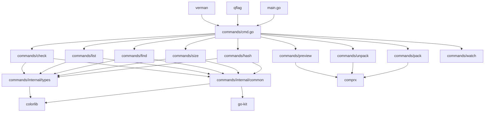

# FCK - 文件系统命令行工具集 项目分析报告

## 一、项目概述

FCK是一个用Go语言开发的多功能文件系统命令行工具集，提供了文件哈希计算、大小统计、高级查找、目录列表、完整性校验、文件打包解包、压缩包预览和命令监控等功能。该项目采用模块化设计，每个功能作为独立的子命令实现，具有良好的扩展性和维护性。

### 1.1 项目基本信息
- **项目名称**: FCK (文件系统命令行工具集)
- **开发语言**: Go 1.25.0
- **项目类型**: 命令行工具
- **许可证**: GNU General Public License v3.0
- **代码仓库**: gitee.com/MM-Q/fck

## 二、目录结构分析

### 2.1 项目根目录结构
```
fck/
├── main.go                    # 程序入口点
├── go.mod                     # Go模块定义文件
├── go.sum                     # 依赖校验文件
├── README.md                  # 项目说明文档
├── LICENSE                    # 许可证文件
├── CLAUDE.md                  # AI编码协作规范
├── build.py                   # 构建脚本
├── commands/                  # 核心命令模块目录
├── gobf/                      # 构建配置文件目录
└── vendor/                    # 依赖库目录
```

### 2.2 核心模块目录结构
```
commands/
├── cmd.go                     # 命令调度主文件
├── flags.go                   # 全局标志配置
├── check/                     # 文件完整性校验模块
├── find/                      # 高级文件查找模块
├── hash/                      # 文件哈希计算模块
├── list/                      # 目录列表模块
├── pack/                      # 文件打包模块
├── preview/                   # 压缩包预览模块
├── size/                      # 文件大小统计模块
├── unpack/                    # 文件解包模块
├── watch/                     # 命令监控模块
└── internal/                  # 内部共享模块
    ├── common/                # 通用工具函数
    └── types/                 # 数据类型定义
```

### 2.3 目录结构评估
- **优点**: 
  - 采用清晰的模块化结构，每个功能独立成目录
  - 内部共享模块(common/types)有效减少代码重复
  - 遵循Go语言标准项目布局规范
  
- **改进点**:
  - 缺少专门的测试目录，测试文件分散在各模块中
  - 缺少docs目录用于存放详细文档

## 三、核心功能模块识别

### 3.1 基础支撑模块

#### 3.1.1 命令行解析模块 (qflag)
- **核心功能**: 提供命令行参数解析和验证
- **对应文件**: vendor/gitee.com/MM-Q/qflag
- **核心输入**: 命令行参数
- **核心输出**: 结构化的命令配置
- **依赖资源**: 无

#### 3.1.2 颜色输出模块 (colorlib)
- **核心功能**: 提供跨平台的彩色终端输出
- **对应文件**: vendor/gitee.com/MM-Q/colorlib
- **核心输入**: 文本内容和颜色配置
- **核心输出**: 带颜色的文本输出
- **依赖资源**: 终端环境

#### 3.1.3 通用工具模块 (common)
- **核心功能**: 提供文件操作、路径处理、错误处理等通用功能
- **对应文件**: commands/internal/common
- **核心输入**: 文件路径、配置参数
- **核心输出**: 处理结果或错误信息
- **依赖资源**: 操作系统文件系统

#### 3.1.4 类型定义模块 (types)
- **核心功能**: 定义项目中的数据结构、常量和配置
- **对应文件**: commands/internal/types
- **核心输入**: 无
- **核心输出**: 类型定义和常量
- **依赖资源**: 无

### 3.2 业务核心模块

#### 3.2.1 文件哈希计算模块 (hash)
- **核心功能**: 计算文件和目录的哈希值，支持多种算法
- **对应文件**: commands/hash/*
- **核心输入**: 文件路径、哈希算法类型
- **核心输出**: 文件哈希值
- **依赖资源**: 文件系统、哈希算法库

#### 3.2.2 文件大小统计模块 (size)
- **核心功能**: 计算文件和目录的磁盘占用大小
- **对应文件**: commands/size/*
- **核心输入**: 文件路径
- **核心输出**: 人性化的大小信息
- **依赖资源**: 文件系统、进度条库

#### 3.2.3 高级文件查找模块 (find)
- **核心功能**: 根据多种条件查找文件，支持正则表达式
- **对应文件**: commands/find/*
- **核心输入**: 查找路径、匹配条件
- **核心输出**: 匹配的文件列表
- **依赖资源**: 文件系统、正则表达式库

#### 3.2.4 目录列表模块 (list)
- **核心功能**: 以表格形式展示目录内容，支持多种排序和样式
- **对应文件**: commands/list/*
- **核心输入**: 目录路径
- **核心输出**: 格式化的目录列表
- **依赖资源**: 文件系统、表格渲染库

#### 3.2.5 文件完整性校验模块 (check)
- **核心功能**: 根据哈希文件验证文件完整性
- **对应文件**: commands/check/*
- **核心输入**: 哈希文件、待校验文件
- **核心输出**: 校验结果报告
- **依赖资源**: 文件系统、哈希算法库

#### 3.2.6 文件打包模块 (pack)
- **核心功能**: 将文件和目录打包成压缩文件
- **对应文件**: commands/pack/*
- **核心输入**: 源路径、目标压缩包路径
- **核心输出**: 压缩包文件
- **依赖资源**: 文件系统、压缩库(comprx)

#### 3.2.7 文件解包模块 (unpack)
- **核心功能**: 解压缩文件到指定目录
- **对应文件**: commands/unpack/*
- **核心输入**: 压缩包路径、目标目录
- **核心输出**: 解压后的文件
- **依赖资源**: 文件系统、解压缩库(comprx)

#### 3.2.8 压缩包预览模块 (preview)
- **核心功能**: 预览压缩包内容而无需解压
- **对应文件**: commands/preview/*
- **核心输入**: 压缩包路径
- **核心输出**: 压缩包内容列表
- **依赖资源**: 文件系统、压缩库(comprx)

#### 3.2.9 命令监控模块 (watch)
- **核心功能**: 周期性执行指定命令并显示结果
- **对应文件**: commands/watch/*
- **核心输入**: 监控命令、执行间隔
- **核心输出**: 命令执行结果
- **依赖资源**: Shell环境、系统命令

## 四、模块间依赖关系分析

### 4.1 依赖关系图



### 4.2 依赖关系分析

#### 4.2.1 纵向依赖关系
- **应用层**: main.go 作为程序入口，依赖 commands/cmd.go
- **命令层**: commands/cmd.go 负责调度各个子命令模块
- **功能层**: 各个子命令模块(hash/size/find等)实现具体功能
- **支撑层**: internal/common 和 internal/types 提供通用功能
- **基础层**: 第三方库提供基础能力(colorlib/qflag/comprx等)

#### 4.2.2 横向依赖关系
- 所有功能模块共同依赖 internal/common 和 internal/types
- pack/unpack/preview 模块共同依赖 comprx 压缩库
- 所有模块都可能使用 colorlib 进行彩色输出
- 所有模块使用 qflag 进行命令行参数解析

#### 4.2.3 潜在依赖问题
- **循环依赖**: 未发现明显的循环依赖问题
- **过度依赖**: 部分模块对 internal/common 的依赖较重，可考虑进一步拆分
- **依赖缺失**: 未发现明显的依赖缺失问题

## 五、设计模式与实现逻辑

### 5.1 使用的设计模式

#### 5.1.1 命令模式 (Command Pattern)
- **应用位置**: commands/cmd.go 中的命令调度逻辑
- **应用场景**: 将每个子命令封装为独立的命令对象，通过统一的接口执行
- **实现方式**: 每个子命令模块提供 InitXxxCmd() 函数创建命令对象，主调度器根据用户输入选择执行相应命令

#### 5.1.2 工厂模式 (Factory Pattern)
- **应用位置**: 各个子命令的初始化函数
- **应用场景**: 创建和配置命令对象及其标志
- **实现方式**: 如 hash.InitHashCmd()、size.InitSizeCmd() 等工厂函数负责创建和配置命令对象

#### 5.1.3 策略模式 (Strategy Pattern)
- **应用位置**: 哈希算法选择、表格样式选择等
- **应用场景**: 根据用户输入选择不同的算法或样式
- **实现方式**: 通过枚举标志和映射表实现不同策略的选择

#### 5.1.4 单例模式 (Singleton Pattern)
- **应用位置**: 全局配置对象、颜色库实例等
- **应用场景**: 确保全局只有一个配置实例
- **实现方式**: 通过全局变量和初始化函数实现

### 5.2 核心业务逻辑实现

#### 5.2.1 文件哈希计算流程
```
用户输入 → 参数验证 → 文件收集 → 并发哈希计算 → 结果输出/写入文件
```
- **关键代码位置**: commands/hash/cmd_hash.go
- **并发处理**: 使用 goroutine 实现并发哈希计算
- **进度显示**: 使用 progressbar 库显示计算进度

#### 5.2.2 文件查找流程
```
用户输入 → 参数验证 → 配置创建 → 模式匹配器 → 文件搜索器 → 结果输出
```
- **关键代码位置**: commands/find/cmd_find.go
- **模式匹配**: 使用正则表达式实现灵活的文件名和路径匹配
- **并发搜索**: 使用 goroutine 实现并发文件搜索

#### 5.2.3 文件打包流程
```
用户输入 → 参数验证 → 过滤器配置 → 压缩选项设置 → 文件打包 → 进度显示
```
- **关键代码位置**: commands/pack/cmd_pack.go
- **过滤处理**: 支持包含/排除模式、文件大小过滤
- **压缩级别**: 可调节压缩级别，平衡压缩率和速度

### 5.3 代码逻辑评估

#### 5.3.1 优点
- **模块化设计**: 各功能模块职责清晰，耦合度低
- **错误处理**: 完善的错误处理机制，提供友好的错误提示
- **并发处理**: 合理使用 goroutine 提高处理性能
- **用户体验**: 丰富的命令行选项和彩色输出提升用户体验

#### 5.3.2 改进点
- **硬编码问题**: 部分配置和常量硬编码在代码中，可考虑提取到配置文件
- **日志系统**: 缺少统一的日志系统，不利于问题排查
- **测试覆盖**: 缺少单元测试和集成测试，代码质量保障不足

## 六、技术栈评估

### 6.1 核心技术栈

#### 6.1.1 编程语言与运行环境
- **Go 1.25.0**: 主开发语言，提供高性能并发处理能力
- **CGO_ENABLED=0**: 禁用CGO，提高编译效率和可移植性

#### 6.1.2 命令行处理
- **qflag v0.4.8**: 自研的命令行参数解析库，提供丰富的参数类型和验证功能
- **特点**: 支持中文帮助信息、自动补全、参数验证等高级功能

#### 6.1.3 用户界面
- **colorlib v1.3.2**: 自研的跨平台彩色输出库
- **go-pretty/v6 v6.6.8**: 提供美观的表格输出和进度条
- **progressbar/v3 v3.18.0**: 提供丰富的进度条样式

#### 6.1.4 文件处理
- **comprx v0.1.6**: 自研的压缩解压库，支持多种格式
- **go-kit v0.0.9**: 提供哈希计算等基础工具
- **shellx v1.0.11**: 提供Shell命令执行能力

#### 6.1.5 构建与发布
- **build.py**: Python构建脚本，支持多平台交叉编译
- **verman v0.0.18**: 版本管理工具

### 6.2 技术栈评估

#### 6.2.1 技术选型适配性
- **Go语言**: 非常适合命令行工具开发，编译后的单文件部署、跨平台支持、高性能并发处理都是显著优势
- **自研库**: qflag、colorlib、comprx等自研库针对项目需求定制，提供了更贴合的功能
- **第三方库**: go-pretty、progressbar等库选择合理，提供了良好的用户体验

#### 6.2.2 版本兼容性
- **Go版本**: 使用Go 1.25.0，属于较新版本，提供了最新的语言特性
- **依赖库**: 各依赖库版本较新，维护状态良好
- **潜在问题**: Go 1.25.0尚未正式发布(截至2025年7月)，可能存在兼容性问题

#### 6.2.3 社区活跃度与维护状态
- **Go语言**: 活跃度高，长期维护有保障
- **自研库**: 由同一组织维护，版本更新协调一致
- **第三方库**: go-pretty、progressbar等库社区活跃，维护良好

## 七、补充分析项

### 7.1 代码规范

#### 7.1.1 命名规范
- **优点**: 
  - 遵循Go语言命名规范，包名使用小写单词
  - 变量和函数名采用驼峰命名法
  - 常量使用大写字母和下划线
- **改进点**:
  - 部分变量名可以更具描述性，如 `cl` 可改为 `colorLib`

#### 7.1.2 注释规范
- **优点**:
  - 包级别注释清晰说明了包的用途
  - 导出函数有完整的注释说明
- **改进点**:
  - 部分复杂逻辑缺少行内注释
  - 注释语言中英文混用，建议统一

#### 7.1.3 代码风格
- **优点**:
  - 代码格式化一致，符合gofmt标准
  - 函数长度适中，职责单一
- **改进点**:
  - 部分函数参数较多，可考虑使用结构体封装

### 7.2 异常处理

#### 7.2.1 错误处理机制
- **优点**:
  - 采用Go语言标准的多返回值错误处理模式
  - 提供了友好的错误信息，便于用户理解
  - 在commands/cmd.go中实现了全局错误恢复机制
- **改进点**:
  - 缺少错误分类和错误码系统
  - 部分场景的错误处理可以更细致

#### 7.2.2 边界条件处理
- **优点**:
  - 对空输入、无效路径等边界条件有基本处理
  - 系统文件和特殊目录有过滤机制
- **改进点**:
  - 对超大文件、超长路径等极端情况处理不足
  - 缺少资源限制机制，可能导致资源耗尽

### 7.3 扩展性

#### 7.3.1 模块扩展性
- **优点**:
  - 模块化设计使得添加新命令相对容易
  - 统一的命令接口和初始化模式
  - internal/common和internal/types提供了良好的基础支持
- **改进点**:
  - 缺少插件机制，无法动态加载功能
  - 命令间通信机制不足，难以实现复杂的工作流

#### 7.3.2 配置扩展性
- **优点**:
  - 丰富的命令行参数提供了灵活的配置选项
  - 枚举类型参数便于扩展新选项
- **改进点**:
  - 缺少配置文件支持，高级配置场景不便
  - 环境变量支持不足

### 7.4 性能关键点

#### 7.4.1 并发处理
- **优点**:
  - 哈希计算、文件搜索等CPU密集型操作使用了并发处理
  - 合理控制并发数量，避免资源竞争
- **改进点**:
  - 缺少动态并发数量调整机制
  - 内存使用优化不足，大文件处理可能导致内存压力

#### 7.4.2 I/O优化
- **优点**:
  - 文件遍历使用了合理的缓冲区大小
  - 避免了不必要的文件读取
- **改进点**:
  - 缺少文件系统缓存利用
  - 大文件处理缺少流式处理支持

#### 7.4.3 内存管理
- **优点**:
  - 及时释放不再使用的资源
  - 避免了明显的内存泄漏
- **改进点**:
  - 缺少内存使用限制机制
  - 大目录处理时内存占用可能过高

## 八、项目核心特点

### 8.1 技术特点
1. **纯Go实现**: 单文件部署，跨平台支持
2. **模块化设计**: 功能模块独立，易于维护和扩展
3. **并发处理**: 充分利用多核CPU提升处理性能
4. **自研核心库**: qflag、colorlib、comprx等自研库提供定制化功能
5. **丰富的用户体验**: 彩色输出、进度条、多种表格样式

### 8.2 功能特点
1. **功能全面**: 覆盖文件操作的各个方面，从哈希计算到压缩解压
2. **性能优化**: 并发处理、智能过滤、进度显示
3. **跨平台兼容**: 支持Windows、Linux、macOS
4. **国际化支持**: 中文帮助信息和错误提示

### 8.3 架构特点
1. **清晰的分层架构**: 应用层-命令层-功能层-支撑层-基础层
2. **松耦合设计**: 模块间依赖关系清晰，易于单独测试和维护
3. **统一的命令接口**: 所有子命令遵循相同的初始化和执行模式

## 九、待优化点

### 9.1 代码质量
1. **增加单元测试和集成测试**: 提高代码质量和稳定性
2. **统一注释语言**: 建议统一使用中文或英文注释
3. **增加错误分类和错误码**: 便于错误处理和问题排查
4. **提取硬编码配置**: 将硬编码的配置提取到配置文件

### 9.2 功能增强
1. **添加配置文件支持**: 便于保存和复用复杂配置
2. **增加插件机制**: 支持动态加载功能扩展
3. **实现命令管道**: 支持命令间的数据流转
4. **增加资源限制**: 防止资源耗尽和系统过载

### 9.3 性能优化
1. **动态并发调整**: 根据系统资源动态调整并发数量
2. **流式处理支持**: 对大文件实现流式处理，降低内存占用
3. **缓存机制**: 实现文件系统缓存利用，提高重复操作性能
4. **内存使用优化**: 优化大目录处理的内存占用

### 9.4 用户体验
1. **增加交互式模式**: 提供更友好的交互式操作界面
2. **增加操作历史**: 保存和回放操作历史
3. **增加批量操作脚本**: 支持批量操作脚本执行
4. **增加操作撤销**: 支持危险操作的撤销功能

## 十、关键记忆点

### 10.1 架构关键点
1. **commands/cmd.go**: 核心调度器，负责命令路由和执行
2. **internal/common**: 通用工具库，提供文件操作、错误处理等功能
3. **internal/types**: 类型定义库，包含常量、数据结构等
4. **模块初始化模式**: 每个子命令提供InitXxxCmd()工厂函数

### 10.2 技术关键点
1. **qflag库**: 自研命令行解析库，支持中文和自动补全
2. **colorlib库**: 自研彩色输出库，提供跨平台颜色支持
3. **comprx库**: 自研压缩库，支持多种压缩格式
4. **并发处理模式**: 使用worker pool模式处理并发任务

### 10.3 扩展关键点
1. **添加新命令**: 在commands目录下创建新模块，实现InitXxxCmd()和XxxCmdMain()函数
2. **添加通用功能**: 在internal/common中添加工具函数，在internal/types中添加类型定义
3. **命令行参数**: 使用qflag库提供的各种标志类型添加新的命令行选项

---

**分析完成时间**: 2025年7月1日  
**分析工具版本**: Trae IDE  
**项目版本**: 基于当前代码库状态