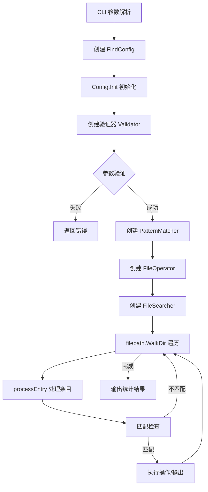
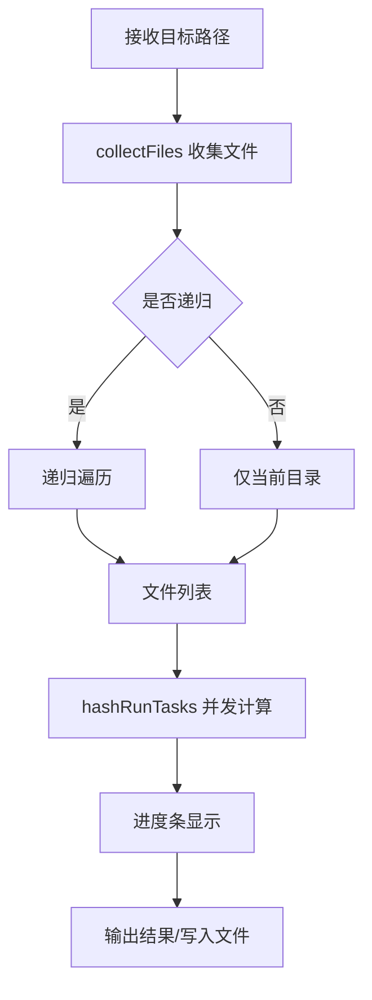

# FCK 项目架构分析报告

> **项目定位**: 一站式文件与系统管理工具集  
> **技术栈**: Go 1.25.0  
> **分析日期**: 2026-04-13  
> **分析范围**: 完整代码库（含 vendor 依赖）

---

## 一、目录结构梳理

### 1.1 整体架构概览

```
fck/
├── cmd/                      # 程序入口
│   └── main.go              # 主入口文件，负责调用 CLI 初始化
├── internal/                 # 内部实现（Go 标准项目结构）
│   ├── cli/                 # CLI 命令定义层（26个命令的 flag 定义）
│   ├── commands/            # 命令业务逻辑层（26个功能模块）
│   ├── types/               # 全局类型定义和常量
│   └── utils/               # 通用工具函数
├── docs/                    # 设计文档（35+ 个设计文档）
├── vendor/                  # 依赖库（自研组件库）
│   └── gitee.com/MM-Q/     # 组织内部依赖
│       ├── colorlib/       # 颜色输出库
│       ├── comprx/         # 压缩解压库
│       ├── go-kit/         # 工具集（fs、hash、fuzzy等）
│       ├── qflag/          # CLI 框架
│       ├── shellx/         # Shell 执行库
│       └── verman/         # 版本管理库
├── build.py                 # Python 构建脚本（跨平台编译）
├── go.mod                   # Go 模块定义
└── README.md               # 项目说明
```

### 1.2 关键目录详解

| 目录 | 用途 | 规范程度 | 说明 |
|------|------|----------|------|
| `cmd/` | 程序入口 | ⭐⭐⭐⭐⭐ | 符合 Go 项目标准结构，单一职责 |
| `internal/cli/` | CLI 命令定义 | ⭐⭐⭐⭐⭐ | 26个命令，每个命令独立文件，结构一致 |
| `internal/commands/` | 业务逻辑 | ⭐⭐⭐⭐⭐ | 按功能模块分包，职责清晰 |
| `internal/types/` | 类型定义 | ⭐⭐⭐⭐ | 集中管理全局类型和常量 |
| `internal/utils/` | 工具函数 | ⭐⭐⭐⭐ | 跨平台属性处理、颜色扩展等 |
| `docs/` | 设计文档 | ⭐⭐⭐⭐⭐ | 每个功能都有详细设计文档 |
| `vendor/` | 依赖管理 | ⭐⭐⭐⭐⭐ | 使用 vendor 模式，依赖可控 |

### 1.3 目录规范评估

**优点**:
- 严格遵循 Go 项目标准布局（Standard Go Project Layout）
- `internal/` 包确保代码不被外部导入
- 命令定义与业务逻辑分层清晰
- 设计文档完整，便于维护

**待优化**:
- `docs/` 目录文件较多，可考虑按功能分类子目录

---

## 二、核心功能模块识别

### 2.1 模块分类总览

FCK 项目包含 **26 个功能模块**，按功能领域分类如下：

#### 2.1.1 文件操作类（8个）

| 模块名称 | 核心功能 | 对应代码文件 | 核心依赖 |
|----------|----------|--------------|----------|
| **cp** | 文件/目录复制 | `cli/cp.go` + `commands/cp/cmd_cp.go` | go-kit/fs.CopyEx |
| **mv** | 文件/目录移动 | `cli/mv.go` + `commands/mv/cmd_mv.go` | go-kit/fs.MoveEx |
| **rm** | 文件/目录删除 | `cli/rm.go` + `commands/rm/cmd_rm.go` | 标准库 os.Remove |
| **mkdir** | 目录创建 | `cli/mkdir.go` + `commands/mkdir/cmd_mkdir.go` | 标准库 os.MkdirAll |
| **touch** | 文件创建/时间戳更新 | `cli/touch.go` + `commands/touch/cmd_touch.go` | 标准库 os.Chtimes |
| **truncate** | 文件截断 | `cli/truncate.go` + `commands/truncate/cmd_truncate.go` | 标准库 os.Truncate |
| **cat** | 文件内容查看 | `cli/cat.go` + `commands/cat/cmd_cat.go` | bufio.Reader |
| **list** | 目录列表（增强版 ls） | `cli/list.go` + `commands/list/*.go` | go-pretty/table |

#### 2.1.2 文件查找与处理类（3个）

| 模块名称 | 核心功能 | 对应代码文件 | 核心依赖 |
|----------|----------|--------------|----------|
| **find** | 高级文件查找 | `cli/find.go` + `commands/find/*.go` | 标准库 filepath.WalkDir |
| **grep** | 文本搜索 | `cli/grep.go` + `commands/grep/*.go` | regexp |
| **sed** | 文本替换 | `cli/sed.go` + `commands/sed/cmd_sed.go` | regexp, bufio |

#### 2.1.3 压缩解压类（3个）

| 模块名称 | 核心功能 | 对应代码文件 | 核心依赖 |
|----------|----------|--------------|----------|
| **pack** | 文件打包压缩 | `cli/pack.go` + `commands/pack/cmd_pack.go` | comprx |
| **unpack** | 文件解包解压 | `cli/unpack.go` + `commands/unpack/cmd_unpack.go` | comprx |
| **preview** | 压缩包预览 | `cli/preview.go` + `commands/preview/cmd_preview.go` | comprx |

#### 2.1.4 哈希校验类（2个）

| 模块名称 | 核心功能 | 对应代码文件 | 核心依赖 |
|----------|----------|--------------|----------|
| **hash** | 文件哈希计算 | `cli/hash.go` + `commands/hash/*.go` | go-kit/hash |
| **check** | 文件完整性校验 | `cli/check.go` + `commands/check/*.go` | go-kit/hash |

#### 2.1.5 系统信息类（4个）

| 模块名称 | 核心功能 | 对应代码文件 | 核心依赖 |
|----------|----------|--------------|----------|
| **size** | 文件/目录大小统计 | `cli/size.go` + `commands/size/*.go` | 标准库 filepath.Walk |
| **date** | 日期时间显示 | `cli/date.go` + `commands/date/cmd_date.go` | 标准库 time |
| **pwd** | 当前工作目录 | `cli/pwd.go` + `commands/pwd/cmd_pwd.go` | 标准库 os.Getwd |
| **home** | 用户主目录 | `cli/home.go` + `commands/home/cmd_home.go` | 标准库 os.UserHomeDir |

#### 2.1.6 工具类（4个）

| 模块名称 | 核心功能 | 对应代码文件 | 核心依赖 |
|----------|----------|--------------|----------|
| **echo** | 文本输出 | `cli/echo.go` + `commands/echo/cmd_echo.go` | 标准库 fmt |
| **watch** | 命令周期性执行 | `cli/watch.go` + `commands/watch/cmd_watch.go` | shellx/shx |
| **xargs** | 参数批量处理 | `cli/xargs.go` + `commands/xargs/cmd_xargs.go` | shellx/shx |
| **alias** | Shell 别名生成 | `cli/alias.go` + `commands/alias/cmd_alias.go` | embed |

#### 2.1.7 开发辅助类（2个）

| 模块名称 | 核心功能 | 对应代码文件 | 核心依赖 |
|----------|----------|--------------|----------|
| **gm** | Git 模型管理 | `cli/gm.go` + `commands/gm/cmd_gm.go` | 标准库 os/exec |
| **test** | 测试命令 | `cli/test.go` + `commands/testcmd/cmd.go` | 标准库 |

### 2.2 模块核心输入/输出

以 **find** 模块为例（最复杂的模块）：

```
输入:
  - CLI 参数: 路径、名称模式、扩展名、大小范围、修改时间等
  - 文件系统: 目标目录树

输出:
  - 匹配文件列表（stdout）
  - 操作结果（删除/移动/执行命令）
  - 统计信息（计数）

核心依赖资源:
  - 文件系统遍历能力
  - 正则表达式引擎
  - 并发执行能力（操作批量文件）
```

---

## 三、模块间依赖关系分析

### 3.1 整体依赖架构

```
┌─────────────────────────────────────────────────────────────┐
│                        应用层                                │
│  ┌─────────┐ ┌─────────┐ ┌─────────┐      ┌─────────┐      │
│  │  cmd/   │ │  cli/   │ │commands/│      │  utils/ │      │
│  │ main.go │ │ 26命令  │ │ 26模块  │      │ 通用工具│      │
│  └────┬────┘ └────┬────┘ └────┬────┘      └────┬────┘      │
│       │           │           │                │            │
│       └───────────┴───────────┴────────────────┘            │
│                           │                                  │
│                           ▼                                  │
│  ┌─────────────────────────────────────────────────────┐   │
│  │                    internal/types/                   │   │
│  │              全局类型定义、常量、配置                │   │
│  └─────────────────────────────────────────────────────┘   │
└─────────────────────────────────────────────────────────────┘
                              │
                              ▼
┌─────────────────────────────────────────────────────────────┐
│                      外部依赖层（vendor）                    │
│  ┌──────────┐ ┌──────────┐ ┌──────────┐ ┌──────────┐       │
│  │  qflag   │ │ colorlib │ │  go-kit  │ │  comprx  │       │
│  │ CLI框架  │ │颜色输出  │ │工具集    │ │压缩解压  │       │
│  └──────────┘ └──────────┘ └──────────┘ └──────────┘       │
│  ┌──────────┐ ┌──────────┐ ┌──────────┐                    │
│  │  shellx  │ │  verman  │ │ go-pretty│                    │
│  │Shell执行 │ │版本管理  │ │表格渲染  │                    │
│  └──────────┘ └──────────┘ └──────────┘                    │
└─────────────────────────────────────────────────────────────┘
```

### 3.2 核心依赖关系详解

#### 3.2.1 CLI 层 → Commands 层

所有 CLI 命令文件（`internal/cli/*.go`）都遵循相同的依赖模式：

```go
// 示例: cli/find.go
import (
    "gitee.com/MM-Q/colorlib"
    "gitee.com/MM-Q/fck/internal/commands/find"  // 依赖业务逻辑层
    "gitee.com/MM-Q/fck/internal/types"
    "gitee.com/MM-Q/qflag"
)
```

**依赖特点**:
- CLI 层只负责 flag 定义和参数解析
- 业务逻辑完全下沉到 commands 层
- 通过 Config 结构体传递参数

#### 3.2.2 Commands 层 → Utils 层

```go
// 示例: commands/find/cmd_find.go
import (
    "gitee.com/MM-Q/fck/internal/utils"  // 通用工具
)
```

**Utils 层提供的能力**:
- 正则表达式构建 (`RegexBuilder`)
- 系统文件检测 (`IsSystemFileOrDir`)
- 跨平台文件属性处理 (`attrs_*.go`)
- 颜色输出扩展

#### 3.2.3 Commands 层 → Vendor 层

| 模块 | 依赖的 Vendor 库 | 用途 |
|------|------------------|------|
| hash, check | go-kit/hash | 哈希计算 |
| cp, mv | go-kit/fs | 文件系统操作 |
| pack, unpack, preview | comprx | 压缩解压 |
| 所有命令 | colorlib | 彩色输出 |
| watch, xargs | shellx/shx | Shell 命令执行 |
| list | go-pretty | 表格渲染 |

### 3.3 依赖关系健康度评估

**优点**:
- ✅ 单向依赖，无循环依赖
- ✅ 分层清晰，职责边界明确
- ✅ 自研组件库（vendor）提高可控性
- ✅ 接口抽象良好（通过 Config 结构体解耦）

**潜在问题**:
- ⚠️ 部分模块直接依赖 colorlib，可考虑抽象日志接口
- ⚠️ vendor 目录较大，依赖更新需要同步维护

---

## 四、设计模式与实现逻辑

### 4.1 设计模式识别

#### 4.1.1 命令模式（Command Pattern）

**应用场景**: 所有 26 个 CLI 命令

**实现方式**:
```go
// 1. 命令定义（cli/find.go）
var FindCmd *qflag.Cmd
func init() {
    FindCmd = qflag.NewCmd("find", "f", qflag.ExitOnError)
    // flag 定义...
    FindCmd.SetRun(runFind)  // 设置执行函数
}

// 2. 业务逻辑（commands/find/cmd_find.go）
func FindCmdMain(cl *colorlib.ColorLib, config *FindConfig) error {
    // 具体实现...
}
```

**优点**:
- 命令定义与执行解耦
- 便于扩展新命令
- 统一的错误处理

#### 4.1.2 策略模式（Strategy Pattern）

**应用场景**: find 命令的匹配策略

**实现方式**:
```go
// commands/find/matcher.go
type PatternMatcher struct {
    cache *MatchCache
}

func (m *PatternMatcher) MatchName(name, pattern string, config *FindConfig) bool {
    // 根据配置选择匹配策略
    if config.Regex {
        return config.NameRegex.MatchString(name)
    }
    // 普通匹配...
}
```

#### 4.1.3 工厂模式（Factory Pattern）

**应用场景**: 表格样式创建

**实现方式**:
```go
// internal/types/types.go
var TableStyleMap = map[string]table.Style{
    "def":  table.StyleDefault,
    "l":    table.StyleLight,
    "r":    table.StyleRounded,
    // ... 20+ 种样式
}

func GetTableStyle(style string) (table.Style, bool) {
    s, ok := TableStyleMap[style]
    return s, ok
}
```

#### 4.1.4 建造者模式（Builder Pattern）

**应用场景**: Config 结构体的初始化

**实现方式**:
```go
// commands/find/config.go
type FindConfig struct {
    // CLI 参数
    FindPath       string
    NamePattern    string
    // ...
    
    // 运行时生成
    NameRegex      *regexp.Regexp
    MatchCount     *atomic.Int64
}

func (c *FindConfig) Init(cl *colorlib.ColorLib) error {
    // 逐步初始化各个字段
    c.Cl = cl
    c.MatchCount = &atomic.Int64{}
    // 编译正则...
    // 初始化映射...
}
```

### 4.2 核心业务逻辑流程

#### 4.2.1 文件查找流程（find 命令）



#### 4.2.2 哈希计算流程（hash 命令）



### 4.3 代码质量评估

**优点**:
- ✅ 函数职责单一，符合 SRP 原则
- ✅ 配置与逻辑分离，便于测试
- ✅ 错误处理完善，返回详细错误信息
- ✅ 并发处理合理（hash、find 等命令）

**待优化**:
- ⚠️ 部分函数较长（如 find 的 matcher），可考虑进一步拆分
- ⚠️ 部分 magic number 未定义常量（如深度限制 32）

---

## 五、技术栈评估

### 5.1 核心技术栈清单

| 类别 | 技术/库 | 版本 | 用途 | 维护状态 |
|------|---------|------|------|----------|
| **语言** | Go | 1.25.0 | 主要开发语言 | ⭐⭐⭐⭐⭐ 活跃 |
| **CLI 框架** | qflag | v0.5.15 | 命令行解析 | ⭐⭐⭐⭐⭐ 自研维护 |
| **颜色输出** | colorlib | v1.3.2 | 终端彩色输出 | ⭐⭐⭐⭐⭐ 自研维护 |
| **压缩解压** | comprx | v0.1.6 | 多格式压缩 | ⭐⭐⭐⭐⭐ 自研维护 |
| **工具集** | go-kit | v0.0.17 | FS、Hash、Pool 等 | ⭐⭐⭐⭐⭐ 自研维护 |
| **Shell 执行** | shellx | v1.0.18 | 命令执行 | ⭐⭐⭐⭐⭐ 自研维护 |
| **版本管理** | verman | v0.0.19 | 版本信息注入 | ⭐⭐⭐⭐⭐ 自研维护 |
| **表格渲染** | go-pretty | v6.6.8 | 表格输出 | ⭐⭐⭐⭐⭐ 活跃 |
| **进度条** | progressbar | v3.19.0 | 进度显示 | ⭐⭐⭐⭐ 活跃 |
| **系统调用** | golang.org/x/sys | v0.42.0 | 系统级操作 | ⭐⭐⭐⭐⭐ 官方维护 |
| **终端** | golang.org/x/term | v0.41.0 | 终端控制 | ⭐⭐⭐⭐⭐ 官方维护 |

### 5.2 技术栈选择评估

#### 5.2.1 优势分析

1. **自研组件库**: 所有核心依赖均为自研（MM-Q 组织），可控性高
2. **轻量级设计**: 无重型框架，启动快，资源占用低
3. **跨平台**: 支持 Windows/Linux/macOS，通过 build tags 区分平台代码
4. **标准库优先**: 优先使用 Go 标准库，减少外部依赖

#### 5.2.2 潜在风险

| 风险点 | 说明 | 建议 |
|--------|------|------|
| 自研库维护 | 依赖组织内部维护，人员变动可能影响更新 | 完善文档，培养维护者 |
| Go 版本较新 | 使用 Go 1.25.0，部分环境可能不支持 | 提供预编译二进制文件 |
| vendor 体积 | vendor 目录包含完整依赖，仓库较大 | 考虑使用 go mod 替代 |

### 5.3 版本兼容性

- **最低 Go 版本**: 1.25.0（使用新特性）
- **CGO**: 默认禁用（`CGO_ENABLED=0`），纯 Go 实现，跨平台兼容性好
- **架构支持**: amd64（可扩展至 arm64）

---

## 六、补充分析项

### 6.1 代码规范

#### 6.1.1 命名规范

| 类型 | 规范 | 示例 |
|------|------|------|
| 包名 | 小写，简短 | `find`, `hash`, `utils` |
| 结构体 | PascalCase | `FindConfig`, `HashConfig` |
| 接口 | PascalCase + er | `Command`, `Validator` |
| 函数 | PascalCase（导出）/ camelCase（内部） | `FindCmdMain`, `runFind` |
| 常量 | 驼峰或全大写 | `OutputFileName`, `ColorRed` |

#### 6.1.2 注释规范

**优点**:
- ✅ 所有导出函数都有完整文档注释
- ✅ 注释包含参数、返回值说明
- ✅ 使用标准 Go 文档格式

**示例**:
```go
// FindCmdMain 执行查找命令
//
// 参数:
//   - cl: 颜色库实例
//   - config: 查找配置指针
//
// 返回值:
//   - error: 查找过程中可能发生的错误
func FindCmdMain(cl *colorlib.ColorLib, config *FindConfig) error
```

#### 6.1.3 代码风格

- 使用标准 `gofmt` 格式化
- 行长度控制合理
- 错误处理优先（`if err != nil` 模式）

### 6.2 异常处理

#### 6.2.1 错误处理模式

```go
// 1. 立即返回错误
if err != nil {
    return fmt.Errorf("failed to collect files: %w", err)
}

// 2. 错误包装（提供上下文）
return fmt.Errorf("error walking directory: %v", walkDirErr)

// 3. 错误聚合（批量处理）
if len(errors) > 0 {
    printUniqueErrors(cl, errors)
}

// 4. panic 恢复（根命令）
defer func() {
    if r := recover(); r != nil {
        err = fmt.Errorf("panic: %v\n%s", r, debug.Stack())
    }
}()
```

#### 6.2.2 异常处理评估

**优点**:
- ✅ 所有错误都被捕获和处理
- ✅ 错误信息包含上下文，便于定位
- ✅ 使用 `%w` 包装错误，支持 errors.Is/As
- ✅ 批量处理时收集错误而非立即退出

**待优化**:
- ⚠️ 部分错误处理重复代码较多，可考虑抽象错误处理函数

### 6.3 扩展性评估

#### 6.3.1 新增命令扩展

添加新命令的标准流程：

1. 创建 `internal/cli/<cmd>.go` - 定义 flag
2. 创建 `internal/commands/<cmd>/cmd_<cmd>.go` - 实现逻辑
3. 在 `internal/cli/root.go` 的 `SubCmds` 中注册

**扩展难度**: ⭐⭐（简单，有明确模板）

#### 6.3.2 功能扩展示例

以 find 命令为例，添加新过滤条件：

1. 在 `FindConfig` 添加字段
2. 在 `cli/find.go` 添加 flag
3. 在 `matcher.go` 添加匹配逻辑

**扩展难度**: ⭐⭐⭐（中等，需理解匹配流程）

### 6.4 性能关键点

#### 6.4.1 并发处理

| 模块 | 并发策略 | 实现方式 |
|------|----------|----------|
| hash | 并发计算 | goroutine + channel |
| find | 并发搜索 | filepath.WalkDir（内部优化） |
| xargs | 并行执行 | sync.WaitGroup + 工作池 |
| check | 并发校验 | goroutine + channel |

#### 6.4.2 性能优化点

**已优化**:
- ✅ hash 命令使用并发计算，充分利用多核
- ✅ find 命令使用 WalkDir（比 Walk 更高效）
- ✅ 使用 sync.Pool 复用对象（go-kit/pool）
- ✅ 大目录扫描使用流式处理，避免内存溢出

**可优化**:
- ⚠️ grep 递归搜索可考虑并行化
- ⚠️ 大文件处理可考虑分块读取

#### 6.4.3 资源管理

```go
// 良好实践：使用 defer 关闭资源
file, err := os.Open(path)
if err != nil {
    return err
}
defer file.Close()

// 良好实践：context 控制超时
ctx, cancel := context.WithCancel(context.Background())
defer cancel()
```

---

## 七、总结

### 7.1 项目核心特点

1. **功能丰富**: 26 个实用命令，覆盖文件操作、查找、压缩、哈希、系统信息等领域
2. **架构清晰**: 分层设计（CLI → Commands → Utils → Vendor），职责明确
3. **自研生态**: 依赖自研组件库（qflag、colorlib、go-kit 等），可控性强
4. **跨平台**: 支持 Windows/Linux/macOS，纯 Go 实现，无 CGO 依赖
5. **高性能**: 关键路径使用并发处理，充分利用多核性能
6. **易扩展**: 新增命令有标准模板，遵循开闭原则
7. **文档完善**: 每个功能都有详细设计文档，便于维护

### 7.2 待优化点

| 优先级 | 优化项 | 说明 |
|--------|--------|------|
| P1 | grep 并行化 | 递归搜索目录时并发处理 |
| P2 | 错误处理抽象 | 统一错误处理函数，减少重复代码 |
| P3 | 常量定义 | 将 magic number 提取为常量 |
| P4 | 接口抽象 | 抽象 colorlib 依赖，便于测试 |
| P5 | 文档分类 | docs 目录按功能分类，便于查找 |

### 7.3 关键记忆点

**快速定位代码**:
- 入口: `cmd/main.go`
- 命令注册: `internal/cli/root.go`
- 命令定义: `internal/cli/<cmd>.go`
- 业务逻辑: `internal/commands/<cmd>/cmd_<cmd>.go`
- 类型定义: `internal/types/types.go`
- 工具函数: `internal/utils/utils.go`

**核心依赖**:
- CLI 框架: `gitee.com/MM-Q/qflag`
- 颜色输出: `gitee.com/MM-Q/colorlib`
- 文件操作: `gitee.com/MM-Q/go-kit/fs`
- 压缩解压: `gitee.com/MM-Q/comprx`
- Shell 执行: `gitee.com/MM-Q/shellx`

**构建命令**:
```bash
# 开发版本
python3 build.py

# 正式版本（安装到 GOPATH/bin）
python3 build.py -s -ai -f

# 发布版本
python3 build.py -batch -z
```

---

## 八、附录

### 8.1 命令清单

| 命令 | 功能 | 复杂度 |
|------|------|--------|
| hash | 文件哈希计算 | ⭐⭐⭐ |
| check | 文件完整性校验 | ⭐⭐⭐ |
| size | 文件大小统计 | ⭐⭐ |
| find | 文件查找 | ⭐⭐⭐⭐⭐ |
| list | 目录列表 | ⭐⭐⭐⭐ |
| pack | 文件打包 | ⭐⭐ |
| unpack | 文件解包 | ⭐⭐ |
| preview | 压缩包预览 | ⭐⭐ |
| watch | 命令监控 | ⭐⭐⭐ |
| cat | 文件查看 | ⭐⭐⭐ |
| grep | 文本搜索 | ⭐⭐⭐⭐ |
| sed | 文本替换 | ⭐⭐⭐ |
| cp | 文件复制 | ⭐⭐ |
| mv | 文件移动 | ⭐⭐ |
| rm | 文件删除 | ⭐⭐ |
| mkdir | 目录创建 | ⭐ |
| touch | 文件创建 | ⭐ |
| truncate | 文件截断 | ⭐ |
| pwd | 当前目录 | ⭐ |
| home | 用户主目录 | ⭐ |
| date | 日期时间 | ⭐ |
| echo | 文本输出 | ⭐ |
| xargs | 参数处理 | ⭐⭐⭐ |
| alias | 别名生成 | ⭐ |
| gm | Git 管理 | ⭐⭐ |
| test | 测试命令 | ⭐ |

### 8.2 文件统计

- Go 源文件: ~60 个
- 代码行数: ~8000+ 行（不含 vendor）
- 测试文件: 6 个（list、find、size 模块）
- 设计文档: 35+ 个

---

**报告完成时间**: 2026-04-13  
**分析师**: Claude Code  
**版本**: v1.0
