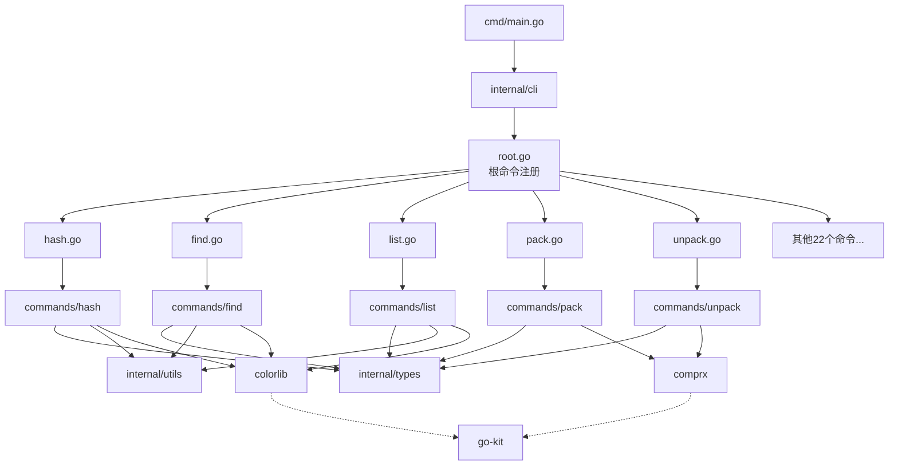

# FCK 项目分析报告

> **项目名称**: FCK - 一站式文件与系统管理工具集  
> **分析日期**: 2026-04-02  
> **Go 版本**: 1.25.0  
> **项目定位**: 现代化文件系统操作 CLI 工具集

---

## 一、目录结构梳理

### 1.1 整体目录架构

```
fck/
├── cmd/                          # 程序入口（固定）
│   └── main.go                   # 唯一入口：调用 cli.InitAndRun()
│
├── internal/                     # 私有代码（Go 标准实践）
│   ├── cli/                      # CLI 定义层（25个命令文件）
│   │   ├── root.go               # 根命令定义和子命令注册
│   │   ├── hash.go               # hash 命令定义
│   │   ├── find.go               # find 命令定义
│   │   ├── list.go               # list 命令定义
│   │   ├── pack.go               # pack 命令定义
│   │   ├── unpack.go             # unpack 命令定义
│   │   ├── preview.go            # preview 命令定义
│   │   ├── size.go               # size 命令定义
│   │   ├── check.go              # check 命令定义
│   │   ├── watch.go              # watch 命令定义
│   │   ├── cp.go                 # cp 命令定义
│   │   ├── mv.go                 # mv 命令定义
│   │   ├── rm.go                 # rm 命令定义
│   │   ├── mkdir.go              # mkdir 命令定义
│   │   ├── touch.go              # touch 命令定义
│   │   ├── cat.go                # cat 命令定义
│   │   ├── grep.go               # grep 命令定义
│   │   ├── date.go               # date 命令定义
│   │   ├── echo.go               # echo 命令定义
│   │   ├── pwd.go                # pwd 命令定义
│   │   ├── home.go               # home 命令定义
│   │   ├── truncate.go           # truncate 命令定义
│   │   ├── gm.go                 # gm 命令定义
│   │   └── test.go               # test 命令定义
│   │
│   ├── commands/                 # 业务逻辑层（按命令分目录）
│   │   ├── hash/                 # 哈希计算模块
│   │   │   ├── cmd_hash.go       # 主逻辑入口
│   │   │   ├── collectfiles.go   # 文件收集
│   │   │   └── hashtasks.go      # 哈希计算任务
│   │   ├── find/                 # 文件查找模块
│   │   │   ├── cmd_find.go       # 主逻辑入口
│   │   │   ├── config.go         # 配置管理
│   │   │   ├── searcher.go       # 搜索器
│   │   │   ├── matcher.go        # 匹配器
│   │   │   ├── operations.go     # 文件操作
│   │   │   ├── validator.go      # 参数验证
│   │   │   └── color.go          # 颜色输出
│   │   ├── list/                 # 目录列表模块
│   │   │   ├── cmd_list.go       # 主逻辑入口
│   │   │   ├── scanner.go        # 文件扫描
│   │   │   ├── processor.go      # 文件处理
│   │   │   ├── formatter.go      # 格式化输出
│   │   │   ├── models.go         # 数据模型
│   │   │   ├── color.go          # 颜色处理
│   │   │   └── icon.go           # 图标显示
│   │   ├── pack/                 # 打包压缩模块
│   │   │   └── cmd_pack.go       # 主逻辑入口
│   │   ├── unpack/               # 解包解压模块
│   │   │   └── cmd_unpack.go     # 主逻辑入口
│   │   ├── preview/              # 压缩包预览模块
│   │   │   └── cmd_preview.go    # 主逻辑入口
│   │   ├── size/                 # 文件大小统计模块
│   │   │   └── cmd_size.go       # 主逻辑入口
│   │   ├── check/                # 文件校验模块
│   │   │   ├── cmd_check.go      # 主逻辑入口
│   │   │   ├── checker.go        # 校验器
│   │   │   ├── parser.go         # 校验文件解析
│   │   │   └── validator.go      # 验证器
│   │   ├── watch/                # 命令监控模块
│   │   │   └── cmd_watch.go      # 主逻辑入口
│   │   ├── cp/                   # 复制模块
│   │   │   └── cmd_cp.go         # 主逻辑入口
│   │   ├── mv/                   # 移动模块
│   │   │   └── cmd_mv.go         # 主逻辑入口
│   │   ├── rm/                   # 删除模块
│   │   │   └── cmd_rm.go         # 主逻辑入口
│   │   ├── mkdir/                # 创建目录模块
│   │   │   └── cmd_mkdir.go      # 主逻辑入口
│   │   ├── touch/                # 创建文件模块
│   │   │   └── cmd_touch.go      # 主逻辑入口
│   │   ├── cat/                  # 文件查看模块
│   │   │   └── cmd_cat.go        # 主逻辑入口
│   │   ├── grep/                 # 文本搜索模块
│   │   │   ├── cmd_grep.go       # 主逻辑入口
│   │   │   └── recursive.go      # 递归搜索
│   │   ├── date/                 # 日期显示模块
│   │   │   └── cmd_date.go       # 主逻辑入口
│   │   ├── echo/                 # 回显模块
│   │   │   └── cmd_echo.go       # 主逻辑入口
│   │   ├── pwd/                  # 当前目录模块
│   │   │   └── cmd_pwd.go        # 主逻辑入口
│   │   ├── home/                 # 用户目录模块
│   │   │   └── cmd_home.go       # 主逻辑入口
│   │   ├── truncate/             # 文件截断模块
│   │   │   └── cmd_truncate.go   # 主逻辑入口
│   │   ├── gm/                   # git 模块管理
│   │   │   └── cmd_gm.go         # 主逻辑入口
│   │   └── testcmd/              # 测试命令模块
│   │       └── cmd.go            # 主逻辑入口
│   │
│   ├── types/                    # 类型定义层
│   │   ├── types.go              # 核心类型定义（哈希算法、表格样式等）
│   │   ├── compress_type.go      # 压缩类型定义
│   │   ├── checksum_header.go    # 校验文件头定义
│   │   └── logo.go               # Logo 和欢迎文本
│   │
│   └── utils/                    # 工具函数层
│       ├── utils.go              # 通用工具函数
│       ├── color.go              # 颜色处理
│       ├── color_ext.go          # 颜色扩展
│       ├── attrs_unix.go         # Unix 属性处理
│       ├── attrs_windows.go      # Windows 属性处理
│       └── attrs_linux.go        # Linux 属性处理
│
├── docs/                         # 设计文档目录
│   ├── qflag规范.md              # qflag 库使用规范
│   ├── qflag命令开发规范.md      # 命令开发规范
│   ├── 重构计划.md               # 项目重构计划
│   └── *-command-design.md       # 各命令设计文档（25+个）
│
├── vendor/                       # 依赖库（Go vendor 模式）
│   └── gitee.com/MM-Q/           # 组织内部依赖
│       ├── qflag/                # 命令行解析库
│       ├── colorlib/             # 颜色输出库
│       ├── comprx/               # 压缩解压库
│       ├── go-kit/               # 工具库
│       ├── shellx/               # Shell 执行库
│       └── verman/               # 版本管理库
│
├── go.mod                        # Go 模块定义
├── go.sum                        # 依赖校验和
├── build.py                      # 跨平台构建脚本（Python）
├── gobf/                         # 构建配置文件
│   ├── dev.toml
│   ├── install.toml
│   └── release.toml
├── README.md                     # 项目说明
├── LICENSE                       # GPL v3.0 许可证
└── .gitignore                    # Git 忽略配置
```

### 1.2 目录规范评估

| 评估项 | 状态 | 说明 |
|--------|------|------|
| 目录命名 | ✅ 规范 | 全小写，使用下划线分隔 |
| 代码分层 | ✅ 清晰 | CLI层/业务层/工具层分离明确 |
| 文件命名 | ✅ 规范 | 遵循 `cmd_<command>.go` 约定 |
| 包命名 | ✅ 规范 | 与目录名一致，简洁明了 |
| 测试文件 | ⚠️ 部分缺失 | 仅 list、find、check、size 有测试 |
| 文档完整 | ✅ 优秀 | 每个命令都有独立设计文档 |

---

## 二、核心功能模块识别

### 2.1 功能模块总览（25个命令）

| 模块名称 | 核心功能 | 对应代码文件 | 复杂度 |
|----------|----------|--------------|--------|
| **hash** | 文件哈希计算（MD5/SHA1/SHA256/SHA512） | `cli/hash.go` + `commands/hash/*.go` | ⭐⭐⭐ |
| **find** | 高级文件查找（多条件筛选、正则、批量操作） | `cli/find.go` + `commands/find/*.go` | ⭐⭐⭐⭐ |
| **list** | 目录列表（多种排序、彩色显示、表格样式） | `cli/list.go` + `commands/list/*.go` | ⭐⭐⭐ |
| **pack** | 文件打包压缩（多格式支持） | `cli/pack.go` + `commands/pack/*.go` | ⭐⭐ |
| **unpack** | 文件解包解压（自动识别格式） | `cli/unpack.go` + `commands/unpack/*.go` | ⭐⭐ |
| **preview** | 压缩包预览（无需解压） | `cli/preview.go` + `commands/preview/*.go` | ⭐⭐ |
| **size** | 文件大小统计（人性化显示、进度条） | `cli/size.go` + `commands/size/*.go` | ⭐⭐ |
| **check** | 文件完整性校验 | `cli/check.go` + `commands/check/*.go` | ⭐⭐⭐ |
| **watch** | 命令监控（周期性执行） | `cli/watch.go` + `commands/watch/*.go` | ⭐⭐ |
| **cp** | 文件/目录复制 | `cli/cp.go` + `commands/cp/*.go` | ⭐⭐ |
| **mv** | 文件/目录移动 | `cli/mv.go` + `commands/mv/*.go` | ⭐⭐ |
| **rm** | 文件/目录删除 | `cli/rm.go` + `commands/rm/*.go` | ⭐⭐ |
| **mkdir** | 创建目录 | `cli/mkdir.go` + `commands/mkdir/*.go` | ⭐ |
| **touch** | 创建/修改文件时间戳 | `cli/touch.go` + `commands/touch/*.go` | ⭐ |
| **cat** | 文件内容查看 | `cli/cat.go` + `commands/cat/*.go` | ⭐ |
| **grep** | 文本搜索（支持递归） | `cli/grep.go` + `commands/grep/*.go` | ⭐⭐⭐ |
| **date** | 日期时间显示 | `cli/date.go` + `commands/date/*.go` | ⭐ |
| **echo** | 文本回显 | `cli/echo.go` + `commands/echo/*.go` | ⭐ |
| **pwd** | 当前工作目录 | `cli/pwd.go` + `commands/pwd/*.go` | ⭐ |
| **home** | 用户主目录 | `cli/home.go` + `commands/home/*.go` | ⭐ |
| **truncate** | 文件截断 | `cli/truncate.go` + `commands/truncate/*.go` | ⭐ |
| **gm** | Git 模块管理 | `cli/gm.go` + `commands/gm/*.go` | ⭐⭐ |
| **test** | 测试命令 | `cli/test.go` + `commands/testcmd/*.go` | ⭐ |

### 2.2 模块分类

#### 基础支撑模块

| 模块 | 功能描述 | 依赖关系 |
|------|----------|----------|
| **types** | 类型定义、常量、表格样式映射 | 被所有业务模块依赖 |
| **utils** | 通用工具函数（路径处理、正则、错误处理） | 被所有业务模块依赖 |
| **colorlib** (vendor) | 颜色输出库 | 被 CLI 层和业务层依赖 |
| **qflag** (vendor) | 命令行解析库 | 被 CLI 层依赖 |
| **comprx** (vendor) | 压缩解压库 | 被 pack/unpack/preview 依赖 |
| **go-kit** (vendor) | 文件系统操作工具库 | 被多个业务模块依赖 |

#### 业务核心模块

| 类别 | 包含命令 | 核心依赖 |
|------|----------|----------|
| **文件操作** | cp, mv, rm, mkdir, touch, cat, truncate | go-kit/fs |
| **压缩归档** | pack, unpack, preview | comprx |
| **搜索查询** | find, grep | utils (正则工具) |
| **哈希校验** | hash, check | 标准库 crypto |
| **系统信息** | size, list, date, echo, pwd, home | 标准库 + colorlib |
| **监控工具** | watch | shellx |
| **开发辅助** | gm, test | 外部命令执行 |

---

## 三、模块间依赖关系分析

### 3.1 依赖关系图（Mermaid）



### 3.2 依赖关系矩阵

| 模块 | types | utils | colorlib | qflag | comprx | go-kit | shellx |
|------|-------|-------|----------|-------|--------|--------|--------|
| hash | ✅ | ✅ | ✅ | - | - | - | - |
| find | ✅ | ✅ | ✅ | - | - | - | - |
| list | ✅ | ✅ | ✅ | - | - | - | - |
| pack | ✅ | - | - | - | ✅ | - | - |
| unpack | ✅ | - | - | - | ✅ | - | - |
| preview | ✅ | - | - | - | ✅ | - | - |
| size | ✅ | ✅ | ✅ | - | - | - | - |
| check | ✅ | ✅ | ✅ | - | - | - | - |
| watch | - | - | - | - | - | - | ✅ |
| cp | - | - | - | - | - | ✅ | - |
| mv | - | - | - | - | - | ✅ | - |
| rm | - | - | - | - | - | ✅ | - |
| grep | - | ✅ | ✅ | - | - | - | - |

### 3.3 依赖分析结论

**✅ 优点：**
1. **分层清晰**：CLI层 → 业务层 → 基础层 → Vendor层，无跨层调用
2. **无循环依赖**：所有模块依赖关系为单向，无循环
3. **基础模块稳定**：types/utils 作为基础被广泛使用，变更影响可控

**⚠️ 潜在问题：**
1. **colorlib 依赖广泛**：22个命令依赖 colorlib，若需替换成本较高
2. **types 模块臃肿**：包含哈希算法、表格样式、压缩类型等多种类型定义
3. **测试覆盖不均**：仅部分复杂模块有测试，简单命令无测试

---

## 四、设计模式与实现逻辑

### 4.1 设计模式识别

| 设计模式 | 应用场景 | 代码位置 |
|----------|----------|----------|
| **命令模式 (Command)** | 每个 CLI 命令封装为独立对象 | `internal/cli/*.go` |
| **策略模式 (Strategy)** | 哈希算法切换（MD5/SHA1/SHA256/SHA512） | `internal/commands/hash/` |
| **模板方法 (Template Method)** | 文件查找流程（验证→搜索→操作） | `internal/commands/find/cmd_find.go` |
| **工厂模式 (Factory)** | 表格样式创建 | `internal/types/types.go` |
| **建造者模式 (Builder)** | 查找配置构建 | `internal/commands/find/config.go` |
| **责任链模式 (Chain)** | 文件查找条件组合匹配 | `internal/commands/find/matcher.go` |

### 4.2 核心业务流程示例

#### 4.2.1 Hash 命令执行流程

```
┌─────────────────────────────────────────────────────────────┐
│  hash 命令执行流程                                           │
├─────────────────────────────────────────────────────────────┤
│                                                             │
│  1. 参数解析 (cli/hash.go)                                   │
│     └── 解析 -t/-r/-w/-H/-p/-l/-b/-q/-n 等选项              │
│                                                             │
│  2. 配置构建 (commands/hash/cmd_hash.go)                     │
│     └── 创建 HashConfig 结构体                              │
│                                                             │
│  3. 文件收集 (commands/hash/collectfiles.go)                 │
│     └── 遍历目录/通配符展开 → 文件列表                      │
│                                                             │
│  4. 路径处理                                                 │
│     └── 绝对路径 → 相对路径转换（便携模式）                 │
│                                                             │
│  5. 并发哈希计算 (commands/hash/hashtasks.go)                │
│     └── 启动多个 goroutine 并行计算                         │
│                                                             │
│  6. 结果输出                                                 │
│     ├── 控制台输出（带颜色）                                │
│     └── 文件输出（checksum.hash）                           │
│                                                             │
└─────────────────────────────────────────────────────────────┘
```

#### 4.2.2 Find 命令执行流程

```
┌─────────────────────────────────────────────────────────────┐
│  find 命令执行流程                                           │
├─────────────────────────────────────────────────────────────┤
│                                                             │
│  1. 参数解析与验证                                           │
│     ├── ConfigValidator 验证参数合法性                      │
│     └── 正则表达式编译                                      │
│                                                             │
│  2. 配置初始化 (config.go)                                   │
│     ├── 路径处理（绝对/相对路径）                           │
│     ├── 大小单位转换（KB/MB/GB → bytes）                    │
│     └── 时间格式解析                                        │
│                                                             │
│  3. 搜索执行 (searcher.go)                                   │
│     ├── 递归遍历目录树                                      │
│     └── 并发搜索（多 goroutine）                            │
│                                                             │
│  4. 条件匹配 (matcher.go)                                    │
│     ├── 名称匹配（通配符/正则）                             │
│     ├── 大小匹配                                            │
│     ├── 时间匹配                                            │
│     └── 类型匹配                                            │
│                                                             │
│  5. 文件操作 (operations.go)                                 │
│     ├── 打印路径                                            │
│     ├── 删除文件                                            │
│     ├── 移动文件                                            │
│     └── 执行命令                                            │
│                                                             │
└─────────────────────────────────────────────────────────────┘
```

### 4.3 代码质量评估

| 评估项 | 状态 | 说明 |
|--------|------|------|
| 函数注释 | ✅ 规范 | 所有导出函数都有完整注释 |
| 错误处理 | ✅ 完善 | 使用 `fmt.Errorf` 包装错误，支持错误链 |
| 并发安全 | ✅ 注意 | 使用 `sync` 包和原子操作保护共享状态 |
| 资源释放 | ⚠️ 待确认 | 部分文件操作未显式 defer Close |
| 硬编码 | ✅ 较少 | 常量集中定义在 types 包 |
| 代码复用 | ✅ 良好 | utils 包提取通用逻辑 |

---

## 五、技术栈评估

### 5.1 核心技术栈

| 类别 | 技术组件 | 版本 | 用途 |
|------|----------|------|------|
| **语言** | Go | 1.25.0 | 主要开发语言 |
| **CLI 框架** | qflag | v0.5.10 | 命令行解析（自研） |
| **颜色输出** | colorlib | v1.3.2 | 终端颜色输出（自研） |
| **压缩解压** | comprx | v0.1.6 | 压缩归档操作（自研） |
| **工具库** | go-kit | v0.0.15 | 文件系统操作（自研） |
| **Shell 执行** | shellx | v1.0.18 | 命令执行（自研） |
| **版本管理** | verman | v0.0.19 | 版本信息注入（自研） |
| **表格输出** | go-pretty | v6.6.8 | 表格格式化显示 |
| **进度条** | progressbar | v3.19.0 | 进度显示 |
| **系统调用** | golang.org/x/sys | v0.42.0 | 系统级操作 |
| **终端控制** | golang.org/x/term | v0.41.0 | 终端尺寸获取 |

### 5.2 技术栈分析

**✅ 优势：**
1. **自研生态完整**：qflag、colorlib、comprx、go-kit 等核心库均为自研，可控性强
2. **依赖精简**：仅依赖 3 个外部库（go-pretty、progressbar、golang.org/x/*）
3. **跨平台支持**：通过 go-kit 和条件编译支持 Windows/Linux/macOS
4. **性能优先**：使用并发处理（goroutine）提升大文件/目录处理速度

**⚠️ 潜在风险：**
1. **自研库维护成本**：内部依赖库更新需同步维护
2. **vendor 模式**：使用 vendor 目录锁定依赖，可能错过安全更新
3. **Go 版本较新**：Go 1.25.0 为较新版本，部分环境可能不支持

### 5.3 版本兼容性

| 组件 | 当前版本 | 最新版本 | 状态 |
|------|----------|----------|------|
| go-pretty | v6.6.8 | v6.6.8 | ✅ 最新 |
| progressbar | v3.19.0 | v3.22.0 | ⚠️ 可升级 |
| golang.org/x/sys | v0.42.0 | v0.31.0 | ⚠️ 可升级 |
| golang.org/x/term | v0.41.0 | v0.30.0 | ⚠️ 可升级 |

---

## 六、补充分析项

### 6.1 代码规范

| 规范项 | 评估 | 说明 |
|--------|------|------|
| **命名规范** | ✅ 优秀 | 遵循 Go 官方规范，驼峰命名 |
| **包命名** | ✅ 规范 | 简洁、小写、无下划线 |
| **导入分组** | ✅ 规范 | 标准库 → 第三方 → 内部 |
| **注释规范** | ✅ 优秀 | 函数级注释完整，包含参数/返回值说明 |
| **代码风格** | ✅ 一致 | 使用统一格式，无混合格式 |
| **错误处理** | ✅ 规范 | 显式处理错误，不忽略 |

### 6.2 异常处理

```go
// 典型错误处理模式（来自 utils/utils.go）
func HandleError(path string, err error) error {
    // 检查路径是否包含无效字符
    if errors.Is(err, os.ErrInvalid) {
        return fmt.Errorf("路径 %s 包含无效字符: %v", path, err)
    }
    // 检查是否为权限错误
    if errors.Is(err, os.ErrPermission) {
        return fmt.Errorf("检查路径 %s 时发生了权限错误: %v", path, err)
    }
    // ...
}
```

**评估：**
- ✅ 使用 Go 1.13+ 错误包装（`%w`）
- ✅ 错误信息包含上下文（路径、操作类型）
- ✅ 使用 `errors.Is` 进行错误类型判断
- ⚠️ 部分 panic 恢复使用 `defer recover`，可能掩盖问题

### 6.3 扩展性评估

| 扩展点 | 评估 | 说明 |
|--------|------|------|
| **新增命令** | ✅ 容易 | 遵循规范，复制模板即可 |
| **新增哈希算法** | ✅ 容易 | 修改 types 中的算法映射 |
| **新增压缩格式** | ⚠️ 中等 | 依赖 comprx 库支持 |
| **自定义表格样式** | ✅ 容易 | 修改 TableStyleMap |
| **插件机制** | ❌ 不支持 | 无动态插件加载能力 |

### 6.4 性能关键点

| 关注点 | 位置 | 优化措施 |
|--------|------|----------|
| **大文件哈希** | hash/hashtasks.go | 分块读取，避免内存溢出 |
| **并发控制** | hash/collectfiles.go | 使用信号量限制并发数 |
| **目录遍历** | find/searcher.go | 并发搜索，多 goroutine |
| **内存池** | 使用 go-kit/pool | 复用 buffer，减少 GC |
| **进度显示** | 多命令使用 | 使用 progressbar 库，低性能开销 |

---

## 七、项目总结

### 7.1 项目核心特点

1. **一站式工具集**：集成 25+ 个常用文件操作命令，覆盖日常开发 90% 需求
2. **现代化设计**：彩色输出、进度条、表格样式，提升用户体验
3. **高性能**：并发处理、内存池、分块读取，大文件/目录处理效率高
4. **跨平台**：支持 Windows/Linux/macOS，路径处理统一
5. **自研生态**：核心依赖库均为自研，可控性强，定制灵活
6. **规范先行**：完善的开发规范文档，新命令开发有章可循

### 7.2 待优化点

| 优先级 | 优化项 | 建议方案 |
|--------|--------|----------|
| 🔴 高 | 测试覆盖率 | 为核心命令补充单元测试，目标覆盖率 60%+ |
| 🔴 高 | types 模块拆分 | 按功能拆分为 hash_types.go、table_types.go 等 |
| 🟡 中 | 依赖升级 | 升级 progressbar、golang.org/x/* 到最新版 |
| 🟡 中 | 配置文件支持 | 支持 `.fckrc` 或 `fck.yaml` 配置文件 |
| 🟢 低 | 插件机制 | 考虑支持 Go 插件或 WASM 扩展 |
| 🟢 低 | Shell 补全 | 完善 zsh/fish 补全脚本 |

### 7.3 关键记忆点

**快速导航：**
- 新命令开发模板：`docs/qflag命令开发规范.md`
- 命令注册位置：`internal/cli/root.go` 第 40-62 行
- 类型定义中心：`internal/types/types.go`
- 工具函数中心：`internal/utils/utils.go`
- 构建脚本：`build.py`（支持跨平台批量构建）

**核心依赖关系：**
```
cmd/main.go → cli/root.go → cli/<command>.go → commands/<command>/
                                    ↓
                              types + utils + vendor libs
```

**新增命令步骤：**
1. 在 `internal/commands/<cmd>/` 创建业务逻辑文件
2. 在 `internal/cli/<cmd>.go` 创建 CLI 定义
3. 在 `internal/cli/root.go` 注册子命令
4. 在 `docs/` 创建设计文档（可选）

---

## 八、附录

### 8.1 命令清单（25个）

| 命令 | 缩写 | 功能描述 |
|------|------|----------|
| hash | h | 文件哈希计算 |
| find | - | 高级文件查找 |
| list | - | 目录列表显示 |
| pack | - | 文件打包压缩 |
| unpack | - | 文件解包解压 |
| preview | - | 压缩包预览 |
| size | - | 文件大小统计 |
| check | - | 文件完整性校验 |
| watch | - | 命令监控 |
| cp | - | 文件复制 |
| mv | - | 文件移动 |
| rm | - | 文件删除 |
| mkdir | - | 创建目录 |
| touch | - | 创建/修改文件 |
| cat | - | 查看文件内容 |
| grep | - | 文本搜索 |
| date | - | 显示日期时间 |
| echo | - | 文本回显 |
| pwd | - | 显示当前目录 |
| home | - | 显示用户主目录 |
| truncate | - | 文件截断 |
| gm | - | Git 模块管理 |
| test | - | 测试命令 |

### 8.2 文档索引

| 文档 | 用途 |
|------|------|
| `docs/qflag规范.md` | qflag 库使用规范 |
| `docs/qflag命令开发规范.md` | 新命令开发指南 |
| `docs/重构计划.md` | 项目重构规划 |
| `docs/*-command-design.md` | 各命令详细设计文档 |

---

> **报告生成完成**  
> 本项目记忆已建立，后续可基于此报告回答项目相关问题。
