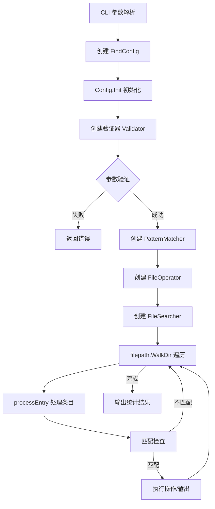
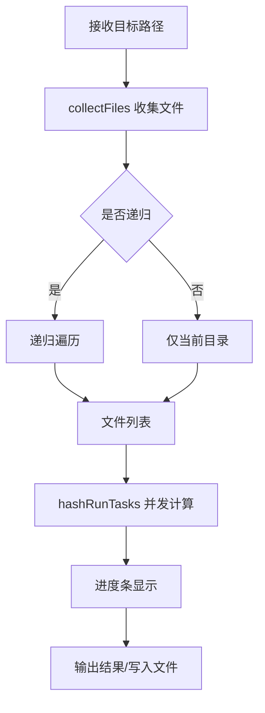

# FCK 项目架构分析报告

> **项目定位**: 一站式文件与系统管理工具集  
> **技术栈**: Go 1.25.0  
> **分析日期**: 2026-04-17  
> **分析范围**: 完整代码库（含 vendor 依赖）

---

## 一、目录结构梳理

### 1.1 整体架构概览

```
fck/
├── cmd/                      # 程序入口
│   └── main.go              # 主入口文件，负责调用 CLI 初始化
├── internal/                 # 内部实现（Go 标准项目结构）
│   ├── cli/                 # CLI 命令定义层（26个命令的 flag 定义）
│   ├── commands/            # 命令业务逻辑层（26个功能模块）
│   ├── types/               # 全局类型定义和常量
│   └── utils/               # 通用工具函数
├── docs/                    # 设计文档（35+ 个设计文档）
├── vendor/                  # 依赖库（自研组件库）
│   └── gitee.com/MM-Q/     # 组织内部依赖
│       ├── colorlib/       # 颜色输出库
│       ├── comprx/         # 压缩解压库
│       ├── go-kit/         # 工具集（fs、hash、fuzzy等）
│       ├── qflag/          # CLI 框架
│       ├── shellx/         # Shell 执行库
│       └── verman/         # 版本管理库
├── build.py                 # Python 构建脚本（跨平台编译）
├── go.mod                   # Go 模块定义
└── README.md               # 项目说明
```

### 1.2 关键目录详解

| 目录 | 用途 | 规范程度 | 说明 |
|------|------|----------|------|
| `cmd/` | 程序入口 | ⭐⭐⭐⭐⭐ | 符合 Go 项目标准结构，单一职责 |
| `internal/cli/` | CLI 命令定义 | ⭐⭐⭐⭐⭐ | 26个命令，每个命令独立文件，结构一致 |
| `internal/commands/` | 业务逻辑 | ⭐⭐⭐⭐⭐ | 按功能模块分包，职责清晰 |
| `internal/types/` | 类型定义 | ⭐⭐⭐⭐ | 集中管理全局类型和常量 |
| `internal/utils/` | 工具函数 | ⭐⭐⭐⭐ | 跨平台属性处理、颜色扩展等 |
| `docs/` | 设计文档 | ⭐⭐⭐⭐⭐ | 每个功能都有详细设计文档 |
| `vendor/` | 依赖管理 | ⭐⭐⭐⭐⭐ | 使用 vendor 模式，依赖可控 |

### 1.3 目录规范评估

**优点**:
- 严格遵循 Go 项目标准布局（Standard Go Project Layout）
- `internal/` 包确保代码不被外部导入
- 命令定义与业务逻辑分层清晰
- 设计文档完整，便于维护

**待优化**:
- `docs/` 目录文件较多，可考虑按功能分类子目录

---

## 二、核心功能模块识别

### 2.1 模块分类总览

FCK 项目包含 **26 个功能模块**，按功能领域分类如下：

#### 2.1.1 文件操作类（8个）

| 模块名称 | 核心功能 | 对应代码文件 | 核心依赖 |
|----------|----------|--------------|----------|
| **cp** | 文件/目录复制 | `cli/cp.go` + `commands/cp/cmd_cp.go` | go-kit/fs.CopyEx |
| **mv** | 文件/目录移动 | `cli/mv.go` + `commands/mv/cmd_mv.go` | go-kit/fs.MoveEx |
| **rm** | 文件/目录删除 | `cli/rm.go` + `commands/rm/cmd_rm.go` | 标准库 os.Remove |
| **mkdir** | 目录创建 | `cli/mkdir.go` + `commands/mkdir/cmd_mkdir.go` | 标准库 os.MkdirAll |
| **touch** | 文件创建/时间戳更新 | `cli/touch.go` + `commands/touch/cmd_touch.go` | 标准库 os.Chtimes |
| **truncate** | 文件截断 | `cli/truncate.go` + `commands/truncate/cmd_truncate.go` | 标准库 os.Truncate |
| **cat** | 文件内容查看（支持语法高亮、分页、head/tail、文件大小限制） | `cli/cat.go` + `commands/cat/*.go` | bufio, oviewer, chroma, stripansi |
| **list** | 目录列表（增强版 ls） | `cli/list.go` + `commands/list/*.go` | go-pretty/table |

#### 2.1.2 文件查找与处理类（3个）

| 模块名称 | 核心功能 | 对应代码文件 | 核心依赖 |
|----------|----------|--------------|----------|
| **find** | 高级文件查找 | `cli/find.go` + `commands/find/*.go` | 标准库 filepath.WalkDir |
| **grep** | 文本搜索 | `cli/grep.go` + `commands/grep/*.go` | regexp |
| **sed** | 文本替换 | `cli/sed.go` + `commands/sed/cmd_sed.go` | regexp, bufio |

#### 2.1.3 压缩解压类（3个）

| 模块名称 | 核心功能 | 对应代码文件 | 核心依赖 |
|----------|----------|--------------|----------|
| **pack** | 文件打包压缩 | `cli/pack.go` + `commands/pack/cmd_pack.go` | comprx |
| **unpack** | 文件解包解压 | `cli/unpack.go` + `commands/unpack/cmd_unpack.go` | comprx |
| **preview** | 压缩包预览 | `cli/preview.go` + `commands/preview/cmd_preview.go` | comprx |

#### 2.1.4 哈希校验类（2个）

| 模块名称 | 核心功能 | 对应代码文件 | 核心依赖 |
|----------|----------|--------------|----------|
| **hash** | 文件哈希计算 | `cli/hash.go` + `commands/hash/*.go` | go-kit/hash |
| **check** | 文件完整性校验 | `cli/check.go` + `commands/check/*.go` | go-kit/hash |

#### 2.1.5 系统信息类（4个）

| 模块名称 | 核心功能 | 对应代码文件 | 核心依赖 |
|----------|----------|--------------|----------|
| **size** | 文件/目录大小统计 | `cli/size.go` + `commands/size/*.go` | 标准库 filepath.Walk |
| **date** | 日期时间显示 | `cli/date.go` + `commands/date/cmd_date.go` | 标准库 time |
| **pwd** | 当前工作目录 | `cli/pwd.go` + `commands/pwd/cmd_pwd.go` | 标准库 os.Getwd |
| **home** | 用户主目录 | `cli/home.go` + `commands/home/cmd_home.go` | 标准库 os.UserHomeDir |

#### 2.1.6 工具类（4个）

| 模块名称 | 核心功能 | 对应代码文件 | 核心依赖 |
|----------|----------|--------------|----------|
| **echo** | 文本输出 | `cli/echo.go` + `commands/echo/cmd_echo.go` | 标准库 fmt |
| **watch** | 命令周期性执行（Linux watch 风格） | `cli/watch.go` + `commands/watch/*.go` | shellx/shx, colorlib, term |
| **xargs** | 参数批量处理 | `cli/xargs.go` + `commands/xargs/cmd_xargs.go` | shellx/shx |
| **alias** | Shell 别名生成 | `cli/alias.go` + `commands/alias/cmd_alias.go` | embed |

#### 2.1.7 开发辅助类（2个）

| 模块名称 | 核心功能 | 对应代码文件 | 核心依赖 |
|----------|----------|--------------|----------|
| **gm** | Git 模型管理 | `cli/gm.go` + `commands/gm/cmd_gm.go` | 标准库 os/exec |
| **test** | 测试命令 | `cli/test.go` + `commands/testcmd/cmd.go` | 标准库 |

### 2.2 模块核心输入/输出

以 **find** 模块为例（最复杂的模块）：

```
输入:
  - CLI 参数: 路径、名称模式、扩展名、大小范围、修改时间等
  - 文件系统: 目标目录树

输出:
  - 匹配文件列表（stdout）
  - 操作结果（删除/移动/执行命令）
  - 统计信息（计数）

核心依赖资源:
  - 文件系统遍历能力
  - 正则表达式引擎
  - 并发执行能力（操作批量文件）

#### 2.2.2 watch 模块核心输入/输出

```
输入:
  - CLI 参数: 间隔时间、执行次数、超时时间、差异高亮等
  - 目标命令: 要周期性执行的 shell 命令

输出:
  - 命令执行结果（stdout + stderr 合并）
  - 差异高亮显示（变化行黄色高亮）
  - 标题栏（执行间隔、命令、时间戳）

核心依赖资源:
  - shellx/shx 命令执行
  - colorlib 颜色输出
  - golang.org/x/term 终端宽度检测

支持的标志:
  -n, --interval    执行间隔（默认 2 秒）
  -c, --count       执行次数限制（默认 -1 无限）
  -t, --timeout     超时时间（默认 30 秒）
  -e, --errexit     出错时退出
  -d, --differences 高亮显示变化的行
  -p, --precise     精确计时模式
  -q, --quiet       静默模式
      --no-title    不显示标题栏
      --no-color    禁用颜色输出

核心特性:
  - 自动清屏（每次执行前）
  - 输出大小限制（stdout 10MB, stderr 1MB）
  - 动态终端宽度适配
  - 精确计时模式（补偿执行耗时）
  - 信号处理（Ctrl+C 优雅退出）
```

---```

---

## 三、模块间依赖关系分析

### 3.1 整体依赖架构

```
┌─────────────────────────────────────────────────────────────┐
│                        应用层                                │
│  ┌─────────┐ ┌─────────┐ ┌─────────┐      ┌─────────┐      │
│  │  cmd/   │ │  cli/   │ │commands/│      │  utils/ │      │
│  │ main.go │ │ 26命令  │ │ 26模块  │      │ 通用工具│      │
│  └────┬────┘ └────┬────┘ └────┬────┘      └────┬────┘      │
│       │           │           │                │            │
│       └───────────┴───────────┴────────────────┘            │
│                           │                                  │
│                           ▼                                  │
│  ┌─────────────────────────────────────────────────────┐   │
│  │                    internal/types/                   │   │
│  │              全局类型定义、常量、配置                │   │
│  └─────────────────────────────────────────────────────┘   │
└─────────────────────────────────────────────────────────────┘
                              │
                              ▼
┌─────────────────────────────────────────────────────────────┐
│                      外部依赖层（vendor）                    │
│  ┌──────────┐ ┌──────────┐ ┌──────────┐ ┌──────────┐       │
│  │  qflag   │ │ colorlib │ │  go-kit  │ │  comprx  │       │
│  │ CLI框架  │ │颜色输出  │ │工具集    │ │压缩解压  │       │
│  └──────────┘ └──────────┘ └──────────┘ └──────────┘       │
│  ┌──────────┐ ┌──────────┐ ┌──────────┐                    │
│  │  shellx  │ │  verman  │ │ go-pretty│                    │
│  │Shell执行 │ │版本管理  │ │表格渲染  │                    │
│  └──────────┘ └──────────┘ └──────────┘                    │
└─────────────────────────────────────────────────────────────┘
```

### 3.2 核心依赖关系详解

#### 3.2.1 CLI 层 → Commands 层

所有 CLI 命令文件（`internal/cli/*.go`）都遵循相同的依赖模式：

```go
// 示例: cli/find.go
import (
    "gitee.com/MM-Q/colorlib"
    "gitee.com/MM-Q/fck/internal/commands/find"  // 依赖业务逻辑层
    "gitee.com/MM-Q/fck/internal/types"
    "gitee.com/MM-Q/qflag"
)
```

**依赖特点**:
- CLI 层只负责 flag 定义和参数解析
- 业务逻辑完全下沉到 commands 层
- 通过 Config 结构体传递参数

#### 3.2.2 Commands 层 → Utils 层

```go
// 示例: commands/find/cmd_find.go
import (
    "gitee.com/MM-Q/fck/internal/utils"  // 通用工具
)
```

**Utils 层提供的能力**:
- 正则表达式构建 (`RegexBuilder`)
- 系统文件检测 (`IsSystemFileOrDir`)
- 跨平台文件属性处理 (`attrs_*.go`)
- 颜色输出扩展

#### 3.2.3 Commands 层 → Vendor 层

| 模块 | 依赖的 Vendor 库 | 用途 |
|------|------------------|------|
| hash, check | go-kit/hash | 哈希计算 |
| cp, mv | go-kit/fs | 文件系统操作 |
| pack, unpack, preview | comprx | 压缩解压 |
| 所有命令 | colorlib | 彩色输出 |
| watch, xargs | shellx/shx | Shell 命令执行 |
| watch | golang.org/x/term | 终端宽度检测 |
| list | go-pretty | 表格渲染 |

### 3.3 依赖关系健康度评估

**优点**:
- ✅ 单向依赖，无循环依赖
- ✅ 分层清晰，职责边界明确
- ✅ 自研组件库（vendor）提高可控性
- ✅ 接口抽象良好（通过 Config 结构体解耦）

**潜在问题**:
- ⚠️ 部分模块直接依赖 colorlib，可考虑抽象日志接口
- ⚠️ vendor 目录较大，依赖更新需要同步维护

---

## 四、设计模式与实现逻辑

### 4.1 设计模式识别

#### 4.1.1 命令模式（Command Pattern）

**应用场景**: 所有 26 个 CLI 命令

**实现方式**:
```go
// 1. 命令定义（cli/find.go）
var FindCmd *qflag.Cmd
func init() {
    FindCmd = qflag.NewCmd("find", "f", qflag.ExitOnError)
    // flag 定义...
    FindCmd.SetRun(runFind)  // 设置执行函数
}

// 2. 业务逻辑（commands/find/cmd_find.go）
func FindCmdMain(cl *colorlib.ColorLib, config *FindConfig) error {
    // 具体实现...
}
```

**优点**:
- 命令定义与执行解耦
- 便于扩展新命令
- 统一的错误处理

#### 4.1.2 策略模式（Strategy Pattern）

**应用场景**: find 命令的匹配策略

**实现方式**:
```go
// commands/find/matcher.go
type PatternMatcher struct {
    cache *MatchCache
}

func (m *PatternMatcher) MatchName(name, pattern string, config *FindConfig) bool {
    // 根据配置选择匹配策略
    if config.Regex {
        return config.NameRegex.MatchString(name)
    }
    // 普通匹配...
}
```

#### 4.1.3 工厂模式（Factory Pattern）

**应用场景**: 表格样式创建

**实现方式**:
```go
// internal/types/types.go
var TableStyleMap = map[string]table.Style{
    "def":  table.StyleDefault,
    "l":    table.StyleLight,
    "r":    table.StyleRounded,
    // ... 20+ 种样式
}

func GetTableStyle(style string) (table.Style, bool) {
    s, ok := TableStyleMap[style]
    return s, ok
}
```

#### 4.1.4 建造者模式（Builder Pattern）

**应用场景**: Config 结构体的初始化

**实现方式**:
```go
// commands/find/config.go
type FindConfig struct {
    // CLI 参数
    FindPath       string
    NamePattern    string
    // ...
    
    // 运行时生成
    NameRegex      *regexp.Regexp
    MatchCount     *atomic.Int64
}

func (c *FindConfig) Init(cl *colorlib.ColorLib) error {
    // 逐步初始化各个字段
    c.Cl = cl
    c.MatchCount = &atomic.Int64{}
    // 编译正则...
    // 初始化映射...
}
```

### 4.2 核心业务逻辑流程

#### 4.2.1 文件查找流程（find 命令）



#### 4.2.2 哈希计算流程（hash 命令）



#### 4.2.3 watch 命令执行流程

```
执行流程:
  1. 解析 CLI 参数，构建 WatchConfig
  2. 验证配置有效性
  3. 设置信号监听（SIGINT/SIGTERM）
  4. 进入主循环:
     a. 检查执行次数限制
     b. 清屏（ANSI 序列）
     c. 打印标题栏（动态终端宽度适配）
     d. 执行命令（shellx/shx，带超时）
     e. 合并 stdout + stderr
     f. 差异高亮处理（如启用 -d）
     g. 输出结果
     h. 计算下次等待时间（支持精确模式）
     i. 等待或退出

核心组件:
  - Executor: 命令执行（带输出大小限制）
  - Scheduler: 调度计时（支持精确模式）
  - DiffHighlighter: 差异高亮（行级对比）
  - OutputManager: 输出管理（清屏、标题栏、颜色）
  - Runner: 主控逻辑

文件结构:
  internal/commands/watch/
  ├── types.go   # 配置、常量、limitedWriter
  └── watch.go   # 核心实现（Executor/Scheduler/DiffHighlighter/OutputManager/Runner）
```

### 4.3 代码质量评估

**优点**:
- ✅ 函数职责单一，符合 SRP 原则
- ✅ 配置与逻辑分离，便于测试
- ✅ 错误处理完善，返回详细错误信息
- ✅ 并发处理合理（hash、find 等命令）

**待优化**:
- ⚠️ 部分函数较长（如 find 的 matcher），可考虑进一步拆分
- ⚠️ 部分 magic number 未定义常量（如深度限制 32）

---

## 五、技术栈评估

### 5.1 核心技术栈清单

| 类别 | 技术/库 | 版本 | 用途 | 维护状态 |
|------|---------|------|------|----------|
| **语言** | Go | 1.25.0 | 主要开发语言 | ⭐⭐⭐⭐⭐ 活跃 |
| **CLI 框架** | qflag | v0.5.15 | 命令行解析 | ⭐⭐⭐⭐⭐ 自研维护 |
| **颜色输出** | colorlib | v1.3.2 | 终端彩色输出 | ⭐⭐⭐⭐⭐ 自研维护 |
| **压缩解压** | comprx | v0.1.6 | 多格式压缩 | ⭐⭐⭐⭐⭐ 自研维护 |
| **工具集** | go-kit | v0.0.17 | FS、Hash、Pool 等 | ⭐⭐⭐⭐⭐ 自研维护 |
| **Shell 执行** | shellx | v1.0.18 | 命令执行 | ⭐⭐⭐⭐⭐ 自研维护 |
| **版本管理** | verman | v0.0.19 | 版本信息注入 | ⭐⭐⭐⭐⭐ 自研维护 |
| **表格渲染** | go-pretty | v6.6.8 | 表格输出 | ⭐⭐⭐⭐⭐ 活跃 |
| **进度条** | progressbar | v3.19.0 | 进度显示 | ⭐⭐⭐⭐ 活跃 |
| **系统调用** | golang.org/x/sys | v0.42.0 | 系统级操作 | ⭐⭐⭐⭐⭐ 官方维护 |
| **终端** | golang.org/x/term | v0.41.0 | 终端控制 | ⭐⭐⭐⭐⭐ 官方维护 |
| **分页器** | oviewer | v0.51.1 | 终端分页查看 | ⭐⭐⭐⭐⭐ 活跃 |
| **语法高亮** | chroma | v2.23.1 | 代码语法高亮 | ⭐⭐⭐⭐⭐ 活跃 |

### 5.2 技术栈选择评估

#### 5.2.1 优势分析

1. **自研组件库**: 所有核心依赖均为自研（MM-Q 组织），可控性高
2. **轻量级设计**: 无重型框架，启动快，资源占用低
3. **跨平台**: 支持 Windows/Linux/macOS，通过 build tags 区分平台代码
4. **标准库优先**: 优先使用 Go 标准库，减少外部依赖

#### 5.2.2 潜在风险

| 风险点 | 说明 | 建议 |
|--------|------|------|
| 自研库维护 | 依赖组织内部维护，人员变动可能影响更新 | 完善文档，培养维护者 |
| Go 版本较新 | 使用 Go 1.25.0，部分环境可能不支持 | 提供预编译二进制文件 |
| vendor 体积 | vendor 目录包含完整依赖，仓库较大 | 考虑使用 go mod 替代 |

### 5.3 版本兼容性

- **最低 Go 版本**: 1.25.0（使用新特性）
- **CGO**: 默认禁用（`CGO_ENABLED=0`），纯 Go 实现，跨平台兼容性好
- **架构支持**: amd64（可扩展至 arm64）

---

## 六、补充分析项

### 6.1 代码规范

#### 6.1.1 命名规范

| 类型 | 规范 | 示例 |
|------|------|------|
| 包名 | 小写，简短 | `find`, `hash`, `utils` |
| 结构体 | PascalCase | `FindConfig`, `HashConfig` |
| 接口 | PascalCase + er | `Command`, `Validator` |
| 函数 | PascalCase（导出）/ camelCase（内部） | `FindCmdMain`, `runFind` |
| 常量 | 驼峰或全大写 | `OutputFileName`, `ColorRed` |

#### 6.1.2 注释规范

**优点**:
- ✅ 所有导出函数都有完整文档注释
- ✅ 注释包含参数、返回值说明
- ✅ 使用标准 Go 文档格式

**示例**:
```go
// FindCmdMain 执行查找命令
//
// 参数:
//   - cl: 颜色库实例
//   - config: 查找配置指针
//
// 返回值:
//   - error: 查找过程中可能发生的错误
func FindCmdMain(cl *colorlib.ColorLib, config *FindConfig) error
```

#### 6.1.3 代码风格

- 使用标准 `gofmt` 格式化
- 行长度控制合理
- 错误处理优先（`if err != nil` 模式）

### 6.2 异常处理

#### 6.2.1 错误处理模式

```go
// 1. 立即返回错误
if err != nil {
    return fmt.Errorf("failed to collect files: %w", err)
}

// 2. 错误包装（提供上下文）
return fmt.Errorf("error walking directory: %v", walkDirErr)

// 3. 错误聚合（批量处理）
if len(errors) > 0 {
    printUniqueErrors(cl, errors)
}

// 4. panic 恢复（根命令）
defer func() {
    if r := recover(); r != nil {
        err = fmt.Errorf("panic: %v\n%s", r, debug.Stack())
    }
}()
```

#### 6.2.2 异常处理评估

**优点**:
- ✅ 所有错误都被捕获和处理
- ✅ 错误信息包含上下文，便于定位
- ✅ 使用 `%w` 包装错误，支持 errors.Is/As
- ✅ 批量处理时收集错误而非立即退出

**待优化**:
- ⚠️ 部分错误处理重复代码较多，可考虑抽象错误处理函数

### 6.3 扩展性评估

#### 6.3.1 新增命令扩展

添加新命令的标准流程：

1. 创建 `internal/cli/<cmd>.go` - 定义 flag
2. 创建 `internal/commands/<cmd>/cmd_<cmd>.go` - 实现逻辑
3. 在 `internal/cli/root.go` 的 `SubCmds` 中注册

**扩展难度**: ⭐⭐（简单，有明确模板）

#### 6.3.2 功能扩展示例

以 find 命令为例，添加新过滤条件：

1. 在 `FindConfig` 添加字段
2. 在 `cli/find.go` 添加 flag
3. 在 `matcher.go` 添加匹配逻辑

**扩展难度**: ⭐⭐⭐（中等，需理解匹配流程）

### 6.4 性能关键点

#### 6.4.1 并发处理

| 模块 | 并发策略 | 实现方式 |
|------|----------|----------|
| hash | 并发计算 | goroutine + channel |
| find | 并发搜索 | filepath.WalkDir（内部优化） |
| xargs | 并行执行 | sync.WaitGroup + 工作池 |
| check | 并发校验 | goroutine + channel |

#### 6.4.2 性能优化点

**已优化**:
- ✅ hash 命令使用并发计算，充分利用多核
- ✅ find 命令使用 WalkDir（比 Walk 更高效）
- ✅ 使用 sync.Pool 复用对象（go-kit/pool）
- ✅ 大目录扫描使用流式处理，避免内存溢出
- ✅ cat 命令使用 bufio.Writer 批量输出，减少系统调用
- ✅ cat 命令添加文件大小限制（-S/--max-size），防止大文件内存溢出

**可优化**:
- ⚠️ grep 递归搜索可考虑并行化
- ⚠️ 大文件处理可考虑分块读取

#### 6.4.3 资源管理

```go
// 良好实践：使用 defer 关闭资源
file, err := os.Open(path)
if err != nil {
    return err
}
defer file.Close()

// 良好实践：context 控制超时
ctx, cancel := context.WithCancel(context.Background())
defer cancel()
```

---

## 七、总结

### 7.1 项目核心特点

1. **功能丰富**: 26 个实用命令，覆盖文件操作、查找、压缩、哈希、系统信息等领域
2. **架构清晰**: 分层设计（CLI → Commands → Utils → Vendor），职责明确
3. **自研生态**: 依赖自研组件库（qflag、colorlib、go-kit 等），可控性强
4. **跨平台**: 支持 Windows/Linux/macOS，纯 Go 实现，无 CGO 依赖
5. **高性能**: 关键路径使用并发处理，充分利用多核性能
6. **易扩展**: 新增命令有标准模板，遵循开闭原则
7. **文档完善**: 每个功能都有详细设计文档，便于维护

### 7.2 待优化点

| 优先级 | 优化项 | 说明 |
|--------|--------|------|
| P1 | grep 并行化 | 递归搜索目录时并发处理 |
| P2 | 错误处理抽象 | 统一错误处理函数，减少重复代码 |
| P3 | 常量定义 | 将 magic number 提取为常量 |
| P4 | 接口抽象 | 抽象 colorlib 依赖，便于测试 |
| P5 | 文档分类 | docs 目录按功能分类，便于查找 |
| P6 | cat 大文件流式处理 | head/tail 模式下使用流式读取，避免加载整个文件 |

### 7.3 关键记忆点

**快速定位代码**:
- 入口: `cmd/main.go`
- 命令注册: `internal/cli/root.go`
- 命令定义: `internal/cli/<cmd>.go`
- 业务逻辑: `internal/commands/<cmd>/cmd_<cmd>.go`
- 类型定义: `internal/types/types.go`
- 工具函数: `internal/utils/utils.go`

**核心依赖**:
- CLI 框架: `gitee.com/MM-Q/qflag`
- 颜色输出: `gitee.com/MM-Q/colorlib`
- 文件操作: `gitee.com/MM-Q/go-kit/fs`
- 语法高亮: `github.com/alecthomas/chroma/v2`
- ANSI 处理: `github.com/acarl005/stripansi`
- 压缩解压: `gitee.com/MM-Q/comprx`
- Shell 执行: `gitee.com/MM-Q/shellx`

**构建命令**:
```bash
# 开发版本
python3 build.py

# 正式版本（安装到 GOPATH/bin）
python3 build.py -s -ai -f

# 发布版本
python3 build.py -batch -z
```

---

## 八、附录

### 8.1 命令清单

| 命令 | 功能 | 复杂度 |
|------|------|--------|
| hash | 文件哈希计算 | ⭐⭐⭐ |
| check | 文件完整性校验 | ⭐⭐⭐ |
| size | 文件大小统计 | ⭐⭐ |
| find | 文件查找 | ⭐⭐⭐⭐⭐ |
| list | 目录列表 | ⭐⭐⭐⭐ |
| pack | 文件打包 | ⭐⭐ |
| unpack | 文件解包 | ⭐⭐ |
| preview | 压缩包预览 | ⭐⭐ |
| watch | 命令监控 | ⭐⭐⭐ |
| cat | 文件查看 | ⭐⭐⭐ |
| grep | 文本搜索 | ⭐⭐⭐⭐ |
| sed | 文本替换 | ⭐⭐⭐ |
| cp | 文件复制 | ⭐⭐ |
| mv | 文件移动 | ⭐⭐ |
| rm | 文件删除 | ⭐⭐ |
| mkdir | 目录创建 | ⭐ |
| touch | 文件创建 | ⭐ |
| truncate | 文件截断 | ⭐ |
| pwd | 当前目录 | ⭐ |
| home | 用户主目录 | ⭐ |
| date | 日期时间 | ⭐ |
| echo | 文本输出 | ⭐ |
| xargs | 参数处理 | ⭐⭐⭐ |
| alias | 别名生成 | ⭐ |
| gm | Git 管理 | ⭐⭐ |
| test | 测试命令 | ⭐ |

### 8.2 文件统计

- Go 源文件: ~60 个
- 代码行数: ~8000+ 行（不含 vendor）
- 测试文件: 6 个（list、find、size 模块）
- 设计文档: 35+ 个

---

---

## 七、近期重要变更记录

### 2026-04-18 watch 命令重构

**变更内容**:
- 完全重构 watch 命令，实现 Linux watch 风格的功能
- 新增差异高亮功能（`-d` 标志，变化行黄色高亮）
- 新增精确计时模式（`-p` 标志，补偿执行耗时）
- 新增输出大小限制（stdout 10MB, stderr 1MB，防止内存溢出）
- 新增动态终端宽度检测（使用 golang.org/x/term）
- 合并 stdout 和 stderr 输出（stderr 在前）
- 使用 shellx/shx 替代 os/exec 执行命令（跨平台一致性）

**移除的功能**:
- `--clear` 标志（改为始终清屏）
- `--beep` / `-b` 标志（响铃提示）
- `--cumulative` 标志（累积差异模式）
- `--no-color` 标志（保留但简化）

**文件结构变更**:
```
internal/commands/watch/
├── types.go   # 新增：配置、常量、limitedWriter
└── watch.go   # 重写：核心实现
```

**核心组件设计**:
- `Executor`: 命令执行（带输出大小限制）
- `Scheduler`: 调度计时（支持精确模式）
- `DiffHighlighter`: 差异高亮（行级对比）
- `OutputManager`: 输出管理（清屏、标题栏、颜色）
- `Runner`: 主控逻辑

---

## 九、近期更新记录

### 2026-04-18 - Sed 命令性能优化

#### 9.1.1 忽略大小写替换优化

优化 `replaceStringIgnoreCase` 函数，将双重遍历改为单次遍历：

**优化前**:
```go
// 第一遍：统计匹配次数
for { idx := strings.Index(...) }
// 第二遍：执行替换（又搜索一次）
for replaced < actual { idx := strings.Index(...) }
```

**优化后**:
```go
// 单次遍历：记录所有匹配位置
var positions []int
for { positions = append(positions, ...) }
// 统一替换（直接使用位置）
for i := 0; i < actual; i++ { result.WriteString(...) }
```

**性能提升**:
- 遍历次数：2 次 → 1 次
- 添加 `result.Grow()` 预分配，减少扩容

**修改文件**:
- `internal/commands/sed/replace.go`: 优化 `replaceStringIgnoreCase` 函数

---

### 2026-04-14 - Sed 命令增强

#### 9.1.1 二进制文件检测支持

为 sed 命令添加了二进制文件检测功能，与 grep 命令保持一致的行为：

**新增功能**:
- `-a/--text`: 强制将二进制文件视为文本处理
- `--ignore-binary`: 静默跳过二进制文件，不输出提示

**实现细节**:
- 使用 `utils.IsBinaryFile()` 检测二进制文件（检查前 8000 字节是否包含空字符）
- 默认行为：检测到二进制文件输出 `bin file <name> matches` 并跳过
- 原地修改模式在创建备份前进行二进制检测

**修改文件**:
- `internal/cli/sed.go`: 添加二进制文件处理标志
- `internal/commands/sed/cmd_sed.go`: 添加检测逻辑和配置字段

#### 9.1.2 管道输入支持

为 sed 命令添加了管道输入支持，允许从标准输入读取内容：

**使用方式**:
```bash
echo "hello world" | fck sed -p "hello" -r "hi"
cat file.txt | fck sed -p "old" -r "new"
```

**实现细节**:
- 使用 `utils.IsStdinPipe()` 检测管道输入
- 使用 `"-"` 作为 stdin 的标识
- 管道模式与 `-i` 互斥（会报错）
- stdin 不检测二进制，默认视为文本

**新增函数**:
- `processStdin()`: 处理标准输入
- `processScanner()`: 通用的扫描器处理函数（提取公共逻辑）

**修改文件**:
- `internal/cli/sed.go`: 添加管道检测和 stdin 处理分支
- `internal/commands/sed/cmd_sed.go`: 添加 stdin 支持，提取 `processScanner` 公共函数

#### 9.1.3 代码重构

**提取公共函数**:
- 将 `processStdin` 和 `processFilePreview` 中的重复逻辑提取为 `processScanner`
- 统一错误信息格式：`error reading %s`

**工具函数迁移**:
- 将 `IsStdinPipe()` 和 `IsBinaryFile()` 迁移到 `internal/utils` 包
- grep 和 sed 命令共享这些工具函数

#### 9.1.4 cat 命令二进制检测功能

**需求分析**:
- 为 cat 命令添加二进制文件检测功能，避免直接输出二进制文件产生乱码
- 参考 grep 命令的实现方式，提供灵活的二进制文件处理选项

**新增标志**:
| 标志 | 长格式 | 说明 |
|------|--------|------|
| `-a` | `--text` | 强制将二进制文件视为文本处理 |
| `-I` | `--ignore-binary` | 完全忽略二进制文件，不输出提示 |

**默认行为**:
- 检测到二进制文件时输出提示 `bin file <filename> matches`，然后跳过内容
- 与 grep 命令保持一致的用户体验

**实现文件**:
- `internal/cli/cat.go`: 添加 `-a` 和 `-I` flag 定义，更新 help 文档和示例
- `internal/commands/cat/cmd_cat.go`: 添加二进制检测逻辑

**代码逻辑**:
```go
// 二进制文件检测 (除非强制文本模式)
if !config.Text {
    isBinary, err := utils.IsBinaryFile(file)
    if err != nil {
        return fmt.Errorf("cannot detect file type for %s: %w", path, err)
    }

    // 处理二进制文件
    if isBinary {
        // -I 模式：静默跳过
        if config.IgnoreBinary {
            return nil
        }

        // 默认行为：输出提示并跳过
        if !config.Quiet {
            fmt.Printf("bin file %s matches\n", path)
        }
        return nil
    }
}
```

**与 grep 对比**:
| 场景 | grep | cat |
|------|------|-----|
| `-I` | 静默跳过 | 静默跳过 |
| 默认 | 输出提示 + 跳过 | 输出提示 + 跳过 |
| `-a` | 强制处理 | 强制处理 |

---

**报告完成时间**: 2026-04-13  
**最近更新**: 2026-04-15  
**分析师**: Claude Code  
**版本**: v1.5

---

## 七、开发记录

### 2026-04-15 cat 命令添加 ov 分页支持

#### 7.0.1 功能概述

为 cat 命令添加了基于 `noborus/ov` 库的分页查看功能，提供类似 `less` 的专业分页体验。

**新增标志**:
| 标志 | 说明 |
|------|------|
| `--ov` | 使用 ov 库进行分页查看 |

**使用方式**:
```bash
fck cat --ov file.txt
```

#### 7.0.2 ov 库特性

- 支持超大文件（超过内存）
- 支持压缩文件（gzip, bzip2, zstd, lz4, xz）
- Unicode 和东亚宽字符支持
- 固定表头/列模式
- 类似 `less` 的快捷键（`q` 退出，`/` 搜索等）

#### 7.0.3 实现文件

- `internal/cli/cat.go`: 添加 `--ov` flag 定义和示例
- `internal/commands/cat/cmd_cat.go`: 添加 `UseOV` 配置字段和调用逻辑
- `internal/commands/cat/ov_pager.go`: ov 分页实现（新增文件）

#### 7.0.4 依赖更新

```bash
go get github.com/noborus/ov/oviewer
go mod vendor
```

新增依赖：
- `github.com/noborus/ov v0.51.1`
- `github.com/gdamore/tcell/v2 v2.13.8`（终端控制）
- 及其他相关依赖

#### 7.0.5 限制说明

- `--ov` 模式目前只支持单个文件
- 与 `--head`、`-u`、`--tail`、`-d` 等标志互斥（ov 模式优先）

---

### 2026-04-16 cat 命令添加语法高亮支持

#### 7.1.1 功能概述

为 cat 命令的分页查看模式添加了基于 `alecthomas/chroma` 库的语法高亮功能，支持 200+ 编程语言的自动检测和高亮显示。

**特性**:
- 根据文件扩展名自动检测语言
- 使用 256 色 ANSI 终端格式输出
- 默认使用 `monokai` 主题
- 高亮失败时优雅降级，显示原内容

**使用方式**:
```bash
fck cat --ov main.go      # 自动检测并高亮 Go 文件
fck cat --ov script.py    # 自动检测并高亮 Python 文件
fck cat --ov file.txt     # 不支持高亮的文件，正常显示
```

#### 7.1.2 实现文件

- `internal/commands/cat/syntax_highlight.go`: 语法高亮核心逻辑（新增文件）
- `internal/commands/cat/ov_pager.go`: 集成高亮功能到分页器

#### 7.1.3 核心 API

```go
// 检测文件类型是否支持高亮
lexer := lexers.Match(filename)
if lexer == nil {
    // 不支持，返回原内容
}

// 执行高亮
iterator, _ := lexer.Tokenise(nil, code)
formatter.Format(writer, style, iterator)
```

#### 7.1.4 依赖更新

```bash
go get github.com/alecthomas/chroma/v2/formatters
go get github.com/alecthomas/chroma/v2/lexers
go get github.com/alecthomas/chroma/v2/styles
go mod vendor
```

新增依赖：
- `github.com/alecthomas/chroma/v2 v2.23.1`
- `github.com/dlclark/regexp2 v1.11.5`（chroma 依赖）

---

### 2026-04-16 cat 命令标志变更

#### 7.2.1 变更内容

将分页查看标志从 `--ov` 改为 `-l, --less`，更符合 Unix 惯例。

| 旧标志 | 新标志 | 说明 |
|--------|--------|------|
| `--ov` | `-l, --less` | 使用分页器查看文件内容 |

**使用方式**:
```bash
# 新用法
fck cat -l file.txt
fck cat --less file.go

# 支持语法高亮
fck cat -l main.go
```

#### 7.2.2 修改文件

- `internal/cli/cat.go`: 修改 flag 定义和示例
- `internal/commands/cat/cmd_cat.go`: 修改配置字段名 `UseOV` -> `UseLess`

#### 7.2.3 向后兼容性

- `--ov` 标志已移除，请使用 `-l` 或 `--less`

---

### 2026-04-15 xargs 命令重构

#### 7.1 新增功能

| 功能 | 说明 | 相关文件 |
|------|------|----------|
| `--shell` 标志 | 支持通过 shell 执行命令，可使用管道、重定向等特性 | `cli/xargs.go`, `commands/xargs/cmd_xargs.go` |
| 双模式执行 | 默认直接执行（安全），`--shell` 模式通过 shell 执行（兼容） | `commands/xargs/cmd_xargs.go` |
| 错误去重 | 相同错误只显示一次，带重复次数统计 | `commands/xargs/cmd_xargs.go` |

#### 7.2 移除功能

| 功能 | 原因 | 相关文件 |
|------|------|----------|
| `-p, --interactive` | 与管道输入冲突，stdin 被耗尽后无法读取确认 | `cli/xargs.go`, `commands/xargs/cmd_xargs.go` |
| `-L, --max-lines` | 实现复杂，需按行处理输入，与当前架构不兼容 | `cli/xargs.go`, `commands/xargs/cmd_xargs.go` |

#### 7.3 Bug 修复

| 问题 | 修复内容 | 文件 |
|------|----------|------|
| EOF 判断不健壮 | `err.Error() != "EOF"` → `!errors.Is(err, io.EOF)` | `commands/xargs/cmd_xargs.go` |
| 命令长度计算不准确 | `calculateCmdLen` 现在考虑占位符替换后的实际长度 | `commands/xargs/cmd_xargs.go` |
| 占位符替换不完整 | `executeDirectly` 现在同时替换 `Command` 和 `CommandArgs` 中的占位符 | `commands/xargs/cmd_xargs.go` |
| 并行执行取消机制 | 添加 `atomic.Bool` 取消标志，出错时停止新任务启动 | `commands/xargs/cmd_xargs.go` |

#### 7.4 代码重构

| 重构项 | 说明 | 文件 |
|--------|------|------|
| 提取公共函数 | `getPlaceholder()` 和 `isReplaceMode()` 消除重复代码 | `commands/xargs/cmd_xargs.go` |
| 错误信息国际化 | 所有错误信息改为英文 | `commands/xargs/cmd_xargs.go` |
| 错误信息格式化 | 结构化输出，支持去重和重复次数统计 | `commands/xargs/cmd_xargs.go` |

#### 7.5 代码结构优化

```
commands/xargs/cmd_xargs.go
├── XargsConfig          # 配置结构体
├── XargsStats           # 统计结构体（新增 Errors 字段）
├── XargsCmdMain         # 主入口
├── readArgs             # 读取参数（支持文件/stdin）
├── splitBatches         # 分批处理（支持 -n, -s）
├── calculateCmdLen      # 计算命令长度（考虑占位符替换）
├── runSequential        # 顺序执行
├── runParallel          # 并行执行（支持 -P，带取消机制）
├── executeBatch         # 执行单个批次
├── executeDirectly      # 直接执行（安全模式）
├── executeWithShell     # Shell 执行（兼容模式）
├── buildCommandString   # 构建命令字符串
├── getPlaceholder       # 获取占位符（新增）
└── isReplaceMode        # 检查替换模式（新增）
```

#### 7.6 当前支持的标志

| 标志 | 功能 | 实现状态 |
|------|------|----------|
| `-0, --null` | 使用 `\0` 作为分隔符 | ✅ |
| `-a, --arg-file` | 从文件读取参数 | ✅ |
| `-d, --delimiter` | 输入分隔符 | ✅ |
| `-e, --exit-on-error` | 出错立即停止 | ✅ |
| `-h, --help` | 显示帮助信息 | ✅ |
| `-i, --replace` | 启用占位符替换模式 | ✅ |
| `-I, --replace-delim` | 自定义占位符字符串 | ✅ |
| `-n, --max-args` | 每批最大参数个数 | ✅ |
| `-P, --max-procs` | 并行进程数 | ✅ |
| `-r, --no-run-if-empty` | 空输入不执行 | ✅ |
| `-s, --max-chars` | 命令最大长度 | ✅ |
| `-t, --verbose` | 打印执行的命令 | ✅ |
| `--shell` | 通过 shell 执行命令 | ✅ |

#### 7.7 错误输出格式

```
err: execution completed: 0 succeeded, 1 failed

Errors (1 unique):
  1. exec: "echo 这是1 1 1": executable file not found in %PATH%
```

重复错误显示次数：
```
Errors (1 unique):
  1. exec: "echo 这是1 1 1": executable file not found in %PATH% (x4)
```

---

### 2026-04-17 cat 命令重构 - 统一查看器设计

#### 8.1 架构重构

**重构目标**: 统一高亮模式和非高亮模式的文件处理逻辑

**重构前问题**:
- 高亮模式和非高亮模式的 head/tail 逻辑不一致
- 代码重复，维护困难
- 文件指针管理混乱

**重构后架构**:
```
commands/cat/
├── cmd_cat.go      # 简化后的主逻辑（仅参数处理和文件检查）
├── viewer.go       # 统一查看器（FileViewer）
│   ├── View()              # 统一入口
│   ├── sliceLines()        # head/tail 切片
│   ├── applySpecialFlags() # -E/-T 处理
│   ├── outputPlain()       # 普通输出
│   └── outputHighlighted() # 高亮输出
└── ov_pager.go     # 分页器模式（oviewer）
```

#### 8.2 核心设计

**FileViewer 结构体**:
```go
type FileViewer struct {
    config   *CatConfig    // CLI 配置
    hlConfig HighlightConfig  // 高亮配置
}
```

**统一处理流程**:
1. 读取文件内容
2. 统一换行符（`\r\n` → `\n`）
3. 按行分割
4. 根据 head/tail 切片
5. 非高亮模式：应用 `-E`/`-T` 标志
6. 根据模式选择输出方式

#### 8.3 功能变更

| 变更类型 | 内容 | 原因 |
|----------|------|------|
| 移除 | `-N, --show-newline` 标志 | 简化实现，换行符统一处理后无法精准显示原换行符 |
| 优化 | `stripANSI` 函数 | 使用正则表达式替代循环，更精确匹配 ANSI 序列 |
| 修复 | 互斥组配置 | 高亮标志与每个特殊标志（-A/-E/-T）单独互斥 |

#### 8.4 互斥组配置

```go
MutexGroups: []qflag.MutexGroup{
    {Name: "head-tail", Flags: []string{"head", "tail"}},
    {Name: "highlight-show-all", Flags: []string{"highlight", "show-all"}},
    {Name: "highlight-show-ends", Flags: []string{"highlight", "show-ends"}},
    {Name: "highlight-show-tabs", Flags: []string{"highlight", "show-tabs"}},
}
```

#### 8.5 当前 cat 命令支持的所有标志

| 标志 | 长选项 | 功能 | 互斥关系 |
|------|--------|------|----------|
| `-n` | `--number` | 显示所有行号 | - |
| `-b` | `--number-nonblank` | 显示非空行行号 | 与 `-n` 互斥（优先级更高） |
| `-E` | `--show-ends` | 行尾显示 `$` | 与 `-H` 互斥 |
| `-T` | `--show-tabs` | 制表符显示为 `^I` | 与 `-H` 互斥 |
| `-A` | `--show-all` | 等价于 `-ET` | 与 `-H` 互斥 |
| `-u` | `--head` | 显示前 N 行 | 与 `-d` 互斥 |
| `-d` | `--tail` | 显示后 N 行 | 与 `-u` 互斥 |
| `-q` | `--quiet` | 静默模式 | - |
| `-a` | `--text` | 强制处理二进制文件 | - |
| `-I` | `--ignore-binary` | 忽略二进制文件 | - |
| `-l` | `--less` | 使用分页器查看 | - |
| `-H` | `--highlight` | 启用语法高亮 | 与 `-A/-E/-T` 互斥 |

---

### 2026-04-17 md 命令新增 - Markdown 预览工具

#### 9.1 功能概述

新增 `md` 子命令，用于预览 Markdown 文件，结合 glamour 和 oviewer 实现渲染和分页查看。

**命令别名**: `md`, `mdv`

#### 9.2 核心特性

| 特性 | 说明 |
|------|------|
| **渲染引擎** | glamour（支持多种主题样式） |
| **分页器** | oviewer（支持双文档切换） |
| **样式支持** | auto, dark, light, dracula, pink, notty |
| **宽度控制** | 支持自定义换行宽度 |
| **文件限制** | 默认 100MB 大小限制 |

#### 9.3 命令行标志

| 标志 | 长选项 | 功能 | 默认值 |
|------|--------|------|--------|
| `-l` | `--less` | 使用分页器查看 | false |
| `-r` | `--raw` | 分页器中显示原始文件（按 `]` 切换） | false |
| `-s` | `--style` | 渲染样式 | auto |
| `-w` | `--width` | 换行宽度（0 表示自动） | 0 |
| `-S` | `--max-size` | 最大文件大小 | 100MB |

#### 9.4 使用示例

```bash
# 直接预览
fck md README.md

# 使用分页器
fck md -l README.md

# 指定样式和宽度
fck md -s dark -w 100 README.md

# 分页器 + 原始视图切换
fck md -l -r README.md
```

#### 9.5 架构设计

```
commands/md/
├── cmd_md.go    # 配置结构体和主入口
└── viewer.go    # MdViewer 实现
    ├── Run()              # 统一入口
    ├── runDirect()        # 直接输出到终端
    ├── runWithPager()     # 使用分页器
    └── runPagerWithContent()  # 统一分页处理
```

#### 9.6 管道输入支持

支持从标准输入读取 Markdown 内容：

```bash
# 管道输入
echo "# Hello" | fck md
cat README.md | fck md -l

# 管道与文件互斥
echo "# Hello" | fck md file.md  # 错误：cannot specify file when reading from pipe
```

**实现要点**:
- 使用 `utils.IsStdinPipe()` 检测管道输入
- 管道模式自动设置文件名为 "stdin"
- 管道输入时禁用文件参数

---

### 2026-04-17 Bug 修复 - xargs shell 模式管道传递问题

#### 10.1 问题描述

当使用 `xargs --shell` 执行 `fck md` 等支持管道输入的命令时，子命令会继承 xargs 的 stdin，导致误判为管道模式。

**复现命令**:
```bash
fck ls | fck xargs -i --shell 'fck md {}'
# 错误：cannot specify file when reading from pipe
```

#### 10.2 根因分析

`executeWithShell` 使用 `shx.RunToTerminal()`，它会继承父进程的 stdin（即 xargs 的管道输入），导致子命令 `fck md` 检测到管道输入而报错。

#### 10.3 修复方案

修改 `executeWithShell` 函数，显式断开 stdin 连接：

```go
// 修改前
if err := shx.RunToTerminal(cmdStr); err != nil {

// 修改后
if err := shx.New(cmdStr).
    WithStdout(os.Stdout).
    WithStderr(os.Stderr).
    Exec(); err != nil {
```

**关键变更**:
- 不设置 `WithStdin()`，使子命令的 stdin 为 nil
- 子命令不再继承 xargs 的管道输入
- 保持 stdout/stderr 输出到终端

---

**报告完成时间**: 2026-04-13  
**最近更新**: 2026-04-17  
**分析师**: Claude Code  
**版本**: v1.7
