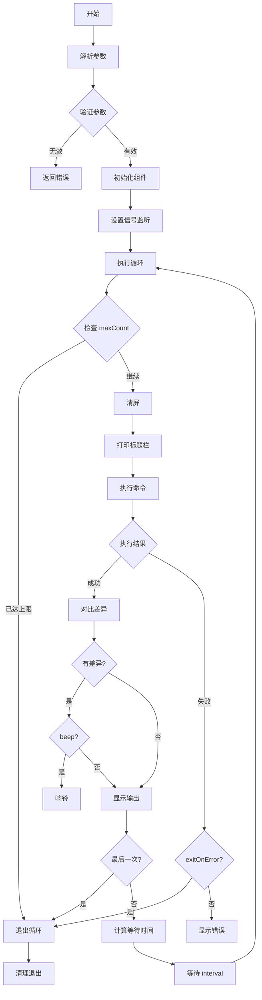

# Watch 命令重构设计方案

> 目标：实现一个功能完善、行为符合 Linux watch 习惯的命令监控工具

---

## 一、Linux watch 命令行为参考

### 1.1 标准行为

```bash
# 基本用法 - 每2秒执行一次命令，清屏并显示标题
watch -n 2 ls -la

# 高亮差异 - 显示变化的行
watch -d ls -la

# 持续高亮 - 累积显示所有变化
watch -d=cumulative ls -la

# 精确时间 - 尝试精确匹配间隔（默认会跳过执行时间）
watch -p date

# 无标题 - 不显示标题栏
watch -t ls -la

# 出错退出 - 命令失败时停止
watch -e ls /nonexistent

# 蜂鸣提示 - 命令输出变化时响铃
watch -b ls -la
```

### 1.2 核心行为特征

1. **默认2秒间隔**，首次立即执行
2. **清屏后显示** - 每次执行前清屏，标题在最上方
3. **标题栏格式** - `Every Xs: command                    时间`
4. **差异高亮** - 支持显示本次与上次的输出差异
5. **精确计时** - `-p` 模式会补偿命令执行时间

---

## 二、重构设计目标

### 2.1 功能目标

| 优先级 | 功能 | 说明 |
|--------|------|------|
| P0 | 清屏显示 | 每次执行前清屏，符合 watch 习惯 |
| P0 | 标题栏 | 显示间隔、命令、当前时间 |
| P0 | 信号处理 | Ctrl+C 优雅退出 |
| P1 | 差异高亮 | 对比上次输出，高亮变化行 |
| P1 | 累积差异 | 累积显示所有变化过的行 |
| P2 | 蜂鸣提示 | 输出变化时响铃 |
| P2 | 精确计时 | 补偿命令执行耗时 |

### 2.2 修复当前问题

1. **清屏时机** - 在命令执行前清屏，而非执行后
2. **最后一次不等待** - 达到 maxCount 后立即退出，不等待 interval
3. **错误处理** - 统一错误输出格式

---

## 三、架构设计

### 3.1 整体架构

```
┌─────────────────────────────────────────────────────────────┐
│                        Watch Runner                         │
│  ┌─────────────┐  ┌─────────────┐  ┌─────────────────────┐  │
│  │  Scheduler  │  │   Executor  │  │  Diff Highlighter   │  │
│  │   调度器     │  │   执行器     │  │     差异高亮器       │  │
│  └─────────────┘  └─────────────┘  └─────────────────────┘  │
└─────────────────────────────────────────────────────────────┘
                              │
                              ▼
                    ┌─────────────────────┐
                    │   Output Manager    │
                    │    输出管理器        │
                    │  (清屏/标题/输出)    │
                    └─────────────────────┘
```

### 3.2 核心组件

#### 3.2.1 Scheduler（调度器）

```go
type Scheduler struct {
    interval    time.Duration
    precise     bool           // 精确计时模式
    lastRunTime time.Time
}

func (s *Scheduler) NextWait() time.Duration {
    if !s.precise {
        return s.interval
    }
    // 精确模式：补偿执行耗时
    elapsed := time.Since(s.lastRunTime)
    wait := s.interval - elapsed
    if wait < 0 {
        return 0
    }
    return wait
}
```

#### 3.2.2 Executor（执行器）

```go
type Executor struct {
    command string
    timeout time.Duration
    shell   string
}

func (e *Executor) Run(ctx context.Context) (*ExecutionResult, error) {
    // 捕获 stdout/stderr
    // 支持超时控制
}

type ExecutionResult struct {
    Stdout   string
    Stderr   string
    ExitCode int
    Duration time.Duration
}
```

#### 3.2.3 Diff Highlighter（差异高亮器）

```go
type DiffHighlighter struct {
    mode        DiffMode       // line/word/ cumulative
    lastOutput  string
    cumulative  map[int]bool   // 累积变化行
}

type DiffMode int
const (
    DiffNone DiffMode = iota
    DiffLine          // 行级差异
    DiffWord          // 词级差异
    DiffCumulative    // 累积差异
)

func (d *DiffHighlighter) Diff(current string) string {
    // 对比上次输出，生成带高亮的输出
    // 支持行级/词级/累积模式
}
```

#### 3.2.4 Output Manager（输出管理器）

```go
type OutputManager struct {
    noHeader    bool
    useColor    bool
    clearScreen bool
}

func (o *OutputManager) Clear() {
    // ANSI 清屏序列
    fmt.Print("\033[H\033[2J")
}

func (o *OutputManager) PrintHeader(interval time.Duration, command string) {
    // Every Xs: command                    时间
}

func (o *OutputManager) PrintOutput(output string, diff bool) {
    // 输出内容，支持差异高亮
}
```

---

## 四、配置设计

### 4.1 命令行参数

```go
type WatchConfig struct {
    // 基本配置
    Command  string        // 要执行的命令
    Interval time.Duration // 执行间隔，默认 2s
    
    // 显示控制
    NoHeader    bool   // -t, --no-title  不显示标题栏
    NoColor     bool   // --no-color      禁用颜色
    ClearScreen bool   // -c, --clear     每次执行前清屏（默认true）
    
    // 差异高亮
    Diff       DiffMode // -d, --differences      高亮差异
    Cumulative bool     // --cumulative          累积差异模式
    
    // 执行控制
    MaxCount    int           // -n, --count      最大执行次数，-1无限
    ExitOnError bool          // -e, --errexit    出错时退出
    Timeout     time.Duration // --timeout        单次超时
    Precise     bool          // -p, --precise    精确计时模式
    
    // 通知
    BeepOnChange bool // -b, --beep  变化时响铃
}
```

### 4.2 Flag 映射

| 短选项 | 长选项 | 说明 | 默认值 |
|--------|--------|------|--------|
| -n | --interval | 执行间隔 | 2s |
| -d | --differences | 高亮差异 | false |
| | --cumulative | 累积差异 | false |
| -t | --no-title | 不显示标题 | false |
| -b | --beep | 变化响铃 | false |
| -e | --errexit | 出错退出 | false |
| -p | --precise | 精确计时 | false |
| -n | --count | 执行次数 | -1(无限) |
| | --timeout | 执行超时 | 30s |
| | --no-color | 禁用颜色 | false |
| | --no-clear | 不清屏 | false |

---

## 五、核心执行流程



---

## 六、关键实现细节

### 6.1 清屏实现

```go
// ANSI 清屏序列
const clearScreenSeq = "\033[H\033[2J\033[3J"

func clearScreen() {
    fmt.Print(clearScreenSeq)
    // Windows 备用方案
    if runtime.GOOS == "windows" {
        cmd := exec.Command("cmd", "/c", "cls")
        cmd.Stdout = os.Stdout
        cmd.Run()
    }
}
```

### 6.2 差异高亮算法

```go
func (d *DiffHighlighter) computeLineDiff(oldLines, newLines []string) []DiffLine {
    result := make([]DiffLine, len(newLines))
    
    for i, line := range newLines {
        status := LineSame
        if i >= len(oldLines) {
            status = LineAdded
        } else if line != oldLines[i] {
            status = LineChanged
        }
        result[i] = DiffLine{Content: line, Status: status}
    }
    
    // 累积模式：标记所有历史变化过的行
    if d.mode == DiffCumulative {
        for i := range result {
            if result[i].Status != LineSame {
                d.cumulative[i] = true
            }
            if d.cumulative[i] {
                result[i].Status = LineChanged
            }
        }
    }
    
    return result
}
```

### 6.3 精确计时

```go
func (w *WatchRunner) runPrecise(ctx context.Context) {
    ticker := time.NewTicker(time.Millisecond * 100)
    defer ticker.Stop()
    
    nextRun := time.Now()
    
    for {
        select {
        case <-ctx.Done():
            return
        case now := <-ticker.C:
            if now.After(nextRun) || now.Equal(nextRun) {
                start := time.Now()
                w.execute()
                elapsed := time.Since(start)
                nextRun = start.Add(w.config.Interval - elapsed)
                if nextRun.Before(time.Now()) {
                    nextRun = time.Now()
                }
            }
        }
    }
}
```

---

## 七、与现有代码对比

### 7.1 主要改进点

| 方面 | 当前实现 | 重构设计 |
|------|----------|----------|
| **清屏时机** | 执行后清屏 ❌ | 执行前清屏 ✅ |
| **清屏方式** | 打印换行符 | ANSI 清屏序列 |
| **差异高亮** | 不支持 | 支持行级/词级/累积 |
| **标题格式** | 自定义格式 | 仿 Linux watch 格式 |
| **精确计时** | 不支持 | 支持 `-p` 模式 |
| **蜂鸣提示** | 不支持 | 支持 `-b` |
| **累积差异** | 不支持 | 支持 `--cumulative` |
| **代码结构** | 单文件 | 组件化拆分 |

### 7.2 向后兼容

- 保留原有基本功能
- 默认行为保持一致（interval 从 1s 改为 2s 以符合 Linux 习惯）
- 新增功能通过新 flag 启用

---

## 八、测试策略

### 8.1 单元测试

```go
func TestDiffHighlighter(t *testing.T) {
    tests := []struct {
        name     string
        old      string
        new      string
        mode     DiffMode
        expected []DiffLine
    }{
        // 测试用例...
    }
}

func TestScheduler(t *testing.T) {
    // 测试精确计时逻辑
}
```

### 8.2 集成测试

```go
func TestWatchRunner(t *testing.T) {
    config := WatchConfig{
        Command:  "echo hello",
        Interval: 100 * time.Millisecond,
        MaxCount: 3,
    }
    
    runner := NewWatchRunner(config)
    err := runner.Run(context.Background())
    assert.NoError(t, err)
}
```

---

## 九、实现优先级

### Phase 1: 核心功能（P0）
- [ ] 修复清屏时机问题
- [ ] 实现 ANSI 清屏
- [ ] 优化标题栏格式
- [ ] 重构代码结构

### Phase 2: 差异高亮（P1）
- [ ] 实现行级差异
- [ ] 实现词级差异
- [ ] 实现累积差异模式

### Phase 3: 高级功能（P2）
- [ ] 精确计时模式
- [ ] 蜂鸣提示
- [ ] 性能优化

---

## 十、参考实现

```go
// 核心循环示例
func (w *WatchRunner) Run(ctx context.Context) error {
    sigChan := make(chan os.Signal, 1)
    signal.Notify(sigChan, syscall.SIGINT, syscall.SIGTERM)
    
    ctx, cancel := context.WithCancel(ctx)
    defer cancel()
    
    go func() {
        <-sigChan
        cancel()
    }()
    
    var lastOutput string
    executionCount := 0
    
    for {
        select {
        case <-ctx.Done():
            return nil
        default:
        }
        
        // 检查执行次数
        if w.config.MaxCount > 0 && executionCount >= w.config.MaxCount {
            return nil
        }
        executionCount++
        
        // 清屏
        if w.config.ClearScreen {
            w.output.Clear()
        }
        
        // 打印标题
        if !w.config.NoHeader {
            w.output.PrintHeader(w.config.Interval, w.config.Command)
        }
        
        // 执行命令
        result, err := w.executor.Run(ctx)
        
        if err != nil {
            if w.config.ExitOnError {
                return err
            }
            fmt.Fprintln(os.Stderr, err)
            continue
        }
        
        // 处理差异高亮
        output := result.Stdout
        if w.config.Diff != DiffNone {
            output = w.highlighter.Diff(output)
        }
        
        // 检查变化并响铃
        if w.config.BeepOnChange && lastOutput != result.Stdout {
            fmt.Print("\a") // 响铃
        }
        lastOutput = result.Stdout
        
        // 输出结果
        fmt.Print(output)
        
        // 最后一次不等待
        if w.config.MaxCount > 0 && executionCount >= w.config.MaxCount {
            return nil
        }
        
        // 等待下次执行
        waitTime := w.scheduler.NextWait()
        select {
        case <-ctx.Done():
            return nil
        case <-time.After(waitTime):
        }
    }
}
```

---

*设计完成日期: 2026-04-17*
