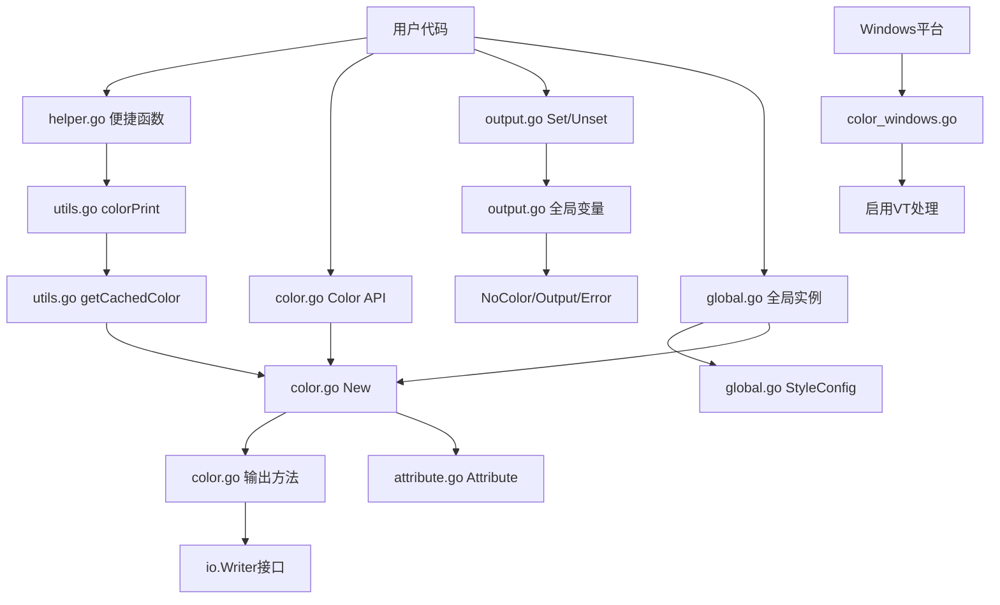

# color 项目分析报告

---

## 一、目录结构梳理

### 1.1 项目根目录结构

```
color/
├── .gitignore          # Git忽略文件配置
├── LICENSE             # MIT许可证文件
├── go.mod              # Go模块定义文件
├── go.sum              # Go模块依赖校验文件
├── doc.go              # 包文档说明文件
├── color.go            # 核心类型和方法（Color结构体、核心API）
├── attribute.go        # 颜色常量定义（SGR属性、颜色常量）
├── output.go           # 输出控制（全局变量、终端检测）
├── helper.go           # 便捷函数（Black/Red/Green等32个函数）
├── utils.go            # 内部工具函数（缓存、辅助函数）
├── global.go           # 全局实例支持（GlobalColor、StyleConfig）
├── color_test.go       # 单元测试文件
└── color_windows.go    # Windows平台特定实现文件
```

### 1.2 目录/文件规范评估

| 项目 | 评估结果 | 说明 |
|------|----------|------|
| 目录层级 | ✅ 规范 | 扁平化结构，符合Go单包库的设计习惯 |
| 文件命名 | ✅ 规范 | 遵循Go命名规范，按功能拆分文件 |
| 代码组织 | ✅ 优秀 | 模块化拆分：属性定义、输出控制、便捷函数、工具函数分离 |
| 文档完整性 | ✅ 完善 | 所有导出函数都有规范的中文注释 |
| 代码注释 | ✅ 规范 | 统一使用「参数/返回值/示例/注意」格式 |

**评价**：这是一个结构清晰、模块化程度高的Go语言工具库项目。经过代码拆分后，每个文件的职责更加单一，便于维护和阅读。

---

## 二、核心功能模块识别

### 2.1 模块总览

| 模块名称 | 核心功能 | 对应代码文件 | 模块类型 |
|----------|----------|--------------|----------|
| 颜色属性定义 | SGR代码、颜色常量定义 | attribute.go | 基础定义模块 |
| ANSI颜色输出 | 提供终端彩色文本输出能力 | color.go | 业务核心模块 |
| 全局实例支持 | 提供线程安全的全局颜色实例 | global.go | 业务核心模块 |
| 输出控制 | 全局配置、终端检测、标准输出 | output.go | 配置控制模块 |
| 便捷函数集 | 预定义颜色的快速调用函数 | helper.go | 业务核心模块 |
| 内部工具 | 缓存机制、辅助函数 | utils.go | 基础支撑模块 |
| Windows平台适配 | Windows控制台ANSI支持启用 | color_windows.go | 平台适配模块 |
| 单元测试 | 功能验证和回归测试 | color_test.go | 测试模块 |

### 2.2 文件职责说明

#### 2.2.1 attribute.go - 颜色属性定义

**核心功能**：定义所有SGR（Select Graphic Rendition）代码常量

**包含内容**：
- `Attribute` 类型定义
- 基础样式属性（Reset、Bold、Italic、Underline等）
- 重置属性（ResetBold、ResetItalic等）
- 前景色常量（FgBlack、FgRed...FgWhite）
- 前景高亮色常量（FgHiBlack...FgHiWhite）
- 背景色常量（BgBlack...BgWhite）
- 背景高亮色常量（BgHiBlack...BgHiWhite）
- 属性映射表 `mapResetAttributes`

**代码统计**：约111行

#### 2.2.2 color.go - 核心类型和方法

**核心功能**：Color结构体定义和核心API实现

**包含内容**：
- `Color` 结构体定义（params、noColor字段）
- 构造函数：`New()`、`RGB()`、`BgRGB()`
- 链式方法：`Add()`、`AddRGB()`、`AddBgRGB()`
- 输出方法：`Print()`、`Printf()`、`Println()`、`Fprint()`、`Fprintf()`、`Fprintln()`
- 字符串方法：`Sprint()`、`Sprintf()`、`Sprintln()`
- 函数生成器：`PrintFunc()`、`PrintfFunc()`、`PrintlnFunc()`等
- 颜色控制：`Set()`、`unset()`、`DisableColor()`、`EnableColor()`
- 比较方法：`Equals()`

**代码统计**：约570行

#### 2.2.3 output.go - 输出控制

**核心功能**：全局配置和终端检测

**包含内容**：
- 全局变量：`NoColor`、`Output`、`Error`
- 终端检测：`noColorIsSet()`、`stdoutIsTerminal()`
- 输出获取：`stdOut()`、`stdErr()`
- 便捷函数：`Set()`、`Unset()`

**代码统计**：约82行

#### 2.2.4 helper.go - 便捷函数

**核心功能**：提供64个预定义颜色的快速调用函数（由 gen/helper_gen.go 自动生成）

**包含内容**：
- 8个标准颜色打印函数：`Black()`、`Red()`...`White()`（接受字符串参数，自动追加换行符）
- 8个标准颜色格式化打印函数：`Blackf()`、`Redf()`...`Whitef()`（接受格式化字符串）
- 8个标准颜色字符串函数：`SBlack()`...`SWhite()`（接受字符串参数，返回字符串）
- 8个标准颜色格式化字符串函数：`SBlackf()`...`SWhitef()`（返回格式化字符串）
- 8个高亮颜色打印函数：`HiBlack()`...`HiWhite()`
- 8个高亮颜色格式化打印函数：`HiBlackf()`...`HiWhitef()`
- 8个高亮颜色字符串函数：`SHiBlack()`...`SHiWhite()`
- 8个高亮颜色格式化字符串函数：`SHiBlackf()`...`SHiWhitef()`

**函数命名规则**：
- `Xxx(message)` - 打印彩色文本并自动追加换行符（仅接受字符串参数）
- `Xxxf(format, a...)` - 打印格式化彩色文本（不自动追加换行符）
- `SXxx(message)` - 返回彩色字符串（仅接受字符串参数）
- `SXxxf(format, a...)` - 返回格式化彩色字符串

**代码统计**：约302行

#### 2.2.5 utils.go - 内部工具

**核心功能**：缓存机制和辅助函数

**包含内容**：
- 颜色缓存：`colorsCache`、`colorsCacheMu`
- 辅助函数：`boolPtr()`、`getCachedColor()`、`colorPrint()`、`colorString()`、`sprintln()`、`clamp255()`

**代码统计**：约95行

#### 2.2.6 global.go - 全局实例支持

**核心功能**：提供线程安全的全局颜色实例，支持独立配置和样式管理（由 gen/global_gen.go 自动生成颜色方法）

**包含内容**：
- `GlobalColor` 结构体定义（config、color、mu字段）
- `StyleConfig` 结构体定义（NoColor、Bold、Underline等样式配置）
- 配置方法：`SetConfig()`、`GetConfig()`、`GetConfigClone()`、`SetNoColor()`、`SetBold()`等
- 颜色快捷方法：`Red()`、`Green()`、`Blue()`等16个标准色（含f后缀格式化版本）
- 字符串方法：`SRed()`、`SGreen()`等16个返回字符串的颜色方法（含f后缀格式化版本）
- 高亮颜色方法：`HiRed()`、`HiGreen()`等16个高亮色（含f后缀格式化版本）
- 单例模式：`GetGlobal()`、`G()`、`ResetGlobal()`、`initGlobal()`

**代码统计**：约446行

**特点**：
- 线程安全：使用 `sync.RWMutex` 保证并发安全
- 配置独立：拥有独立的 `StyleConfig` 配置，不影响全局 `NoColor` 变量
- 对象复用：内部复用单个 `Color` 对象，避免频繁创建
- 链式调用：配置方法支持链式调用
- 默认行为：默认启用加粗样式，自动继承全局 `NoColor` 设置
- 代码生成：颜色方法通过 gen/global_gen.go 自动生成

#### 2.2.7 color_windows.go - Windows平台适配

**核心功能**：在Windows系统上启用虚拟终端处理

**代码统计**：约22行

---

## 三、模块间依赖关系分析

### 3.1 依赖关系图（Mermaid）



### 3.2 文件依赖关系

| 文件 | 依赖文件 | 依赖类型 |
|------|----------|----------|
| color.go | attribute.go | 类型依赖（Attribute） |
| color.go | output.go | 变量依赖（Output、NoColor） |
| color.go | utils.go | 函数依赖（sprintln） |
| helper.go | utils.go | 函数依赖（colorPrint、colorString） |
| utils.go | color.go | 函数依赖（New） |
| global.go | color.go | 类型依赖（Color、Attribute） |
| global.go | output.go | 变量依赖（NoColor） |
| output.go | - | 无依赖（基础配置） |
| color_windows.go | - | 系统调用 |

### 3.3 代码拆分优势

| 优势 | 说明 |
|------|------|
| 职责单一 | 每个文件只负责一个方面的功能 |
| 易于维护 | 修改颜色常量不会影响核心逻辑 |
| 便于测试 | 可以单独测试各个模块 |
| 可读性高 | 新开发者可以快速定位代码位置 |
| 减少冲突 | 多人协作时减少代码合并冲突 |

---

## 四、设计模式与实现逻辑

### 4.1 设计模式识别

#### 4.1.1 建造者模式（Builder Pattern）

**应用场景**：Color对象的链式创建和属性添加

**代码位置**：`color.go`

```go
// 链式调用示例
c := color.New(color.FgCyan).Add(color.Underline)
d := color.New(color.FgCyan, color.Bold)
red := color.New(color.FgRed)
boldRed := red.Add(color.Bold)
```

#### 4.1.2 工厂模式（Factory Pattern）

**应用场景**：helper.go中的便捷函数作为Color对象的工厂方法

**代码位置**：`helper.go`、`utils.go`

```go
// 工厂函数示例
func Red(format string, a ...interface{}) { 
    colorPrint(format, FgRed, a...) 
}

func getCachedColor(p Attribute) *Color {
    // 从缓存获取或创建Color对象
}
```

#### 4.1.3 单例模式（缓存变体）

**应用场景**：颜色对象缓存，避免重复创建相同属性的Color对象

**代码位置**：`utils.go`

```go
var (
    colorsCache   = make(map[Attribute]*Color)
    colorsCacheMu sync.Mutex
)

func getCachedColor(p Attribute) *Color {
    colorsCacheMu.Lock()
    defer colorsCacheMu.Unlock()
    c, ok := colorsCache[p]
    if !ok {
        c = New(p)
        colorsCache[p] = c
    }
    return c
}
```

### 4.2 注释规范

所有导出函数统一使用以下注释格式：

```go
// 函数名 简要描述。
// 可选的详细说明。
//
// 参数:
//   - 参数名: 参数说明
//
// 返回值:
//   - 类型: 返回值说明
//
// 示例:
//   代码示例
//
// 注意:
//   特殊说明
```

---

## 五、技术栈评估

### 5.1 核心技术栈

| 技术组件 | 版本 | 用途 | 社区状态 |
|----------|------|------|----------|
| Go语言 | 1.25.0 | 开发语言 | ✅ 活跃，官方维护 |
| go-colorable | v0.1.14 | Windows颜色输出支持 | ✅ 活跃维护 |
| go-isatty | v0.0.22 | 终端检测 | ✅ 活跃维护 |
| golang.org/x/sys | v0.43.0 | 系统调用（Windows） | ✅ 官方扩展库 |

### 5.2 代码质量改进

| 改进项 | 改进前 | 改进后 | 状态 |
|--------|--------|--------|------|
| 文件拆分 | 单文件677行 | 6个文件，职责分离 | ✅ 已完成 |
| 注释规范 | 简单注释 | 统一格式，中文注释 | ✅ 已完成 |
| 错误处理 | 隐式忽略 | 显式忽略（_, _ =） | ✅ 已完成 |
| 常量注释 | 无注释 | 详细中文注释 | ✅ 已完成 |
| 全局实例 | 无 | 新增 global.go | ✅ 已完成 |
| API命名 | XxxString | SXxx 格式 | ✅ 已完成 |
| RGB参数验证 | 无验证 | 自动截断到0-255 | ✅ 已完成 |

---

## 六、补充分析项

### 6.1 代码规范

| 规范项 | 评估结果 | 说明 |
|--------|----------|------|
| 命名规范 | ✅ 规范 | 遵循Go命名约定 |
| 注释规范 | ✅ 优秀 | 统一格式，包含参数、返回值、示例 |
| 代码风格 | ✅ 一致 | 使用标准Go代码风格 |
| 错误处理 | ✅ 规范 | 显式忽略错误，消除lint警告 |
| 模块化 | ✅ 优秀 | 按功能拆分文件，职责清晰 |

### 6.2 文件统计（更新后）

| 文件 | 代码行数 | 说明 |
|------|----------|------|
| color.go | ~570行 | 核心类型和方法 |
| attribute.go | ~111行 | 颜色常量定义 |
| output.go | ~82行 | 输出控制 |
| helper.go | ~302行 | 便捷函数 |
| utils.go | ~95行 | 内部工具函数 |
| global.go | ~520行 | 全局实例支持 |
| color_test.go | ~670行 | 单元测试 |
| color_windows.go | ~22行 | Windows适配 |
| **总计** | **~2372行** | 拆分后总计 |

### 6.3 扩展性评估

| 扩展点 | 评估 | 说明 |
|--------|------|------|
| 新增颜色属性 | ✅ 容易 | 在attribute.go添加常量即可 |
| 新增便捷函数 | ✅ 容易 | 在helper.go添加函数即可 |
| 新增输出目标 | ✅ 容易 | 实现io.Writer接口即可 |
| 修改核心逻辑 | ✅ 容易 | 在color.go修改，不影响其他文件 |

---

## 七、总结

### 7.1 项目核心特点

1. **模块化设计**：代码按功能拆分为6个文件，职责清晰
2. **完善注释**：所有导出函数都有规范的中文注释
3. **代码质量**：通过golangci-lint检查，无errcheck警告
4. **轻量高效**：依赖精简，性能优化（缓存机制、对象复用）
5. **API友好**：提供便捷函数、链式调用和全局实例三种使用方式
6. **全局实例**：线程安全的单例模式，支持独立配置和样式管理
7. **跨平台**：原生支持Windows和Unix-like系统

### 7.2 改进成果

| 改进项目 | 改进内容 | 效果 |
|----------|----------|------|
| 代码拆分 | 单文件→6文件 | 职责分离，易于维护 |
| 注释规范化 | 统一注释格式 | 提升可读性，便于使用 |
| 错误处理 | 显式忽略错误 | 消除lint警告，代码规范 |
| 常量注释 | 添加详细注释 | 便于理解颜色属性含义 |
| 全局实例 | 新增 global.go | 提供线程安全的单例模式 |
| API命名 | XxxString→SXxx | 符合标准库命名惯例 |
| 管道检测 | 自动检测终端 | 管道输出时自动禁用颜色 |
| 代码生成 | 添加 gen/ 目录 | 自动生成重复代码，减少维护成本 |
| API重构 | 区分格式化/非格式化方法 | 不带f后缀自动换行，带f后缀支持格式化 |

### 7.3 关键记忆点

- **项目定位**：Go语言ANSI颜色输出库，用于终端文本着色
- **文件结构**：
  - `attribute.go` - 所有颜色常量定义
  - `color.go` - Color结构体和核心API
  - `output.go` - 全局配置和终端检测
  - `helper.go` - 64个便捷函数（由 gen/helper_gen.go 自动生成）
  - `utils.go` - 缓存和辅助函数
  - `global.go` - 全局实例支持（GlobalColor、StyleConfig）
  - `global_methods.go` - 全局实例颜色方法（由 gen/global_gen.go 自动生成）
  - `gen/` - 代码生成工具目录
- **使用方式**：
  - 便捷函数：`color.Red("text")` / `color.Redf("format: %s", val)`
  - 链式API：`color.New(color.FgRed).Add(color.Bold).Print("text")`
  - 全局实例：`color.G().Red("text")` / `color.G().Redf("format: %s", val)`
- **缓存机制**：`utils.go`中的`colorsCache`缓存单属性Color对象
- **全局实例**：`global.go`提供线程安全的单例模式，支持配置克隆和对象复用
- **平台适配**：`color_windows.go`的`init()`启用Windows VT处理
- **颜色禁用**：支持全局`NoColor`变量、`NO_COLOR`环境变量、管道自动检测
- **API命名**：字符串返回方法使用 `SXxx` 格式（如 `SRed`、`SHiGreen`）

---

## 八、附录

### 8.1 许可证

MIT License - 允许自由使用、修改和分发

### 8.2 版本历史

| 日期 | 版本 | 变更内容 |
|------|------|----------|
| 2026-05-03 | v1.0 | 初始分析报告 |
| 2026-05-03 | v2.0 | 更新：代码拆分、注释规范化、错误处理修复 |
| 2026-05-03 | v3.0 | 更新：新增全局实例支持、API命名规范、管道自动检测 |
| 2026-05-03 | v3.1 | 更新：RGB参数验证（自动截断到0-255） |
| 2026-05-04 | v4.0 | 更新：API重构，添加代码生成工具，区分格式化/非格式化方法 |

---

> **报告状态**：已更新项目记忆，反映代码生成工具和API重构后的最新状态
