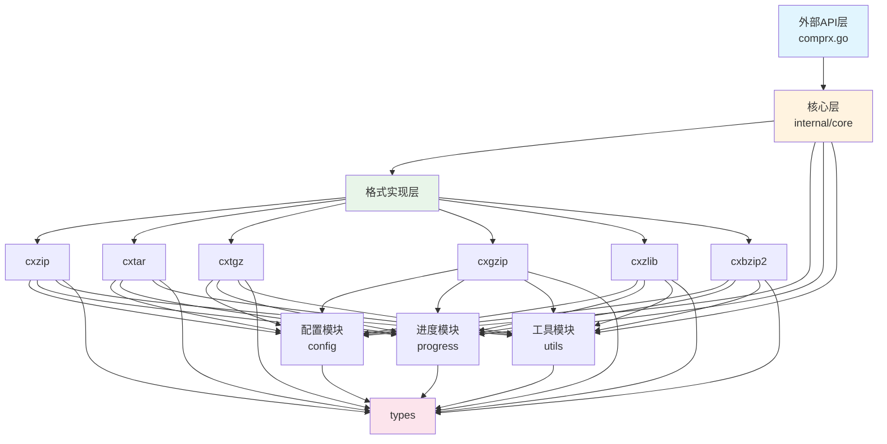

# ComprX 项目分析报告

> 生成时间: 2026-05-23  
> 项目路径: `d:\峡谷\Dev\本地项目\comprx`  
> 分析工具: Trae IDE + Kimi-K2.5

---

## 一、项目概述

**ComprX** 是一个功能强大的 Go 语言压缩解压缩库，提供统一的 API 接口处理多种压缩格式（ZIP、TAR、TGZ、GZIP、ZLIB、BZIP2）。项目采用模块化架构设计，支持线程安全操作、进度条显示、文件过滤等高级功能。

### 1.1 核心特性
- 支持 7 种压缩格式：ZIP、TAR、TGZ/TAR.GZ、GZIP、ZLIB、BZ2/BZIP2
- 线程安全：所有操作均为线程安全
- 进度显示：4 种进度条样式（文本、Unicode、ASCII、默认）
- 智能过滤：支持 glob 模式匹配、文件大小过滤
- 内存操作：支持 GZIP/ZLIB 的字节数据和字符串内存压缩/解压
- 流式处理：支持 GZIP/ZLIB 的流式压缩和解压缩

---

## 二、目录结构分析

### 2.1 根目录结构

```
comprx/
├── README.md              # 项目说明文档
├── LICENSE                # MIT 许可证
├── go.mod                 # Go 模块定义
├── go.sum                 # Go 依赖校验
├── APIDOC.md              # API 文档
│
├── comprx.go              # 主入口文件 - 提供便捷函数
├── options.go             # 配置选项定义
├── filter.go              # 文件过滤功能
├── list.go                # 压缩包列表功能
├── memory.go              # 内存压缩/解压功能
├── size.go                # 文件大小格式化
├── export.go              # 导出类型定义
│
├── *_test.go              # 测试文件
│
├── internal/              # 内部实现包
│   ├── core/              # 核心逻辑
│   ├── cxzip/             # ZIP 格式实现
│   ├── cxtar/             # TAR 格式实现
│   ├── cxtgz/             # TGZ 格式实现
│   ├── cxgzip/            # GZIP 格式实现
│   ├── cxzlib/            # ZLIB 格式实现
│   ├── cxbzip2/           # BZIP2 格式实现
│   ├── config/            # 配置管理
│   ├── progress/          # 进度显示
│   └── utils/             # 工具函数
│
├── types/                 # 公共类型定义
│   ├── types.go           # 核心类型（压缩格式、进度样式等）
│   ├── filter.go          # 过滤器类型
│   └── list.go            # 列表相关类型
│
├── docs/                  # 设计文档
│   ├── ARCHITECTURE.md    # 架构设计文档
│   ├── implementation-plan.md
│   └── ...
│
└── vendor/                # 依赖库（vendor 模式）
    ├── gitee.com/MM-Q/go-kit/
    └── github.com/schollz/progressbar/
```

### 2.2 目录规范评估

| 目录 | 用途 | 规范程度 |
|------|------|----------|
| `internal/` | 内部实现包，遵循 Go 标准项目布局 | ✅ 优秀 |
| `types/` | 公共类型定义，与 internal 分离 | ✅ 优秀 |
| `docs/` | 设计文档归档 | ✅ 良好 |
| `vendor/` | 依赖管理，使用 vendor 模式 | ✅ 良好 |
| 根目录 | 入口文件组织清晰 | ✅ 良好 |

**评价**: 目录结构遵循 Go 语言标准项目布局规范，层次分明，职责清晰。

---

## 三、核心功能模块分析

### 3.1 模块划分

```
┌─────────────────────────────────────────────────────────────┐
│                      外部 API 层 (Package comprx)              │
├─────────────────────────────────────────────────────────────┤
│  便捷函数  │  配置选项  │  文件过滤  │  列表功能  │  内存操作   │
│  comprx.go │ options.go │ filter.go  │  list.go   │ memory.go  │
└─────────────────────────────────────────────────────────────┘
                              │
                              ▼
┌─────────────────────────────────────────────────────────────┐
│                      核心逻辑层 (internal/core)                │
│                      comprx.go / list.go                      │
└─────────────────────────────────────────────────────────────┘
                              │
        ┌─────────────────────┼─────────────────────┐
        ▼                     ▼                     ▼
┌───────────────┐    ┌───────────────┐    ┌───────────────┐
│  格式实现层    │    │   支撑模块     │    │   类型定义     │
├───────────────┤    ├───────────────┤    ├───────────────┤
│ cxzip/        │    │ config/       │    │ types/        │
│ cxtar/        │    │ progress/     │    │               │
│ cxtgz/        │    │ utils/        │    │               │
│ cxgzip/       │    │               │    │               │
│ cxzlib/       │    │               │    │               │
│ cxbzip2/      │    │               │    │               │
└───────────────┘    └───────────────┘    └───────────────┘
```

### 3.2 模块详细说明

#### 3.2.1 基础支撑模块

| 模块名称 | 核心功能 | 对应文件 | 关键依赖 |
|----------|----------|----------|----------|
| **配置管理** | 压缩等级、覆盖策略、进度配置 | `internal/config/config.go` | types, progress |
| **进度显示** | 4 种进度条样式、进度计算 | `internal/progress/progress.go` | schollz/progressbar |
| **工具函数** | 文件操作、路径验证、格式检测 | `internal/utils/utils.go` | types |
| **类型定义** | 压缩格式、进度样式、过滤器 | `types/*.go` | 无 |

#### 3.2.2 格式实现模块

| 模块名称 | 支持格式 | 核心功能 | 对应文件 |
|----------|----------|----------|----------|
| **cxzip** | .zip | 压缩/解压/列表 | `zip.go`, `unzip.go`, `list.go` |
| **cxtar** | .tar | 压缩/解压/列表 | `tar.go`, `untar.go`, `list.go` |
| **cxtgz** | .tgz, .tar.gz | 压缩/解压/列表 | `tgz.go`, `untgz.go`, `list.go` |
| **cxgzip** | .gz | 压缩/解压/列表/内存操作 | `gzip.go`, `ungzip.go`, `memory.go` |
| **cxzlib** | .zlib | 压缩/解压/列表/内存操作 | `zlib.go`, `unzlib.go`, `memory.go` |
| **cxbzip2** | .bz2, .bzip2 | 解压/列表（仅解压） | `unbzip2.go`, `list.go` |

#### 3.2.3 业务核心模块

| 模块名称 | 核心功能 | 输入 | 输出 |
|----------|----------|------|------|
| **Pack** | 压缩文件/目录 | 源路径、配置 | 压缩文件 |
| **Unpack** | 解压文件 | 压缩文件、目标路径 | 解压后的文件 |
| **List** | 查看压缩包内容 | 压缩文件路径 | 文件列表信息 |
| **Filter** | 文件过滤 | 文件路径、大小 | 是否跳过 |
| **Memory** | 内存压缩/解压 | 字节数据/字符串 | 压缩/解压数据 |

---

## 四、模块间依赖关系

### 4.1 依赖关系图



### 4.2 依赖分析

**依赖方向**: 自上而下，无循环依赖

**核心依赖链**:
1. `外部API` → `core` → `格式实现` → `config/progress/utils` → `types`
2. 所有格式实现模块都依赖 `types` 包
3. `config` 依赖 `types` 和 `progress`
4. `progress` 依赖 `types` 和第三方库 `progressbar`

**依赖健康度**: ✅ 优秀
- 无循环依赖
- 依赖方向清晰
- 底层模块（types）无外部依赖

---

## 五、设计模式与实现逻辑

### 5.1 设计模式识别

#### 5.1.1 工厂模式
**位置**: `internal/core/comprx.go`  
**应用**: 通过 `New()` / `NewComprx()` 创建压缩器实例

```go
// 创建压缩器实例
func NewComprx() *Comprx {
    return &Comprx{
        Config: config.New(),
    }
}
```

#### 5.1.2 策略模式
**位置**: `internal/core/comprx.go`  
**应用**: 根据压缩格式自动选择对应的处理策略

```go
// 根据压缩格式进行打包
switch compressType {
case types.CompressTypeZip:
    return cxzip.Zip(dst, src, c.Config)
case types.CompressTypeTar:
    return cxtar.Tar(dst, src, c.Config)
case types.CompressTypeTgz, types.CompressTypeTarGz:
    return cxtgz.Tgz(dst, src, c.Config)
// ...
}
```

#### 5.1.3 建造者模式（链式配置）
**位置**: `options.go`  
**应用**: 通过链式方法构建配置选项

```go
opts := comprx.DefaultOptions().
    WithInclude([]string{"*.go"}).
    WithExclude([]string{"*_test.go"}).
    WithMaxSize(10 * 1024 * 1024).
    WithProgress(true)
```

#### 5.1.4 模板方法模式
**位置**: 各格式实现模块  
**应用**: 所有格式实现遵循统一的处理流程模板

```
统一流程:
1. 路径验证与转换
2. 检查目标文件是否存在
3. 计算源文件总大小（进度模式）
4. 初始化进度显示
5. 创建压缩/解压流
6. 遍历处理文件
7. 关闭资源
```

### 5.2 核心业务逻辑流程

#### 5.2.1 压缩流程

```
用户调用 Pack(dst, src)
        │
        ▼
┌───────────────────────┐
│ 1. 参数验证           │
│    - 检查路径非空     │
│    - 路径规范化       │
└───────────────────────┘
        │
        ▼
┌───────────────────────┐
│ 2. 格式检测           │
│    - 根据扩展名识别   │
│    - 返回 CompressType│
└───────────────────────┘
        │
        ▼
┌───────────────────────┐
│ 3. 前置检查           │
│    - 目标文件存在性   │
│    - 覆盖策略检查     │
│    - 创建目标目录     │
└───────────────────────┘
        │
        ▼
┌───────────────────────┐
│ 4. 格式分发           │
│    - switch 选择处理器│
└───────────────────────┘
        │
        ▼
┌───────────────────────┐
│ 5. 格式特定处理       │
│    - ZIP/TAR/TGZ/...  │
│    - 遍历文件         │
│    - 应用过滤器       │
│    - 写入压缩数据     │
└───────────────────────┘
        │
        ▼
┌───────────────────────┐
│ 6. 资源清理           │
│    - 关闭文件         │
│    - 关闭进度条       │
└───────────────────────┘
```

#### 5.2.2 文件过滤流程

```
文件路径 + 大小 + 是否目录
        │
        ▼
┌───────────────────────┐
│ 1. 大小过滤           │
│    - 检查 MinSize     │
│    - 检查 MaxSize     │
│    - 目录跳过此检查   │
└───────────────────────┘
        │
        ▼
┌───────────────────────┐
│ 2. 包含模式检查       │
│    - 匹配任一 Include │
│    - 不匹配则跳过     │
└───────────────────────┘
        │
        ▼
┌───────────────────────┐
│ 3. 排除模式检查       │
│    - 匹配任一 Exclude │
│    - 匹配则跳过       │
└───────────────────────┘
        │
        ▼
    返回: 是否跳过
```

### 5.3 代码质量分析

#### 5.3.1 优点
1. **文档完善**: 每个函数都有详细的 GoDoc 注释
2. **错误处理**: 使用 `fmt.Errorf` 包装错误，提供上下文
3. **资源管理**: 使用 `defer` 确保资源释放
4. **参数验证**: 入口函数都有参数校验
5. **路径安全**: 实现了路径遍历攻击防护

#### 5.3.2 潜在优化点
1. **重复代码**: 各格式实现模块有较多相似代码，可进一步抽象
2. **错误类型**: 可定义自定义错误类型，便于调用方判断
3. **日志记录**: 当前无日志系统，调试困难

---

## 六、技术栈评估

### 6.1 核心技术栈

| 技术组件 | 版本/说明 | 用途 | 评估 |
|----------|-----------|------|------|
| **Go** | 1.25.0 | 编程语言 | ✅ 最新稳定版 |
| **标准库** | archive/zip, archive/tar, compress/gzip, compress/zlib, compress/bzip2 | 压缩算法实现 | ✅ 官方维护，稳定可靠 |
| **go-kit** | v0.0.7 | 对象池（buffer、byte） | ✅ 内部依赖，轻量高效 |
| **progressbar** | v3.18.0 | 进度条显示 | ✅ 社区活跃，功能完善 |

### 6.2 技术选型分析

**优势**:
1. 使用 Go 标准库实现核心压缩算法，无外部依赖风险
2. 进度条使用成熟的第三方库，避免重复造轮子
3. 使用对象池优化内存分配，提升性能

**待确认**:
1. `go-kit` 为内部依赖，需确认维护状态
2. Go 1.25.0 较新，需考虑兼容性

---

## 七、补充分析

### 7.1 代码规范

| 检查项 | 状态 | 说明 |
|--------|------|------|
| 命名规范 | ✅ | 使用驼峰命名，符合 Go 规范 |
| 包命名 | ✅ | 简短、清晰（cxzip、cxtgz 等） |
| 注释规范 | ✅ | 完整的 GoDoc 注释 |
| 导入分组 | ✅ | 标准库、内部包、第三方包分组 |
| 错误处理 | ✅ | 统一使用 `fmt.Errorf` 包装 |

### 7.2 异常处理

```go
// 典型错误处理模式
if err != nil {
    return fmt.Errorf("failed to xxx: %w", err)
}
```

**覆盖情况**:
- ✅ 文件操作错误
- ✅ 路径验证错误
- ✅ 压缩/解压过程错误
- ✅ 参数验证错误

### 7.3 扩展性评估

**优点**:
1. 新增压缩格式只需实现统一接口
2. 配置选项通过结构体扩展，向后兼容
3. 过滤器支持自定义模式

**扩展点**:
1. 新增格式：在 `internal/` 下创建新包，在 `core` 中添加分发逻辑
2. 新增进度样式：在 `types` 中定义，在 `progress` 中实现
3. 新增过滤条件：在 `FilterOptions` 中添加字段

### 7.4 性能关键点

| 位置 | 优化措施 | 效果 |
|------|----------|------|
| `pool.CalculateBufferSize` | 动态计算缓冲区大小 | 减少内存分配 |
| `pool.GetByteCap/PutByte` | 对象池复用缓冲区 | 减少 GC 压力 |
| `progress.CopyBuffer` | 带进度的大文件复制 | 避免内存溢出 |
| `filter.matchAnyPattern` | 快速失败优化 | 减少无效匹配 |

---

## 八、总结

### 8.1 项目核心特点

1. **多格式统一接口**: 7 种压缩格式使用一致的 API，降低学习成本
2. **高度模块化**: 清晰的层次结构，易于维护和扩展
3. **完善的过滤系统**: 支持 glob 模式、大小过滤，满足复杂场景
4. **线程安全**: 所有操作均为线程安全，支持并发使用
5. **丰富的进度显示**: 4 种进度样式，适应不同终端环境
6. **内存优化**: 使用对象池减少内存分配，提升性能

### 8.2 待优化点

1. **代码复用**: 各格式实现模块存在重复代码，可抽象公共逻辑
2. **错误类型**: 建议定义自定义错误类型，便于调用方精确处理
3. **日志系统**: 建议添加可选的日志记录功能，便于调试
4. **单元测试**: 部分模块测试覆盖率可进一步提升
5. **性能基准**: 建议添加性能基准测试，量化优化效果

### 8.3 关键记忆点

| 类别 | 关键信息 |
|------|----------|
| **项目定位** | Go 语言压缩解压缩库，支持 7 种格式 |
| **架构模式** | 分层架构：API 层 → 核心层 → 格式实现层 → 支撑层 |
| **核心类型** | `CompressType`, `CompressionLevel`, `ProgressStyle`, `FilterOptions` |
| **设计模式** | 工厂模式、策略模式、建造者模式、模板方法模式 |
| **线程安全** | 所有操作均为线程安全 |
| **依赖关系** | 自上而下，无循环依赖，底层 `types` 包无外部依赖 |
| **性能优化** | 对象池复用、动态缓冲区、快速失败 |
| **安全特性** | 路径遍历攻击防护、UNC 路径检测 |
| **新增功能** | `IsArchive()` 函数判断文件是否为支持的压缩格式 |

---

## 九、附录

### 9.1 文件清单

**核心文件**:
- `comprx.go` - 主入口，便捷函数（新增 `IsArchive()` 函数）
- `options.go` - 配置选项
- `internal/core/comprx.go` - 核心逻辑
- `types/types.go` - 核心类型定义

**格式实现**:
- `internal/cxzip/zip.go` - ZIP 压缩
- `internal/cxtgz/tgz.go` - TGZ 压缩
- `internal/cxgzip/gzip.go` - GZIP 压缩
- `internal/cxzlib/zlib.go` - ZLIB 压缩
- `internal/cxbzip2/unbzip2.go` - BZIP2 解压

**支撑模块**:
- `internal/config/config.go` - 配置管理
- `internal/progress/progress.go` - 进度显示
- `internal/utils/utils.go` - 工具函数
- `types/filter.go` - 过滤器实现

### 9.2 版本信息

- **Go 版本**: 1.25.0
- **模块路径**: `gitee.com/MM-Q/comprx`
- **主要依赖**:
  - `gitee.com/MM-Q/go-kit v0.0.7`
  - `github.com/schollz/progressbar/v3 v3.18.0`

---

> **记忆状态**: ✅ 已完成项目记忆建立  
> **后续支持**: 可基于此报告回答项目相关的细节问题
