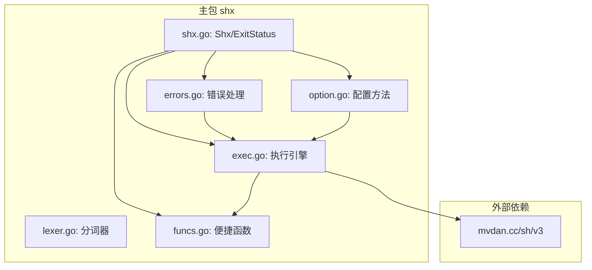

# ShellX 项目深度分析报告

> 分析日期：2026-06-18
> 分析目标：全面理解项目架构、设计模式、代码实现及技术选型

---

## 1. 项目概述

**Shx** 是一个 Go 语言编写的 Shell 命令执行库，基于 `mvdan.cc/sh/v3` 纯 Go 实现，提供跨平台一致的 Shell 命令执行能力。

### 1.1 元信息

| 属性 | 值 |
|------|-----|
| 模块名 | `gitee.com/MM-Q/shx` |
| Go 版本 | `go 1.25.0` |
| 核心依赖 | `mvdan.cc/sh/v3 v3.12.0` |
| 间接依赖 | `golang.org/x/sys v0.33.0`, `golang.org/x/term v0.32.0` |

---

## 2. 目录结构解析

```
shx/                                       # 项目根目录
├── AGENTS.md                              # 项目分析报告（本文件）
├── APIDOC.md                              # API 文档
├── LICENSE                                # 开源许可证
├── README.md                              # 项目说明文档
├── go.mod                                 # Go 模块定义文件
├── go.sum                                 # 依赖校验文件
│
├── shx.go                                 # 包文档 + Shx 结构体 + 构造函数 + newShx 内部构造
├── exec.go                                # 执行方法（Exec/ExecOutput/ExecContext，含脚本文件解析分支）
├── option.go                              # 配置方法（WithDir/WithEnv/WithEnvs/WithTimeout/WithContext/WithStdin/WithStdout/WithStderr）
├── funcs.go                               # 便捷函数（Run/Out/RunWith/OutCtx 等 22 个导出函数）
├── errors.go                              # 错误类型 + handleError + IsExitStatus
├── lexer.go                               # 命令字符串分词器（Split/SplitE，选择性转义，Windows 路径原生兼容）
│
├── shx_test.go                            # 构造函数 + 执行 + 配置测试
├── exec_test.go                           # 执行方法测试（超时/上下文/重复执行）
├── option_test.go                         # 配置方法测试（目录/环境变量/超时/上下文）
├── funcs_test.go                          # 便捷函数测试
├── errors_test.go                         # 错误处理测试（IsExitStatus/handleError）
├── script_test.go                         # 脚本文件执行测试
│
├── cmd/
│   ├── shx/
│   │   └── main.go                        # CLI 命令行工具（测试执行入口）
│   ├── shck/
│   │   └── main.go                        # 语法检查 CLI
│   └── shfmt/
│       └── main.go                        # 格式化 CLI（含 -w 写回标志）
│
├── shx-skill/
│   ├── SKILL.md                           # 技能文档（自包含）
│   └── references/
│       ├── api.md                         # API 完整参考
│       └── examples.md                    # 使用示例
```

### 2.1 目录规范度评估

| 维度 | 评价 |
|------|------|
| **命名规范** | 符合 Go 标准（小写文件名 + `_test.go` 测试文件） |
| **文件粒度** | 职责划分清晰（类型/执行/配置/便捷函数/错误/分词各司其职） |
| **文档完备性** | 每个 Go 文件含包级别注释，导出类型/函数均有注释 |
| **测试覆盖** | 完整的表驱动测试、并发安全测试、模糊测试 |
| **冗余情况** | 无冗余目录或文件 |

---

## 3. 核心功能模块

### 3.1 模块总览

```
┌─────────────────────────────────────────────────────┐
│                  Shx 整体架构                        │
├─────────────────────────────────────────────────────┤
│                                                     │
│   ┌──────────────────────────────────────────┐      │
│   │         Shx 对象（业务核心）               │      │
│   │  · 配置方法 (WithXxx)                    │      │
│   │  · 同步执行 (Exec/ExecOutput/ExecContext) │      │
│   │  · 无进程控制（仅 context 取消）          │      │
│   └──────────────────────────────────────────┘      │
│                                                     │
│   ┌──────────────────────────────────────────┐      │
│   │        便捷函数层                        │      │
│   │  Run/Out/RunWith/OutCtx                  │      │
│   │  RunScript/OutScript/RunScriptWith 等    │      │
│   └──────────────────────────────────────────┘      │
│                                                     │
│   ┌──────────────────────────────────────────┐      │
│   │        分词器（工具支撑）                  │      │
│   │  Split/SplitE                            │      │
│   └──────────────────────────────────────────┘      │
│                                                     │
│   ┌──────────────────────────────────────────┐      │
│   │        共享设计层                        │      │
│   │  · 链式调用 API · 上下文/超时优先级控制   │      │
│   └──────────────────────────────────────────┘      │
└─────────────────────────────────────────────────────┘
```

### 3.2 模块明细

| 模块名称 | 类型 | 核心功能 | 对应文件 | 输入 | 输出 |
|---------|------|---------|---------|------|------|
| **Shx 对象** | 业务核心 | 纯 Go Shell 执行对象（导出字段 + 链式配置） | [shx.go](file:///d:/峡谷/Dev/本地项目/shellx/shx.go) | 命令字符串/脚本文件 | 错误/输出 |
| **执行引擎** | 业务核心 | mvdan.cc/sh 驱动的命令执行（支持命令字符串和脚本文件） | [exec.go](file:///d:/峡谷/Dev/本地项目/shellx/exec.go) | Shx 配置 + 上下文 | 错误/合并输出 |
| **脚本执行** | 业务扩展 | 从 `.sh` 脚本文件中读取并解析执行 Bash 脚本 | [exec.go](file:///d:/峡谷/Dev/本地项目/shellx/exec.go) | 脚本文件路径 | 错误/合并输出 |
| **配置方法** | 业务封装 | 链式配置工作目录/环境变量/超时/上下文/标准IO | [option.go](file:///d:/峡谷/Dev/本地项目/shellx/option.go) | 配置参数 | `*Shx`（支持链式调用） |
| **便捷函数层** | 业务封装 | 24 个导出快捷执行函数 + FormatOptions 配置结构体（含 CheckSyntax/Format 等语法检查与格式化函数） | [funcs.go](file:///d:/峡谷/Dev/本地项目/shellx/funcs.go) | 命令字符串/脚本路径 + 可选超时 | 错误/输出字节流/格式化结果 |
| **错误处理** | 基础支撑 | ExitStatus/SyntaxError 包装与错误分类 | [errors.go](file:///d:/峡谷/Dev/本地项目/shellx/errors.go) | 原始错误 | 分类错误 |
| **命令分词器** | 工具支撑 | 智能拆分 Shell 命令字符串（选择性转义，Windows 路径原生兼容） | [lexer.go](file:///d:/峡谷/Dev/本地项目/shellx/lexer.go) | 命令字符串 | 拆分后的参数切片 |

### 3.3 模块依赖关系

```
shx (主包)
├── shx.go         ← 依赖 types（Shx 结构体定义在 shx.go 中）
├── errors.go      ← 依赖 types（ExitStatus）
├── exec.go        ← 依赖 types, errors.go (handleError)
├── option.go      ← 依赖 types（Shx 结构体）
├── funcs.go       ← 依赖 types（New）, exec.go (Exec/ExecOutput)
└── lexer.go       ← 独立工具（不依赖其他内部模块）
```

### 3.4 依赖关系 Mermaid 流程图



### 3.5 依赖风险识别

| 风险类型 | 描述 | 严重度 |
|---------|------|--------|
| **外部依赖** | 依赖 `mvdan.cc/sh/v3 v3.12.0`，社区活跃，维护良好 | ✅ 安全 |
| **间接依赖** | `golang.org/x/sys` 和 `golang.org/x/term` 由 Go 官方维护 | ✅ 安全 |

---

## 4. 设计模式与实现逻辑

### 4.1 识别到的设计模式

| 设计模式 | 代码位置 | 应用场景 |
|---------|---------|---------|
| **Fluent Builder（流式构建器）** | `option.go` 中 `WithDir().WithTimeout().WithEnv()` 等 | 链式配置 Shx 对象 |
| **Template Method（模板方法）** | `funcs.go` 中 `Run/Out/RunWith/OutCtx` 等 | 18 个便捷函数封装了 Shx 的创建→配置→执行流程 |
| **Exported Fields（导出字段）** | `shx.go` 中 `Shx` 结构体 | 7 个核心字段导出，支持结构体字面量配置与链式 API 双模式 |
| **Error Wrapping（错误包装）** | `errors.go` 中 `handleError()` | 将底层错误包装为语义明确的用户友好错误 |
| **Config Object（配置对象）** | `funcs.go` 中 `FormatOptions` + `DefaultFormatOptions()` | 格式化行为配置的结构体封装，提供合理默认值 |

### 4.2 核心执行流程

```
shx.New("echo hello")
    │
    ├─ 创建 Shx 对象
    ├─ parser = syntax.NewParser(syntax.Variant(syntax.LangBash))   ── Bash 方言解析器
    ├─ env = expand.ListEnviron()    ── 继承系统环境变量
    └─ dir = os.Getwd()              ── 当前工作目录
    │
    ▼
.WithTimeout(5s).WithEnv("K", "V")
    │ 链式配置
    ▼
cmd.Exec()
    │
    ├─ 1. buildContext()
    │      │
    │      ├─ Ctx != nil? → 使用用户上下文（覆盖 timeout）
    │      ├─ Timeout > 0 → context.WithTimeout
    │      └─ 默认        → context.Background()
    │
    ├─ 2. execWithContext(ctx)
    │      │
    │      ├─ 判断 s.scriptFile != "" ?
    │      │   ├─ 是 → os.Open(file) → parser.Parse(file)  ── 从文件解析 AST
    │      │   └─ 否 → parser.Parse(cmdStr)                ── 从字符串解析 AST
    │      │
    │      ├─ interp.New(opts)   ── 创建解释器 Runner
    │      │     ├─ interp.Env(s.Env)
    │      │     ├─ interp.Dir(s.Dir)
    │      │     └─ interp.StdIO(s.Stdin, out, errOut)
    │      │
    │      └─ runner.Run(ctx, file)  ── 执行 AST
    │
    └─ 3. handleError(err, cmdStr, timeout)
           │
           ├─ context.Canceled      → "command canceled"
           ├─ context.DeadlineExceeded → "command timed out"
           ├─ interp.ExitStatus     → ExitStatus{Code, err}（保留原始错误链）
           └─ 其他                  → "command failed"
```

### 4.3 超时与上下文优先级规则

```
                    ┌─────────────────────────────┐
                    │   WithContext(userCtx)      │
                    │   （用户显式设置上下文）       │
                    └─────────────┬───────────────┘
                                  │ 最高优先级
                                  │ 完全覆盖 WithTimeout
                                  ▼
                    ┌─────────────────────────────┐
                    │   WithTimeout(duration)     │
                    │   （设置超时时长）            │
                    └─────────────┬───────────────┘
                                  │ 次优先级
                                  │ Ctx 为 nil 时才生效
                                  ▼
                    ┌─────────────────────────────┐
                    │   默认 context.Background()  │
                    │   （无超时，无取消）           │
                    └─────────────────────────────┘
```

### 4.4 命令字符串分词器实现逻辑

```
splitInternal("git commit -m \"feat: add feature\"")
    │
    ├─ trimSpace → "git commit -m \"feat: add feature\""
    │
    ├─ 逐字符遍历 rune 序列
    │   │
    │   ├─ 遇到 '\\' + nextChar → 选择性转义：
    │   │   仅在 nextChar 为引号/特殊字符/空格/'\' 时作为转义
    │   │   普通字符（如 Windows 路径 \p\f）直接写入反斜杠
    │   ├─ 遇到 '&' & nextChar='&' → 识别多字符操作符 "&&"
    │   ├─ 遇到 '"'/'`' → handleQuoteChar：切换引号状态
    │   │   ├─ 不在引号内 → 进入引号状态，记录引号类型
    │   │   └─ 在引号内且同类型 → 退出引号状态
    │   ├─ 遇到 ';'/'|'/'&' 等 → 非引号态下作为独立 token
    │   └─ 遇到空格 → 仅在非引号态下 flushBuilder 分割
    │
    ├─ 遍历结束 → flush 最后一个 token
    │
    ├─ inQuotes == true → 返回 UnclosedQuoteError
    │
    └─ 返回 ["git", "commit", "-m", "feat: add feature"]
```

---

## 5. 技术栈评估

### 5.1 核心技术栈

| 分类 | 技术 | 版本 | 用途 |
|------|------|------|------|
| **语言** | Go | 1.25.0 | 项目基础语言 |
| **第三方** | `mvdan.cc/sh/v3` | v3.12.0 | 纯 Go Shell 解析/执行 |
| **官方扩展** | `golang.org/x/sys` | v0.33.0 | 系统调用接口（间接） |
| **官方扩展** | `golang.org/x/term` | v0.32.0 | 终端控制（间接） |

### 5.2 技术选型评估

| 维度 | 评价 |
|------|------|
| **场景适配度** | ⭐⭐⭐⭐⭐ 专注纯 Go Shell 执行，覆盖命令字符串和脚本文件两大场景 |
| **技术成熟度** | ⭐⭐⭐⭐⭐ `mvdan.cc/sh` 是 Go 生态中最成熟的 Shell 解析库 |
| **依赖风险** | ⭐⭐⭐⭐ 依赖一个成熟的第三方库，维护良好 |
| **版本兼容性** | ⭐⭐⭐⭐⭐ Go 1.25.0（最新版本），依赖均维护良好 |
| **社区活跃度** | ⭐⭐⭐⭐ `mvdan.cc/sh/v3` 由 Daniel Martí 维护，Star 数量高，持续更新 |
| **过时风险** | ⭐⭐⭐⭐⭐ 无过时组件，均为活跃维护项目 |

---

## 6. 代码规范与质量分析

### 6.1 命名规范

| 规范项 | 评分 | 说明 |
|--------|------|------|
| **包命名** | ✅ | 全小写单名：`shx` |
| **类型命名** | ✅ | 大写导出：`Shx`, `ExitStatus` |
| **函数命名** | ✅ | `New`, `Exec`, `Run`, `WithTimeout` 等符合 Go 惯例 |
| **文件名** | ✅ | 小写+下划线：`shx.go`, `funcs_test.go` |
| **接收器名** | ✅ | 单字母：`s *Shx` |

### 6.2 注释规范

- **包级别注释**：每个 Go 文件均包含包注释，说明文件职责
- **导出类型注释**：所有导出类型均有注释
- **导出函数注释**：所有导出函数均标注参数/返回值/注意事项
- **注意标注**：关键并发安全问题使用 `// 注意:` 或 `// 并发安全说明:` 标注

### 6.3 测试覆盖

| 测试文件 | 测试内容 |
|---------|---------|
| `shx_test.go` | 构造函数 + 执行 + 配置 + 环境变量测试 |
| `exec_test.go` | Exec/ExecOutput/ExecContext 超时/取消/重复执行测试 |
| `option_test.go` | WithDir/WithEnv/WithEnvs/WithTimeout/WithContext/WithStdin/WithStdout/WithStderr |
| `funcs_test.go` | Run/Out/RunWith/OutWith 等便捷函数 + CheckSyntax/CheckScriptSyntax/Format/FormatScript + FormatWithOptions/FormatScriptWithOptions |
| `script_test.go` | 脚本文件执行测试（正常执行、文件不存在、空路径、超时、WithDir、WithEnv、链式配置、Bash 特有语法） |
| `errors_test.go` | IsExitStatus 识别、handleError 分类 |

### 6.4 异常处理分析

| 场景 | 处理方式 | 评价 |
|------|---------|------|
| **参数校验失败** | `panic()` | 快速失败，符合库设计意图（无效配置不应进入执行阶段） |
| **命令执行错误** | `handleError()` | 统一分类包装，返回语义明确的错误 |
| **超时/取消** | context 机制 + 语义错误 | 精确识别 DeadlineExceeded/Canceled |
| **退出码** | `ExitStatus` | 退出码可从错误中提取，且通过 `Unwrap()` 保留原始 `interp.ExitStatus` 错误链 |

### 6.5 扩展性评估

| 维度 | 评价 |
|------|------|
| **新增便捷函数** | ⭐⭐⭐⭐⭐ 模板方法模式，只需封装 Shx 创建→配置→执行三步 |
| **Bash 方言默认** | ⭐⭐⭐⭐⭐ 默认使用 Bash 方言解析器（`syntax.LangBash`），支持 `[[ ]]`、`function`、`select` 等 Bash 特有语法 |
| **结构体字段导出** | ⭐⭐⭐⭐⭐ 7 个核心字段导出（Dir/Env/Timeout/Ctx/Stdin/Stdout/Stderr），支持结构体字面量和链式 API 双模式配置 |

### 5.6 性能关键点

| 关注点 | 分析 | 建议 |
|--------|------|------|
| **AST 解析** | ⚠️ 每次执行需解析字符串为 AST，短命令场景有解析开销 | 设计取舍，不可避免 |

---

## 6. 核心特点总结

### 6.1 项目核心特点

1. **纯 Go 实现**：基于 `mvdan.cc/sh/v3`，不依赖系统 shell，跨平台行为一致
2. **Bash 方言解析**：默认使用 `syntax.LangBash` 解析器，支持 `[[ ]]`、`function`、`select` 等 Bash 特有语法
3. **脚本文件执行**：原生支持执行 `.sh` 脚本文件，通过 `NewScript`/`RunScript`/`OutScript` 等 API 无缝集成，`NewScript` 自动校验 `.sh` 扩展名
4. **链式调用 API**：完全流畅的链式 API 设计，与 Go 生态主流趋势一致
5. **结构体字段导出**：`Shx` 结构体 7 个核心字段导出（Dir/Env/Timeout/Ctx/Stdin/Stdout/Stderr），支持结构体字面量和链式 API 双模式配置
6. **重复执行支持**：移除了单次执行保护，每次执行重新创建底层资源
7. **构造函数简化**：提取 `newShx` 内部构造函数，消除 4 处重复初始化代码
8. **命令分词器**：智能拆分 Shell 命令字符串，支持选择性转义，Windows 路径原生兼容
9. **语法检查与格式化**：基于 `mvdan.cc/sh/v3/syntax` 提供 `CheckSyntax`/`Format` 等 6 个函数和 `FormatOptions` 配置结构体，`Format`/`FormatScript` 默认保留注释、4 空格缩进、case 缩进，`FormatWithOptions`/`FormatScriptWithOptions` 支持自定义 8 个格式化选项
10. **完整测试覆盖**：包含全面的表驱动测试、并发安全测试、模糊测试与 Windows 路径测试
11. **CLI 工具链**：`shx`（执行）、`shck`（语法检查）、`shfmt`（格式化）三个独立 CLI 工具，帮助信息中均包含项目地址
12. **错误链支持**：`ExitStatus` 通过 `Unwrap()` 保留原始错误，支持 `errors.Is/As` 穿透

### 6.2 关键记忆点（用于后续快速回忆）

```
项目: Shx - Go Shell 命令执行库
模块: gitee.com/MM-Q/shx
Go版本: 1.25.0
依赖: mvdan.cc/sh/v3 v3.12.0

单包结构 (根目录):
  ├─ shx.go: Shx 结构体 (7个导出字段: Dir/Env/Timeout/Ctx/Stdin/Stdout/Stderr)
  ├─ shx.go: 构造函数 (New/NewArgs/NewCmds/NewScript) + newShx 内部构造
  ├─ exec.go: 执行引擎 (字符串/文件双解析路径)
  ├─ option.go: 配置方法 (WithDir/WithEnv/WithEnvs/WithTimeout/WithContext/WithStdin/WithStdout/WithStderr)
  ├─ funcs.go: 24个便捷函数 + FormatOptions 结构体 (含 Run/RunScript/CheckSyntax/Format/FormatWithOptions 等)
  ├─ errors.go: handleError + IsExitStatus + SyntaxError
  ├─ lexer.go: 命令分词器 (Split/SplitE) + 命令查找 (FindCmd/FindCommandPath)
  ├─ cmd/shx/main.go:   CLI 执行工具
  ├─ cmd/shck/main.go:  CLI 语法检查工具
  ├─ cmd/shfmt/main.go: CLI 格式化工具（-w 写回）
  └─ shx-skill/: 技能文档 (SKILL.md + api.md + examples.md)

设计模式: 流式构建器 | 模板方法 | 错误包装 | 导出字段 | 配置对象（FormatOptions + DefaultFormatOptions）
上下文优先级: WithContext > WithTimeout > context.Background
执行模式: 每次新建 Runner + 重新解析 AST，支持重复执行
并发安全: 配置阶段非并发安全, 执行阶段并发安全
默认解析器: syntax.LangBash (支持 Bash 特有语法)
单次保护: 已移除
脚本校验: NewScript 要求路径以 .sh 结尾，否则 panic
FindCmd: 只在 PATH 中查找命令（不主动搜索 CWD）。ErrDot 分支用 path 而非 name 构建绝对路径，避免 Windows 丢失扩展名
```
错误链: ExitStatus 通过 Unwrap() 保留原始 interp.ExitStatus，支持 errors.Is 穿透
格式化: FormatOptions 结构体控制 8 个选项，DefaultFormatOptions 返回 {Indent=4, SwitchCaseIndent, KeepComments}
         FormatWithOptions/FormatScriptWithOptions 接受自定义选项，Format/FormatScript 委托调用默认
CLI 帮助: 三个工具（shx/shck/shfmt）帮助信息均包含项目地址 https://gitee.com/MM-Q/shx.git
```

---

## 7. 附录

### 7.1 导出 API 速查

```go
// 包导入
import "gitee.com/MM-Q/shx"

// 构造函数
func New(cmdStr string) *Shx
func NewArgs(cmd string, args ...string) *Shx
func NewCmds(cmds []string) *Shx
func NewScript(filePath string) *Shx           // 从 bash 脚本文件创建（路径必须以 .sh 结尾）

// 执行方法
func (s *Shx) Exec() error                      // 执行命令
func (s *Shx) ExecOutput() ([]byte, error)      // 执行并返回输出
func (s *Shx) ExecContext(ctx context.Context) error
func (s *Shx) ExecContextOutput(ctx context.Context) ([]byte, error)

// 配置方法（链式调用）
func (s *Shx) WithDir(dir string) *Shx
func (s *Shx) WithEnv(key, value string) *Shx
func (s *Shx) WithEnvs(envs []string) *Shx
func (s *Shx) WithTimeout(d time.Duration) *Shx
func (s *Shx) WithContext(ctx context.Context) *Shx
func (s *Shx) WithStdin(r io.Reader) *Shx
func (s *Shx) WithStdout(w io.Writer) *Shx
func (s *Shx) WithStderr(w io.Writer) *Shx

// 属性获取
func (s *Shx) Raw() string                      // 获取原始命令字符串

// Shx 结构体导出字段（可直接通过结构体字面量配置）
type Shx struct {
    Env     expand.Environ  // 环境变量
    Dir     string          // 工作目录
    Timeout time.Duration   // 超时时间
    Ctx     context.Context // 上下文
    Stdin   io.Reader       // 标准输入
    Stdout  io.Writer       // 标准输出
    Stderr  io.Writer       // 标准错误
    // ... 内部字段省略
}

// 便捷执行函数
func Run(cmd string) error                      // 执行命令
func RunToTerminal(cmd string) error            // 执行命令并输出到终端
func Out(cmd string) ([]byte, error)            // 获取输出
func RunWith(cmd string, timeout time.Duration) error
func OutWith(cmd string, timeout time.Duration) ([]byte, error)
func RunWithIO(cmd string, stdin io.Reader, stdout, stderr io.Writer) error
func OutWithIO(cmd string, stdin io.Reader, stdout, stderr io.Writer) ([]byte, error)
func RunCtx(ctx context.Context, cmd string) error
func OutCtx(ctx context.Context, cmd string) ([]byte, error)

// 脚本文件便捷函数
func RunScript(filePath string) error
func RunScriptToTerminal(filePath string) error
func OutScript(filePath string) ([]byte, error)
func RunScriptWith(filePath string, timeout time.Duration) error
func OutScriptWith(filePath string, timeout time.Duration) ([]byte, error)
func RunScriptWithIO(filePath string, stdin io.Reader, stdout, stderr io.Writer) error
func OutScriptWithIO(filePath string, stdin io.Reader, stdout, stderr io.Writer) ([]byte, error)
func RunCtxScript(ctx context.Context, filePath string) error
func OutCtxScript(ctx context.Context, filePath string) ([]byte, error)

// 错误判断
func IsExitStatus(err error) (uint8, bool)

// 语法检查
func CheckSyntax(script string) error
func CheckScriptSyntax(filePath string) error

// 格式化
func Format(script string) (string, error)
func FormatScript(filePath string) (string, error)
func FormatWithOptions(script string, opts FormatOptions) (string, error)
func FormatScriptWithOptions(filePath string, opts FormatOptions) (string, error)

// 格式化选项
type FormatOptions struct { ... }
func DefaultFormatOptions() FormatOptions

// 错误类型
type ExitStatus struct { Code uint8; err error /* 内部字段，用于错误链 */ }
func (e ExitStatus) Error() string     // "exit status N"
func (e ExitStatus) Unwrap() error     // 返回原始错误，支持 errors.Is 穿透
type SyntaxError struct { File string; Line int; Column int; Message string }

// FormatOptions 控制 shell 脚本格式化的行为选项
//   DefaultFormatOptions() 返回: Indent=4, SwitchCaseIndent=true, KeepComments=true
//   其余选项默认 false
type FormatOptions struct {
    Indent            uint   // 缩进空格数（0 表示使用 tab）
    SwitchCaseIndent  bool   // case 语句体是否缩进
    KeepComments      bool   // 是否保留注释
    BinaryNextLine    bool   // &&、|| 等二元操作符是否换行显示
    FunctionNextLine  bool   // 函数体 { 是否换行
    SpaceRedirects    bool   // 重定向符前后是否加空格
    SingleLine        bool   // 是否单行输出
    Minify            bool   // 是否最小化输出（压缩模式）
}

### CLI 命令行工具

位置: `cmd/shx/main.go`、`cmd/shck/main.go`、`cmd/shfmt/main.go`

| 工具 | 路径 | 功能 | 主要标志 |
|------|------|------|---------|
| `shx` | `cmd/shx/main.go` | 执行命令/脚本 | `-h, --help` |
| `shck` | `cmd/shck/main.go` | 语法检查 | `-h, --help` |
| `shfmt` | `cmd/shfmt/main.go` | 格式化 | `-w, -h, --help` |

行为: 传入一个参数，若为已存在的文件则作为脚本处理，否则作为命令字符串处理。

```bash
shx "echo hello"       # 执行命令
shx deploy.sh          # 执行脚本文件
shx -h                 # 显示帮助信息（含项目地址）

shck "echo hello"      # 检查命令语法
shck deploy.sh         # 检查脚本文件语法
shck -h                # 显示帮助信息（含项目地址）

shfmt deploy.sh        # 格式化并打印到终端
shfmt -w deploy.sh     # 格式化并写回原文件
shfmt -h               # 显示帮助信息（含项目地址）
shfmt "for i;do echo;i;done"  # 格式化命令字符串

退出码透传：脚本/命令的退出码直接作为 shx.exe 的退出码。
项目地址: https://gitee.com/MM-Q/shx.git
```

---

> **分析完成**：单包结构，以 `mvdan.cc/sh/v3` 为核心提供纯 Go Shell 命令执行能力。
